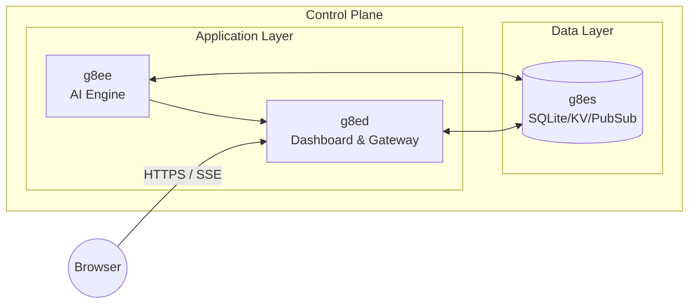
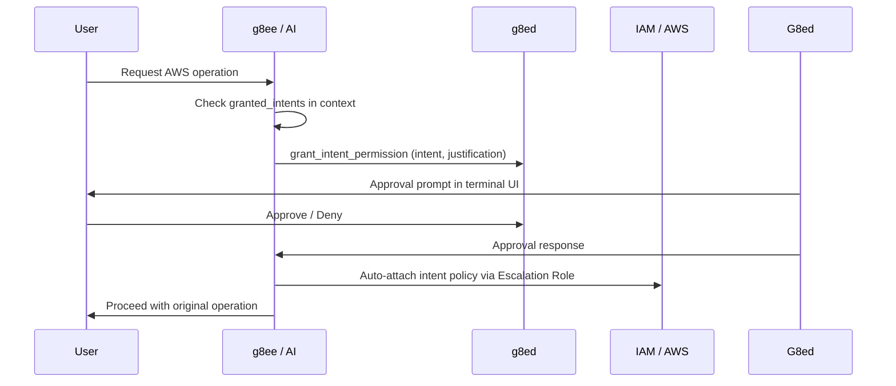

# g8ee

g8ee is the AI engine for the g8e platform. It provides an agentic, LLM-powered interface for infrastructure operations and troubleshooting, featuring human-in-the-loop safety controls, data sovereignty, and a multi-provider LLM abstraction layer.

---

## The AI Lifecycle

g8ee follows a strict "Traceable Pipeline" model for every message. A single user request moves through six distinct phases:

### 1. Ingress & Context Assembly
The `internal_router` receives the request. `ChatPipelineService` triggers `_prepare_chat_context`, performing a 15-step assembly process:
- **Context Enrichment**: Fetches the investigation state and binds available `g8eo` operators.
- **Workflow Detection**: Determines if the investigation is `OPERATOR_BOUND` or `OPERATOR_NOT_BOUND`.
- **Memory Injection**: Retrieves user-level and case-level memories from `MemoryDataService`.
- **System Prompt Assembly**: Builds a modular system prompt based on agent mode, bound operators, and investigation state.

### 2. Triage (The Gatekeeper)
Before invoking the primary LLM, the `TriageAgent` classifies the message:
- **Simple**: Routed to the **Dash** agent using the **Assistant** model (e.g., greetings, simple status checks, single-tool calls).
- **Complex**: Escalated to the **Sage** agent using the **Primary** model (e.g., troubleshooting, command execution, multi-step investigations).

> **Architecture Note**: Per GDD §14.1, **Triage** is a classifier only — it does NOT generate clarifying questions. The **Interrogation Protocol** is handled by reasoning agents: **Dash** (for simple tasks) and **Sage** (for complex tasks). When an agent needs clarification, tool execution is deferred until user answers are received.

### 3. Orchestration (The ReAct Loop)
The `g8eEngine` runs the core agentic loop:
- **Provider Turn**: Communicates with the configured `LLMProvider` (Gemini, Anthropic, Ollama, etc.).
- **Tool Dispatch**: If the LLM requests a tool, `AIToolService` routes it. Universal tools (like `web_search`) run locally; gated tools (like `run_commands_with_operator`) route through the **Tribunal**.
- **Iteration**: The loop continues until the LLM provides a final text response or hits the `AGENT_MAX_TOOL_TURNS` limit.

### 4. Governance & Safety
Every gated operation is verified through multiple layers:
- **Sentinel**: Scrubs sensitive data (PII, secrets) from inputs and outputs.
- **Tribunal**: An ensemble of five independent agents that translates intent into hardened shell commands.
- **Warden**: A defensive coordinator that performs pre-execution risk assessment and enforces the Two-Strike Circuit Breaker.
- **Auditor**: A high-reasoning agent that performs the final consistency check and Merkle commitment once the Warden has cleared the command.
- **Approval Pipeline**: State-changing operations trigger an `OPERATOR_COMMAND_APPROVAL_REQUESTED` event, halting execution until a human approves via the UI.

### 5. Streaming & Delivery
Responses are delivered via **Server-Sent Events (SSE)**:
- **Real-time**: `deliver_via_sse` publishes chunks (text, thinking, tool calls) to `g8ed` as they arrive.
- **Per-Iteration Persistence**: Intermediate AI commentary is persisted to the database *during* the loop, ensuring history is preserved if the connection drops.

### 6. Post-Flight & Telemetry
After the stream completes:
- **Final Persistence**: The complete response, token usage, and grounding metadata are saved.
- **LFAA Audit**: `OperatorLFAAService` publishes Local-First Audit Architecture events to the operator for an immutable execution record.
- **Background Memory**: `MemoryGenerationService` (Codex) updates the investigation's memory context based on the turn.

---

## Architecture

g8ee is a Python/FastAPI service. It follows a strict service hierarchy to ensure isolation and testability.

### Component Relationships



### Data Access Hierarchy
1. **Clients**: Handle raw transport/protocol (e.g., `DBClient`, `PubSubClient`, `BlobClient`).
2. **Handler Services**: Wrap clients with domain logic and error handling (e.g., `DBService`, `KVService`, `BlobService`).
3. **Orchestrators**: Consume handler services to implement platform features (e.g., `ChatPipelineService`, `InvestigationService`).

---

## Core Subsystems

### The Tribunal (Ensemble Command Generation)
The Tribunal is a five-member panel that converts Sage's intent into executable commands. Members receive the same intent, cannot see each other, and operate under distinct lenses to surface diverse technical considerations:
- **Axiom**: Focuses on **Composition** (clean, efficient pipelines).
- **Concord**: Focuses on **Safety** (defensive flags, minimal permissions).
- **Variance**: Focuses on **Edge Cases** (whitespaces, symlinks, locales, null inputs).
- **Pragma**: Focuses on **Convention** (idiomatic tool usage for the target OS/shell).
- **Nemesis**: The **Adversary**—produces plausible-but-flawed commands to ensure the Auditor is vigilant.

The Tribunal uses a ranked-vote system to select a winner. The **Warden** then performs a safety analysis; only once cleared does the **Auditor** perform the final consistency check and Merkle commitment.

### LFAA (Local-First Audit Architecture)
`OperatorLFAAService` ensures every action taken by the AI is recorded on the target system. This provides an immutable audit trail that persists even if the control plane is compromised or inaccessible.

### Warden (Defensive Coordination)
The `warden` agent coordinates defensive analysis, classifying the risk of commands, errors, and file operations. The Warden validates the safety of a command *before* the Auditor cryptographically commits to the results.

### LLM Interface (`LLMProvider`)
g8ee abstracts LLM providers through a unified interface (`app/llm/provider.py`). This allows the platform to switch between Gemini, Anthropic, OpenAI, and Ollama with zero changes to orchestration logic.

| Tier | Usage | Configuration |
|------|-------|---------------|
| **Primary** | Complex reasoning (Sage), Auditor, Judge. | `primary_provider` |
| **Lite** | Triage, Tribunal members, Scribe, Codex, Warden. | `lite_provider` |
| **Assistant** | (Legacy) Phasing out in favor of Lite tier. | `assistant_provider` |

---

## Governance & Audit

### Agent Reputation (The Scoreboard)
g8ee maintains a reputation scoreboard for all AI agents. After every Tribunal invocation, the `ReputationService` updates scores based on the Auditor's verdict and the results of the ranked vote.

### Merkle Commitments (Artifact B)
The Auditor binds every verdict to a snapshot of the current reputation state by writing a signed Merkle commitment. These commitments are chained (`prev_root`) via HMAC-SHA256 signatures to provide a verifiable, tamper-evident history of agent performance.

### LFAA (Local-First Audit Architecture)
`OperatorLFAAService` ensures every action taken by the AI is recorded on the target system. This provides an immutable audit trail that persists even if the control plane is compromised or inaccessible. The Operator remains the system of record for all infrastructure mutations.

---

## Client Architecture

g8ee enforces a strict hierarchy for data access: **Clients** handle raw transport/protocol, **Handler Services** wrap clients with domain logic, and **Orchestrators** (like `ChatPipelineService`) consume the services.

g8ee maintains 5 core data clients, each with exactly one handler service:

| Client | Handler Service | Responsibility |
|--------|-----------------|----------------|
| `DBClient` | `DBService` | Authoritative document persistence (SQLite `documents` via g8es) |
| `KVCacheClient` | `KVService` | High-frequency state and session data (SQLite `kv_store` via g8es) |
| `PubSubClient` | `PubSubService` | Event-driven messaging and operator command dispatch |
| `BlobClient` | `BlobService` | Binary data storage and retrieval (SQLite `blobs` via g8es) |
| `InternalHttpClient` | `HTTPService` | External API communication (via `ServiceFactory`) |

### Initialization & Lifespan

Client and service lifecycle is managed in `app/main.py` via a 6-phase bootstrap process:
1. **Bootstrap Settings** -- Load minimal config for connectivity.
2. **Core Clients** -- Instantiate all 4 g8es clients (DB, KV, PubSub, Blob).
3. **Handler Services** -- Wrap clients in their respective services.
4. **CacheAsideService** -- Initialize the query caching layer.
5. **Platform Settings** -- Load full platform configuration.
6. **Service Factory** -- Construct all remaining domain services (Investigation, Operator, AI).

All clients share a common TLS configuration using the platform CA certificate.

---

## Streaming Architecture

### LLM Provider Abstraction

All LLM communication passes through the `LLMProvider` abstract base class (`app/llm/provider.py`). Six role-specific methods must be implemented:

| Method | Returns | Used For |
|--------|---------|----------|
| `generate_content_stream_primary` | `AsyncGenerator[StreamChunkFromModel]` | Main primary loop — yields chunks as they arrive |
| `generate_content_primary` | `GenerateContentResponse` | Non-streaming primary model calls |
| `generate_content_stream_assistant` | `AsyncGenerator[StreamChunkFromModel]` | Streaming assistant model calls (deprecated) |
| `generate_content_assistant` | `GenerateContentResponse` | Risk analysis, memory, title generation (deprecated) |
| `generate_content_stream_lite` | `AsyncGenerator[StreamChunkFromModel]` | Streaming lite model calls |
| `generate_content_lite` | `GenerateContentResponse` | Triage, Tribunal, eval |

Each method accepts a role-specific settings dataclass (`PrimaryLLMSettings`, `AssistantLLMSettings`, `LiteLLMSettings`) that carries the generation parameters appropriate for that role. LLM configuration is sourced from `G8eeUserSettings.llm` — there is no platform-level LLM default. The `get_llm_provider(settings.llm, is_lite=True)` factory constructs a provider from user settings on each request. The `is_lite` flag determines whether to use the `lite_provider` or `primary_provider` configuration.

`StreamChunkFromModel` is the canonical inter-layer type (`app/models/agent.py`). Its `type` field is a `StreamChunkFromModelType` enum (`app/constants/__init__.py`) with values: `text`, `thinking`, `thinking.update`, `thinking.end`, `tool.call`, `tool.result`, `citations`, `complete`, `error`, `retry`. All provider-specific types are translated to `StreamChunkFromModel` at the provider boundary — nothing above the provider layer touches SDK types. `StreamChunkData` carries the typed payload for every chunk type, including labels, icons, and categories for tool calls.

### Provider Implementations

| Provider | Module | Streaming Model |
|----------|--------|-----------------|
| `GeminiProvider` | `app/llm/providers/gemini.py` | Opens the SDK stream with tenacity retry on the connection step only, then yields `StreamChunkFromModel` objects immediately as each SDK chunk arrives — no buffering |
| `AnthropicProvider` | `app/llm/providers/anthropic.py` | Streams via `client.messages.stream`, accumulating tool input JSON across deltas; yields text and thinking chunks immediately, emits tool call chunks on `content_block_stop`. **Parameter constraints:** `temperature` and `top_p` are mutually exclusive on Anthropic — the provider always uses `temperature` and never sends `top_p`. When extended thinking is enabled, `temperature` is forced to `1.0` and `top_k` is omitted. **Hardened Message handling:** messages must strictly alternate between user and assistant — consecutive same-role Content objects are merged. Every `tool_result` must carry the `tool_use_id` from the preceding assistant's `tool_use` block. Empty text blocks are dropped. |
| `OllamaProvider` | `app/llm/providers/ollama.py` | Streams via the `ollama` Python SDK's AsyncClient; selects the reasoning dialect via `LLMModelConfig.thinking_dialect` (`NONE` or `NATIVE_TOGGLE`); extracts `thinking` field from responses and streams it as `thought=True` chunks. |
| `OpenAIProvider` | `app/llm/providers/open_ai.py` | Streams via `AsyncOpenAI` for OpenAI endpoints; translates `ThinkingLevel` into `reasoning.effort` for reasoning models; when tools are present falls back to a non-streaming call and yields the response as a single chunk |
| `G8elProvider` | `app/llm/providers/g8el.py` | Platform's llama.cpp inference server component; inherits from `LlamaCppProvider` to reuse OpenAI-compatible logic. |
| `LlamaCppProvider` | `app/llm/providers/llama_cpp.py` | Generic llama.cpp provider; supports streaming via OpenAI-compatible API. |

**Gemini retry contract:** `_open_stream_attempt` wraps only the `generate_content_stream` API call in a tenacity retry (up to 4 attempts, exponential backoff, retryable on 429/503). Once the stream is open, chunks flow directly — no retry is possible mid-stream. If the stream breaks after yielding has started, the error propagate to the retry guard, which prevents re-attempting a partially-delivered response.

**Thought signatures (Gemini 3):** Every tool call Part requires a thought signature or the API returns 400. `GeminiProvider` normalises inbound SDK `thought_signature` bytes to a base64 string (`ThoughtSignature.from_sdk`) and passes it through as-is on outbound requests. Thought and text parts carry signatures when available; signature-only parts are emitted as empty-text parts per the Gemini 3 streaming spec.

**Ollama Provider:** The `OllamaProvider` is a dedicated provider for Ollama endpoints, using the official `ollama` Python SDK's AsyncClient:
- **Endpoint Handling:** Strips `/v1` suffix if present to match Ollama's native API format
- **Thinking Support:** Enables `think=true` parameter for primary model calls to support Ollama's thinking feature; extracts `thinking` field from responses and streams it as `thought=True` chunks
- **SSL Verification:** Uses the Ollama SDK's default SSL verification behavior
- **Tool Calling:** Converts tool declarations to Ollama's function calling format; falls back to non-streaming when tools are present to avoid hanging

### AI Streaming Loop

The `ChatPipelineService` is the single streaming implementation used by all chat paths. It runs a ReAct function-calling loop and yields `StreamChunkFromModel` objects:

```
stream_response
  └── _stream_with_tool_loop       (ReAct loop — runs until no pending tool calls)
        ├── _process_provider_turn      (consumes one provider stream, owns thinking state)
        │     yields: TEXT, THINKING, THINKING_UPDATE, THINKING_END, TOOL_CALL chunks
        └── execute_turn_tool_calls (sequential function execution)
              └── orchestrate_tool_execution (Tribunal routing & dispatch)
                    ├── TribunalInvoker (for run_commands_with_operator)
                    └── AIToolService.execute_tool_call (uniform handler dispatch)
              yields: TOOL_CALL, TOOL_RESULT chunks
        final yields: CITATIONS (if grounding used), COMPLETE
```

Retry behaviour in `stream_response`: if the provider raises a retryable error and streaming has not yet started (`streaming_started=False`), the entire attempt is retried up to `AGENT_MAX_RETRIES` times with exponential backoff. Once any `TEXT` chunk has been yielded (`streaming_started=True`), errors are surfaced immediately — a partial response is never replayed.

**Tool-loop turn limit:** `_stream_with_tool_loop` caps ReAct iterations at `AGENT_MAX_TOOL_TURNS` (default 25). When the cap is reached, the agent does **not** silently abort — instead it calls `OperatorApprovalService.request_command_approval` through the same approval pipeline that gates operator-bound tools, with a justification explaining the turn limit. On approve, the turn counter resets and the loop continues (so the operator can be asked again at the next 25-turn boundary); on deny, feedback, or timeout, the loop terminates cleanly with `finish_reason=stopped_by_operator`. If no approval service is wired (e.g., isolated test construction), the legacy behaviour of aborting at the cap is preserved.

`_process_provider_turn` owns all thinking state transitions for one LLM call. Thinking chunks are emitted as `StreamChunkFromModelType.THINKING` (or `THINKING_UPDATE`/`THINKING_END`) and delivered to g8ed for UI rendering if the model supports it. Text chunks are yielded as `StreamChunkFromModelType.TEXT` immediately.

### SSE Delivery Pipeline

`run_with_sse` consumes `stream_response` and delivers each `TEXT` chunk to the browser via `EventService` without batching or delay:

```
LLM SDK  →  GeminiProvider  →  stream_response  →  deliver_via_sse
                                                       │  TEXT chunk arrives
                                                       ▼
                                             EventService.publish (SessionEvent)
                                                       │  HTTP POST
                                                       ▼
                                                    g8ed /api/internal/sse/push
                                                       │  SSE fan-out
                                                       ▼
                                                    Browser
```

Each `TEXT` chunk produces exactly one HTTP POST to g8ed (`LLM_CHAT_ITERATION_TEXT_CHUNK_RECEIVED` event). g8ed relays it to the browser immediately via its SSE connection. `LLM_CHAT_ITERATION_TEXT_COMPLETED` is published once after the loop exits, carrying finish reason, citation metadata, and token usage.

`deliver_via_sse` chunk dispatch:

| `StreamChunkFromModelType` | SSE event(s) published | Side effect |
|-------------------|--------------------|--------------|
| `TEXT` | `LLM_CHAT_ITERATION_TEXT_CHUNK_RECEIVED` | Appends to `AgentStreamState.response_text` |
| `THINKING` | `LLM_CHAT_ITERATION_THINKING_STARTED` (`action_type=START` on the first chunk of a thinking burst, `UPDATE` thereafter) | Sets `thinking_started=True` on `AgentStreamState` |
| `THINKING_END` | `LLM_CHAT_ITERATION_THINKING_STARTED` (`action_type=END`) | Sets `thinking_ended=True` on `AgentStreamState` |
| `RETRY` | `LLM_CHAT_ITERATION_RETRY` (carries `attempt`, `max_attempts`) | — |
| `TOOL_CALL` | `LLM_CHAT_ITERATION_TOOL_CALL_STARTED` (always, for every tool); plus `LLM_TOOL_G8E_WEB_SEARCH_REQUESTED` (search_web only). `OPERATOR_NETWORK_PORT_CHECK_REQUESTED` is intentionally NOT emitted here: the TOOL_CALL chunk is yielded after the port check has already executed, so a sidecar REQUESTED event would arrive after `port_service`'s STARTED / COMPLETED / FAILED and would only create an orphaned UI indicator. The port-check indicator lifecycle is owned by STARTED / COMPLETED / FAILED (emitted from `port_service`). | — |
| `TOOL_RESULT` | `LLM_CHAT_ITERATION_TOOL_CALL_COMPLETED` (always, for every tool); `LLM_TOOL_G8E_WEB_SEARCH_COMPLETED` / `_FAILED` (search_web only); `LLM_CHAT_ITERATION_COMPLETED` (turn tick, increments `_turn`) | Awaits `on_iteration_text(response_text)` if provided and the buffer is non-whitespace, then clears `AgentStreamState.response_text` so the next iteration's text starts fresh |
| `CITATIONS` | `LLM_CHAT_ITERATION_CITATIONS_RECEIVED` (only when `grounding_used=True`) | Stores `grounding_metadata` on `AgentStreamState` |
| `COMPLETE` | none in-loop; `LLM_CHAT_ITERATION_TEXT_COMPLETED` is emitted once after the loop exits with the post-loop `response_text`, finish reason, citation metadata, and aggregate token usage | Stores `token_usage` and `finish_reason` on `AgentStreamState` |
| `ERROR` | `LLM_CHAT_ITERATION_FAILED` (carries provider error message) | Sets internal `error_occurred=True` and breaks the loop; the post-loop `LLM_CHAT_ITERATION_TEXT_COMPLETED` is suppressed |

`deliver_via_sse` initializes `grounding_metadata` and `token_usage` to `None` before the loop to prevent `UnboundLocalError` if the stream is empty or ends before those chunks arrive. Wrapping `try/except` translates `asyncio.CancelledError` and any uncaught `Exception` raised by the generator into `LLM_CHAT_ITERATION_FAILED` events; `CancelledError` is re-raised after the event is published, all other exceptions are swallowed so the SSE channel remains usable.

#### Per-Iteration AI Text Persistence

`response_text` is **not** a single buffer for the whole stream — it is a per-iteration accumulator. `deliver_via_sse` accepts an optional `on_iteration_text: Callable[[str], Awaitable[None]] | None` parameter. On every `TOOL_RESULT` chunk (i.e., at the end of each ReAct iteration), if the callback was supplied and `response_text.strip()` is non-empty, it is awaited with the accumulated pre-tool text **before** the buffer is cleared. Persistence failures inside the callback are caught and logged so they cannot break the live SSE stream.

`ChatPipelineService._run_chat_impl` wires this callback into a closure that writes each iteration's commentary as a `MessageSender.AI_PRIMARY` row via `InvestigationService.add_chat_message`. The post-stream `_persist_ai_response` writes the final segment (still in `response_text`) as another `AI_PRIMARY` row, attaching the aggregate `grounding_metadata` and `token_usage` collected over the whole stream; it skips the write when `response_text` is whitespace-only (e.g., when the agent ends on a tool result with no closing narration).

The resulting chronological shape of `conversation_history` for a multi-turn tool loop is:

```
user_chat
  -> ai_primary (iteration 1 commentary)         <- via on_iteration_text
  -> system     (operator.command.approval.*)    <- via approval_service._audit
  -> user_terminal (operator command result)
  -> ai_primary (iteration 2 commentary)         <- via on_iteration_text
  -> system     (operator.command.approval.*)
  -> user_terminal (operator command result)
  -> ...
  -> ai_primary (final answer, with token_usage + grounding_metadata)
                                                  <- via _persist_ai_response
```

Intermediate rows carry `AIResponseMetadata(source=EVENT_SOURCE_AI_PRIMARY)` with no grounding or token-usage fields; only the final row carries the aggregate totals for the entire stream. Frontend restore (`chat-history.js`) renders each `AI_PRIMARY` row through the same `appendDirectHtmlResponse` path used for live chunks, so a restored conversation looks identical to the live stream.

### Error Handling

g8ee uses a unified error model derived from `G8eError`. Custom error signatures have been updated to support component attribution and detailed context.

| Error Class | Purpose | Key Parameters |
|-------------|---------|----------------|
| `ResourceNotFoundError` | Resource not found in DB | `message`, `resource_type`, `resource_id` |
| `AuthorizationError` | Permission denied | `message="Insufficient permissions"` |
| `ValidationError` | Request/model validation failure | `message`, `field`, `constraint` |
| `BusinessLogicError` | Invariant violation | `message`, `code` |
| `ExternalServiceError` | External service failure | `message`, `service_name`, `cause` |
| `NetworkError` | Network connectivity failure | `message`, `retry_suggested`, `cause` |
| `ConfigurationError` | Configuration missing or invalid | `message`, `key` |

---

## Data Models

Core data models for cache operations and markers are located in `app/models/cache.py`.

- **ArrayUnion** — Marker for appending to array fields: `ArrayUnion(values=[...], max_length=N)`
- **ArrayRemove** — Marker for removing from array fields: `ArrayRemove(values=[...])`
- **BatchWriteOperation** — Container for atomic multi-document writes.

## Cache-Aside Service

g8ee uses `CacheAsideService` to manage synchronization between the authoritative `DBService` and the `KVService` (g8es).

- **Invariants**: All write operations (`create`, `update`, `delete`, `batch`) **invalidate** the cache. Population only occurs during a `get_document` MISS.
- **`create_document`**: Checks for document existence in the DB first. If it exists, the call fails with a `DatabaseError`. If not, it writes to the DB and invalidates the cache key.
- **`get_document`**: Implements lazy-loading. It checks the KV cache first; if missing, it fetches from the DB and "warms" the cache.
- **`query_documents`**: Uses MD5 hashing of query parameters to cache result sets.
- **`append_to_array`**: Atomic `arrayUnion` on DB followed by cache invalidation.

For the full list of call behaviors and TTL strategies, see [architecture/storage.md](../architecture/storage.md#cache-aside-service).

---

## Workflow Modes

### Operator Bound

Activated when at least one `g8eo` Operator has `status=bound`.

- **Full Tool Suite**: Command execution (via Tribunal), file operations, directory listing, port checks, and web search (if configured).
- **Human-in-the-Loop**: All state-changing operations require explicit user approval.
- **Thinking**: Enabled for models supporting reasoning levels (`MINIMAL`, `LOW`, `MEDIUM`, `HIGH`).
- **Cloud Operators**: AWS-type operators use JIT permission escalation via the **Intent System**. `g8ep` operators (`cloud_subtype=g8ep`) are a special type of cloud operator that provides direct system access and bypasses the intent system.
- **Multi-Operator**: The AI selects the target per command using `target_operator`. Batch operations fan out across `target_operators` with a single unified approval.

### Operator Not Bound (Advisory Mode)

Advisory mode—no operator connected.

- **Limited Tools**: `search_web` only (if Vertex AI Search is configured and credentials are present).
- **No Tools**: If search is not configured, zero tools are registered. The system automatically swaps to `*_no_search.txt` prompt variants to prevent the model from attempting undeclared functions.
- **Behavior**: AI provides guidance, suggested commands, and analysis, but cannot execute any actions on infrastructure.

#### Tool Availability Model

`AIToolService.search_web_available` (a `@property`) reflects whether `search_web` is registered in `_tool_declarations`. `ChatPipelineService` passes this flag to `build_modular_system_prompt`, which delegates it to `load_mode_prompts`. When `operator_not_bound` and `search_web_available=False`, `load_mode_prompts` swaps the capabilities and execution prompt files for their no-search variants — no string manipulation occurs at runtime.

```
vertex_search_enabled=true + credentials  →  search_web registered  →  search_web_available=True
                                             standard prompt files
                                             tools section included

vertex_search_enabled not set / missing  →  search_web not registered  →  search_web_available=False
                                             *_no_search.txt variant files
                                             tools section suppressed
```

---
## LLM Configuration

> **Recommended LLM: Google Gemini 3.1.** The platform was designed around Gemini best practices. The Gemini provider is the most robust and extensively tested integration. Other providers are supported but are not part of the standard test pipeline.

### Model Configuration Registry

All LLM model configurations are defined in `components/g8ee/app/models/model_configs.py`. This file contains the canonical source of truth for:

- **Supported models** across all providers (Anthropic, Gemini, OpenAI, Ollama)
- **Model capabilities and constraints** (context window, thinking support, tool support, output limits)
- **Supported thinking levels** for each model (`OFF`, `MINIMAL`, `LOW`, `MEDIUM`, `HIGH`)

The `LLMModelConfig` class defines the schema for each model:
- `name`: Model identifier string
- `supported_thinking_levels`: The single source of truth for thinking capability. An empty list means the model cannot think at all. A list containing `OFF` means thinking is opt-in; a list omitting `OFF` means the model is always-on reasoning and callers must supply one of the listed non-`OFF` levels. See [architecture/thinking_levels.md](../architecture/thinking_levels.md).
- `supports_thinking`: Derived read-only property — `True` iff `supported_thinking_levels` is non-empty. Do not set this field directly; change the levels list instead.
- `thinking_budgets`: Optional per-level `dict[ThinkingLevel, int]` used by Anthropic to override the default token-budget table when a model benefits from non-default values (Opus uses this to opt into a 32_000-token HIGH budget).
- `thinking_dialect`: Ollama-only. Selects the wire encoding for reasoning toggling (`NONE` omits the `think` kwarg; `NATIVE_TOGGLE` sends `think=True`/`False`). Cloud providers ignore this field.
- `supports_tools`: Boolean indicating if the model supports function calling
- `context_window_input`: Maximum input tokens
- `context_window_output`: Maximum output tokens (max_tokens)

The `MODEL_REGISTRY` provides runtime access to model configurations via `get_model_config(model_name)`.

### Supported Models

#### Anthropic Models
| Model | Thinking Levels | Tools | Context In | Context Out |
|-------|-----------------|-------|------------|-------------|
| `claude-opus-4-6` | HIGH, MEDIUM, LOW | Yes | 200,000 | 8,192 |
| `claude-sonnet-4-6` | HIGH, MEDIUM, LOW | Yes | 200,000 | 8,192 |
| `claude-haiku-4-5` | LOW, MINIMAL | Yes | 200,000 | 8,192 |

#### Gemini Models
| Model | Thinking Levels | Tools | Context In | Context Out |
|-------|-----------------|-------|------------|-------------|
| `gemini-3.1-pro-preview` | HIGH, MEDIUM, LOW | Yes | 1,000,000 | 64,000 |
| `gemini-3.1-pro-preview-customtools` | HIGH, MEDIUM, LOW | Yes | 1,000,000 | 64,000 |
| `gemini-3-flash-preview` | HIGH, MEDIUM, LOW | Yes | 1,000,000 | 64,000 |
| `gemini-3.1-flash-lite-preview` | HIGH, MEDIUM, LOW, MINIMAL | Yes | 1,000,000 | 64,000 |

#### OpenAI Models
| Model | Thinking Levels | Tools | Context In | Context Out |
|-------|-----------------|-------|------------|-------------|
| `gpt-5.4` | - | Yes | 128,000 | 8,192 |
| `gpt-5.4-pro` | - | Yes | 128,000 | 8,192 |
| `gpt-5.4-mini` | LOW, MINIMAL | Yes | 200,000 | 8,192 |
| `gpt-5.4-nano` | - | Yes | 128,000 | 8,192 |
| `gpt-5.3-instant` | - | Yes | 128,000 | 8,192 |
| `gpt-4o` | - | Yes | 128,000 | 8,192 |
| `gpt-4o-mini` | - | Yes | 128,000 | 8,192 |
| `gpt-4-turbo` | - | Yes | 128,000 | 8,192 |
| `gpt-3.5-turbo` | - | Yes | 16,385 | 4,096 |

#### Ollama Models
| Model | Thinking Levels | Tools | Context In | Context Out |
|-------|-----------------|-------|------------|-------------|
| `qwen3.5:122b` | HIGH, OFF | Yes | 256,000 | 8,192 |
| `glm-5.1:cloud` | HIGH, OFF | Yes | 256,000 | 8,192 |
| `gemma4:26b` | HIGH, OFF | Yes | 128,000 | 8,192 |
| `nemotron-3-nano:30b` | HIGH, OFF | Yes | 128,000 | 8,192 |
| `llama3.2:3b` | - | Yes | 32,768 | 8,192 |
| `qwen3.5:2b` | HIGH, OFF | Yes | 32,768 | 8,192 |
| `gemma4:e4b` | HIGH, OFF | Yes | 32,768 | 8,192 |
| `gemma4:e2b` | HIGH, OFF | Yes | 32,768 | 8,192 |

### Model Roles

| Role | Provider Setting | Used For |
|------|------------------|----------|
| **Primary** | `primary_provider` | Complex reasoning, Sage (main chat), Auditor (Tribunal verification), Judge (evaluation) |
| **Lite** | `lite_provider` | Triage, Tribunal members (Axiom, Concord, Variance, Pragma, Nemesis), Dash, Scribe, Codex, Warden |
| **Assistant** | `assistant_provider` | **Deprecated** - being phased out in favor of Lite tier |

The lite tier always has thinking disabled regardless of capability. The primary tier supports thinking when the model capability allows it.

All services access models via tier-specific settings (`primary_model`, `lite_model`, `assistant_model`). The `get_llm_provider(settings.llm, is_lite=True)` factory constructs a provider from user settings on each request. The `is_lite` flag determines whether to use the `lite_provider` or `primary_provider` configuration.

### Per-Message Model Override

The UI exposes two separate model dropdowns: **Primary** (complex tasks) and **Assistant** (simple tasks). Each dropdown is populated with provider-specific model options. Selecting a model overrides the corresponding server default for that request. An empty selection (`""`) defers to the configured server default.

### LLM Config Discovery

On SSE connect, g8ed pushes a `llm.config` event containing provider-specific `primary_models` and `assistant_models` arrays plus the current defaults. The browser populates both model dropdowns from this event — no separate HTTP call is required.

### Triage & Routing

Before invoking the primary model, g8ee classifies each incoming message as `simple` or `complex` using the `triage_message` utility. This avoids the full model for messages that can be handled cheaply by the `lite` model.

**Classification Rules:**
- **Short-circuit:** Messages with attachments always escalate to the primary model (multimodal analysis).
- **Empty messages:** Escalated to primary model (Sage) for handling.
- **Complexity signals:** Lite model looks for technical depth, reasoning chains, or explicit requests for action.
- **Interrogation Protocol:** Per GDD §14.1, clarifying questions are generated by reasoning agents (**Dash** for simple tasks, **Sage** for complex tasks), NOT by Triage. When a reasoning agent emits questions, the pipeline short-circuits: `ChatPipelineService` emits `LLM_CHAT_ITERATION_STARTED`, delivers questions via `LLM_CHAT_ITERATION_TEXT_CHUNK_RECEIVED` and `LLM_CHAT_ITERATION_TEXT_COMPLETED`, persists to the conversation ledger, and defers tool execution until user answers are received.

---

## Function Tools

### Tool Registration Registry (`TOOL_SPECS`)

g8ee uses a single-source declarative registry for AI tools in `app/services/ai/tool_registry.py`. Each `ToolSpec` entry in `TOOL_SPECS` carries everything the platform needs to know about a tool:

- **Name** — The `OperatorToolName` enum value.
- **Scope** — `UNIVERSAL` (no bound operator required) or `OPERATOR_GATED` (bound-operator auth required; also the Tribunal routing set).
- **Agent Modes** — The set of `AgentMode` values in which the tool is exposed to the LLM.
- **Builder/Handler** — Method names on `AIToolService` that build the declaration and dispatch execution.
- **Display Metadata** — Label, icon, and category used for UI rendering.

Consumers (auth gate, Tribunal routing, prompt assembly) all derive from this one registry.

### Active Tools

| Tool | Approval Required | Scope | Purpose |
|------|-------------------|-------|---------|
| `run_commands_with_operator` | Yes | Gated | Execute shell commands on target systems (via Tribunal) |
| `file_create_on_operator` | Yes | Gated | Create new files with content |
| `file_write_on_operator` | Yes | Gated | Replace entire file contents |
| `file_update_on_operator` | Yes | Gated | Surgical find-and-replace within files |
| `file_read_on_operator` | No | Gated | Read file content (with optional line ranges) |
| `list_files_and_directories_with_detailed_metadata` | No | Gated | Directory listing with metadata |
| `fetch_file_history` | No | Gated | Retrieve file edit history and commit information |
| `fetch_file_diff` | No | Gated | Retrieve specific file diffs and change details |
| `check_port_status` | No | Gated | Check TCP/UDP port reachability |
| `grant_intent_permission` | Yes (via intent flow) | Gated | Request AWS intent permissions for cloud operators |
| `revoke_intent_permission` | Yes (via intent flow) | Gated | Revoke AWS intent permissions |
| `query_investigation_context` | No | Universal | Query investigation data (conversation history, status, history trail, operator actions) on-demand |
| `get_command_constraints` | No | Universal | Retrieve whitelisted/blacklisted command patterns |
| `g8e_web_search` | No | Universal | Web search via Vertex AI Search — requires `vertex_search_enabled=true` in `platform_settings` |
| `list_ssh_inventory` | No | Universal | List the platform's SSH inventory |
| `stream_operator_to_ssh_fleet` | No | Universal | Stream the operator binary to a fleet of SSH hosts |

Automatic Function Calling (AFC) is always disabled. g8ee uses a custom sequential function-calling loop to preserve thought signatures and ensure accurate tracking of intermediate steps.

---

## Operator Execution

### Operator Service Layer

`OperatorCommandService` (`app/services/operator/command_service.py`) is the entry point for operator tool execution. It is a pure injection target — business logic is owned by focused sub-services.

`AIToolService` handles the dispatch from the AI loop. It uses a `_tool_handlers` dispatch table populated from per-tool modules under `app/services/ai/tools/`, each exporting an `async handle()` function with a uniform signature. For `run_commands_with_operator`, dispatch routes through `TribunalInvoker` to refine the natural-language request into a precise shell command.

`OperatorApprovalService` (`app/services/operator/approval_service.py`) is a first-class service on `app.state.approval_service`, independently constructed in `main.py` and injected into `OperatorCommandService.build()`. The g8ee router for `/api/internal/operator/approval/respond` depends on `OperatorApprovalService` directly — approval responses do not pass through `OperatorCommandService`.

The approval service exposes three typed request methods, each accepting a Pydantic model:
- `request_command_approval(CommandApprovalRequest)` — command execution approval
- `request_file_edit_approval(FileEditApprovalRequest)` — file operation approval
- `request_intent_approval(IntentApprovalRequest)` — IAM intent permission approval

All three models extend `ApprovalRequestBase` (`app/models/operators.py`) which carries common fields: `g8e_context`, `timeout_seconds`, `justification`, `execution_id`, `operator_session_id`, `operator_id`.

Approval responses use `handle_approval_response(OperatorApprovalResponse)` — a single typed model (`app/models/internal_api.py`) with `approval_id`, `approved`, `reason`, `operator_session_id`, and `operator_id`. The router enriches `operator_session_id`/`operator_id` from `G8eHttpContext.bound_operators[0]` before calling the service.

| Sub-service | Responsibility |
|-------------|----------------|
| `OperatorPubSubService` | Pub/sub lifecycle, channel subscription, command dispatch, result waiting |
| `OperatorApprovalService` | Human-in-the-loop approval request, poll, and response flow (first-class on `app.state`) |
| `OperatorExecutionService` | Command validation, risk analysis, batch execution, pub/sub command dispatch |
| `OperatorResultHandlerService` | Inbound result parsing from g8eo pub/sub messages |
| `OperatorFileService` | File create/write/update/read operations on the operator |
| `OperatorFilesystemService` | Directory listing (`fs_list`) and file read (`fs_read`) |
| `OperatorIntentService` | AWS intent permission grant and revocation |
| `OperatorLFAAService` | Local-First Audit Architecture event dispatch |
| `OperatorPortService` | TCP/UDP port reachability checks |
| `TribunalInvoker` | Command generation pipeline coordinator (Sage -> Executor) |

All service contracts are defined as `Protocol` types in `app/services/protocols.py`. The circular dependency between `OperatorPubSubService` and `OperatorResultHandlerService` is resolved by the factory via a single post-construction assignment — no `None` injection.


### Heartbeat Flow

g8ee is the persistence authority for heartbeats. It subscribes to `heartbeat:{operator_id}:{session}` channels, validates and persists each heartbeat (rolling buffer of last 10, latest snapshot, system info), then notifies g8ed for SSE fan-out to the browser. See [components/g8ed.md — Heartbeat Architecture](g8ed.md#heartbeat-architecture) for the full end-to-end flow including g8ed's role.

g8ee also owns heartbeat status decay: `HeartbeatStaleMonitorService` (`app/services/operator/heartbeat_stale_monitor.py`) runs on a timer and transitions operator status to `stale` or `offline` when heartbeats stop arriving (60s threshold). This consolidates operator status ownership in g8ee, eliminating dual-writer race conditions on the `operators` collection.

### Defensive Safety

Before dispatching any state-changing operation, g8ee runs AI-powered safety analysis: command risk classification (LOW / MEDIUM / HIGH, fails closed to HIGH), file operation safety (blocks writes to system paths and destructive ops on dirty git repos), and error analysis with auto-fix (maximum 2 retries before escalating to the user). See [architecture/security.md — Operator Commands via Sentinel](../architecture/security.md#operator-commands-via-sentinel-g8eo) for full details.

### MCP Adapter

> For comprehensive MCP architecture, provider-agnostic design, and translation layer patterns, see [architecture/mcp.md](../architecture/mcp.md).

g8ee implements an **MCP Client Adapter** that translates outbound tool calls into the Model Context Protocol (MCP) JSON-RPC 2.0 format. This is part of g8e' provider-agnostic event system design—MCP is one protocol translator among potentially many, all mapping to internal event types.

- **Tool Call Wrapping**: Outbound execution requests are wrapped in MCP `tools/call` JSON-RPC payloads.
- **Result Unwrapping**: Inbound `g8e.v1.operator.mcp.tools.result` events are unwrapped from JSON-RPC responses.
- **Structured Reconstruction**: g8ee uses a two-tier reconstruction logic for MCP results:
    1. **Structured Metadata (Preferred)**: Uses a g8e-specific `_metadata` field in the MCP result containing the `original_payload` and `event_type` for 100% reliable reconstruction.
    2. **Content Heuristics (Fallback)**: Parses serialized JSON from the `text` content using field-name heuristics (e.g., `host`, `entries`, `history`) to map back to internal typed payloads.
- **Integration**: The adapter is integrated into `OperatorCommandService` and `OperatorPubSubService`, making the transition to MCP transparent to the AI engine.
- **Governance**: Standards-based wire format while preserving g8e' secure pub/sub transport and human-in-the-loop governance layers.

### MCP Gateway Service

> For comprehensive MCP architecture, provider-agnostic design, and translation layer patterns, see [architecture/mcp.md](../architecture/mcp.md).

`MCPGatewayService` (`app/services/mcp/gateway_service.py`) enables external MCP clients (e.g. Claude Code) to execute g8e tools through the standard governance pipeline. It sits behind two internal endpoints on `internal_router.py`:

| Endpoint | Purpose |
|----------|---------|
| `POST /api/internal/mcp/tools/list` | Returns tool declarations formatted as MCP `tools/list` response items |
| `POST /api/internal/mcp/tools/call` | Executes a tool call through `AIToolService.execute_tool()` |

**Tool listing** reads `AIToolService.get_tools()` with the resolved `AgentMode` and converts each `ToolDeclarations` into MCP format (`{ name, description, inputSchema }`).

**Tool calling** builds a synthetic `EnrichedInvestigationContext` from `G8eHttpContext.bound_operators` (resolving operator documents from cache via `OperatorDataService`), then delegates to `AIToolService.execute_tool()`. The full governance pipeline runs: security validation, operator binding check, risk analysis, human approval gate, and audit logging. The result is converted to MCP `CallToolResult` format (`{ content: [{ type: "text", text }], isError }`).

**Initialization:** `MCPGatewayService` is created on `app.state.mcp_gateway_service` during startup, after `AIToolService` and `OperatorDataService`.

### Command Validation Policies

`OperatorCommandService` enforces three **independent** policies on every command, configured via `settings.command_validation`:

| Policy | Setting | JSON Config | Semantics | Where enforced |
|--------|---------|-------------|-----------|----------------|
| Whitelist (hard allow-list) | `enable_whitelisting` + `whitelisted_commands` | `config/whitelist.json` (`enabled` field) | Only listed commands may run at all. Non-listed commands are rejected at L1 safety validation. | `app/utils/safety.py::validate_command_safety` |
| Blacklist (hard block-list) | `enable_blacklisting` | `config/blacklist.json` (`enabled` field) | Listed commands/patterns are rejected at L1 safety validation. **Enabled by default** as a recommended safety boundary. | `app/utils/safety.py::validate_command_safety` |
| Auto-approve (skip-approval list) | `enable_auto_approve` + `config/auto_approved.json` (platform default) + `auto_approved_commands` (CSV override) | `config/auto_approved.json` (`enabled` field) | Listed base verbs bypass the human approval prompt. **Enabled by default** to work in harmony with reputation staking (agent personas + built-in engine) for peak signal and efficiency. | `OperatorCommandService.execute_command_internal` |

**JSON `enabled` field semantics:** Each JSON config file has an `enabled` boolean field (defaults to `true`). When `enabled: false`, the validator loads an empty index regardless of the entries in the file — this is a file-level kill switch that allows platform operators to neutralize the entire JSON file without touching per-request settings. Enforcement requires **both** the JSON `enabled` field and the corresponding per-request setting to be `true`.

The three policies are orthogonal. Auto-approve runs **after** L1 safety validation, so a command must pass every hard gate before its base verb is checked against `auto_approved_commands`. The Tribunal is informed of all three via `get_command_constraints` (`auto_approve_enabled`, `auto_approved_commands`) but must still obey hard gates regardless of auto-approve.

When auto-approve applies, `OPERATOR_COMMAND_APPROVAL_PREPARING` is suppressed and `request_command_approval` is skipped entirely — the command proceeds directly to risk analysis and dispatch.

### Multi-Operator Binding

When multiple operators are bound, the AI must specify a `target_operator`. Resolution tries hostname match first, then exact operator ID, then list index. For batch operations, `target_operators` accepts a list (or `["all"]`) and g8ee requests a single unified approval covering all N target systems, then fans out the command to every resolved operator in parallel (bounded by `command_validation.max_batch_concurrency`, default 10). Each per-operator execution gets its own `execution_id` and emits its own `OPERATOR_COMMAND_STARTED` / `COMPLETED` / `FAILED` events, all tagged with a shared `batch_id` for UI grouping and audit correlation. Partial failures are reported via `CommandExecutionResult.successful_count` / `failed_count` / `execution_results`; set `command_validation.batch_fail_fast=true` to cancel remaining siblings after the first failure.

### Cloud Operator Self-Discovery

Read-only AWS IAM introspection commands (e.g., `aws sts get-caller-identity`, role/policy listing) are not auto-approved by g8ee itself — they go through the same approval gate as every other command. Operators may rubber-stamp them via the `auto_approved_commands` setting (see [Command Validation Policies](#command-validation-policies)). The intent system handles privileged AWS operations: see [Cloud Operator & AWS Intents](#cloud-operator--aws-intents).

### Operator Execution History & Activity

g8ee tracks all operator-related actions and results to maintain a continuous picture of the environment.

#### Activity Log
The `add_operator_activity` method in `OperatorDataService` records high-level events (command execution, file edits, approvals) to the operator's `activity_log` array in g8es. These entries use the `ConversationHistoryMessage` model and are primarily used for UI visibility into what the AI has done on a specific system.

#### Command History
All command results are appended to `command_results_history` on the `OperatorDocument` via `append_command_result`. g8eo results are processed by `OperatorResultHandlerService` and routed to this history.

#### Local Retention (LFAA)
While g8es stores a summary of recent activity, the **Operator remains the system of record** via LFAA. g8ee dispatches audit events to the operator's local vault for long-term retention and cryptographic verification.

---

## Cloud Operator & AWS Intents

The Operator has two `OperatorType` values: **System** (`system` — cloud CLI tools blocked) and **Cloud** (`cloud` — cloud CLI tools enabled). Cloud operators carry an additional `cloud_subtype` field (`aws`, `gcp`, `azure`) identifying the provider. The intent system described in this section applies only to Cloud Operators with `cloud_subtype=aws`. g8ep operators (`cloud_subtype=g8ep`) have direct system access and do not use the intent system.

Cloud Operators for AWS implement a **Zero Standing Privileges** model. The Operator is started with `--cloud --provider aws` — either automatically on the g8ep sidecar (local dev, credentials from `~/.aws`) or deployed to an EC2 instance in the customer's VPC (credentials from IAM instance profile). In both cases the AI launches with only bootstrap permissions (STS identity, IAM role introspection) and dynamically requests additional permissions through the intent system.

### Intent Workflow



### Two-Role Security Architecture

| Role | Attached To | Can Do | Cannot Do |
|------|------------|--------|-----------|
| **Operator Role** | EC2 instance profile or `~/.aws` credentials | Execute AWS operations (EC2, S3, RDS, etc.) | Modify its own IAM policies |
| **Escalation Role** | Assumed temporarily | Attach `Intent-*` prefixed policies to the Operator Role | Access any AWS resources directly |

The Escalation Role requires an external ID (prevents confused deputy attacks) and is only assumed during permission escalation — credentials are cleared immediately after.

This architecture ensures that even a compromised AI cannot grant itself arbitrary permissions; it can only attach pre-defined intent policies.

### Available Intents

Intents are grouped into discovery (read-only) and management (read-write) tiers. Management and write intents require their corresponding discovery/read intent as a prerequisite. The AI automatically requests all required intents together in a single approval.

**Compute**
- `ec2_discovery` — View EC2 instances, VPCs, subnets, security groups
- `ec2_management` — Start, stop, reboot instances *(requires ec2_discovery)*
- `ec2_snapshot_management` — Create and manage EC2/EBS snapshots and AMIs *(requires ec2_discovery)*

**Storage**
- `s3_read` — Read objects from S3
- `s3_write` — Write files to S3 *(requires s3_read)*
- `s3_delete` — Delete objects from S3 *(requires s3_read)*
- `s3_bucket_discovery` — List and view S3 bucket configurations
- `terraform_state` — Manage Terraform state in S3/DynamoDB

**IaC**
- `cloudformation_deployment` — Create and update CloudFormation stacks

**Monitoring & Logging**
- `cloudwatch_logs` — View and write CloudWatch Logs
- `cloudwatch_metrics` — Read CloudWatch metrics

**Secrets & Security**
- `secrets_read` — Read from AWS Secrets Manager
- `kms_discovery` — View KMS keys and aliases
- `kms_crypto` — Encrypt/decrypt with KMS *(requires kms_discovery)*
- `iam_discovery` — Read-only IAM access for debugging

**Database**
- `rds_discovery` — View RDS databases and clusters
- `rds_management` — Start, stop, reboot RDS *(requires rds_discovery)*
- `rds_snapshot_management` — Create and manage RDS snapshots *(requires rds_discovery)*
- `dynamodb_discovery` — View DynamoDB tables
- `dynamodb_read` — Query and scan DynamoDB
- `dynamodb_write` — Write to DynamoDB *(requires dynamodb_read)*

**Aurora**
- `aurora_cluster_management` — Manage Aurora clusters: failover, modify, add/remove instances *(requires rds_discovery)*
- `aurora_scaling` — Manage Aurora Serverless v2 scaling and capacity *(requires rds_discovery)*
- `aurora_cloning` — Clone Aurora clusters for dev/test/analysis *(requires rds_discovery)*
- `aurora_global_database` — Cross-region Aurora Global Database operations *(requires rds_discovery)*

**Containers & Orchestration**
- `ecs_discovery` — View ECS clusters, services, tasks
- `ecs_management` — Update services, run tasks *(requires ecs_discovery)*
- `eks_discovery` — View EKS clusters and nodegroups
- `lambda_discovery` — View Lambda functions
- `lambda_invoke` — Execute Lambda functions *(requires lambda_discovery)*

**Networking**
- `vpc_discovery` — View VPCs, subnets, route tables, security groups
- `elb_discovery` — View load balancers and target groups
- `route53_discovery` — View DNS hosted zones and records
- `route53_management` — Create/modify DNS records *(requires route53_discovery)*
- `autoscaling_discovery` — View Auto Scaling groups
- `autoscaling_management` — Scale ASGs *(requires autoscaling_discovery)*

**Messaging & Events**
- `sns_discovery` — View SNS topics
- `sns_publish` — Publish to SNS *(requires sns_discovery)*
- `sqs_discovery` — View SQS queues
- `sqs_management` — Send and manage SQS messages *(requires sqs_discovery)*
- `eventbridge_discovery` — View EventBridge rules and event buses

**Serverless & Analytics**
- `apigateway_discovery` — View API Gateway APIs
- `stepfunctions_discovery` — View Step Functions state machines
- `stepfunctions_execution` — Start and stop Step Functions executions *(requires stepfunctions_discovery)*
- `athena_discovery` — View Athena workgroups and queries
- `athena_query_execution` — Execute Athena queries *(requires athena_discovery)*
- `glue_discovery` — View Glue databases and crawlers

**Other**
- `elasticache_discovery` — View ElastiCache clusters
- `cloudfront_discovery` — View CloudFront distributions
- `codedeploy_discovery` — View CodeDeploy applications and deployments
- `acm_discovery` — View SSL/TLS certificates
- `cost_explorer` — View AWS cost and usage data

---

## Data Sovereignty & LFAA

### Sovereign Mode (Local Storage)

When local storage is enabled on an Operator (the default), all tool call outputs — command stdout/stderr, file contents, directory listings — are stored in the Operator's working directory. g8ee receives only metadata (hashes, sizes) with a `stored_locally=true` flag, not the raw data itself.

This means the **g8e platform never stores sensitive command output or file content**.

### Local-First Audit Architecture (LFAA)

LFAA extends sovereign mode to make the **Operator the system of record** for all conversation context. The platform is a stateless relay; no chat history or execution logs persist in the platform database.

> *"The Platform handles routing. The Operator handles retention."*

Key LFAA components on the Operator:
- **Audit Vault** — Local SQLite database (`{workdir}/.g8e/data/g8e.db`) storing all events: user messages, command executions, file mutations, and AI responses. Sensitive fields encrypted at rest.
- **Ledger** — Local Git repository (`{workdir}/.g8e/data/ledger`) providing cryptographic version history for every file the AI has modified.

For complete schema DDL, exact table/column definitions, vault encryption details (AES-256-GCM envelope encryption, KEK derivation, DEK wrapping), and data flow specifics, see [architecture/storage.md — g8eo Operator Storage](../architecture/storage.md#g8eo--operator-storage).

---

## Sentinel: Platform-Wide Protection

Sentinel is the platform-wide protector that runs on both the AI Engine (`g8ee`) and the Operator (`g8eo`), providing multiple layers of security for the user's remote systems and data.

- **AI Engine Side (`g8ee`)** — Performs **ingress scrubbing** as a redundant layer of protection for all Operator data (command results, file contents) before it is transmitted to any model provider. It also scrubs sensitive data from user messages (27 patterns).
- **Operator Side (`g8eo`)** — Performs **pre-execution threat detection** (46 MITRE ATT&CK-mapped categories) to block dangerous commands on the host, and **egress scrubbing** to ensure raw sensitive data never leaves the system of record.
- **`sentinel_mode`** — Controls whether the AI reads from the scrubbed vault or the raw vault. The Python bool is converted to the wire string format at the pub/sub boundary. See [architecture/storage.md — Sentinel Mode and Vault Mode](../architecture/storage.md#sentinel-mode-and-vault-mode) for details.

Sentinel ensures that sensitive information is replaced with safe placeholders (e.g., `[AWS_KEY]`, `[EMAIL]`) across the entire pipeline, standing guard on both the operator and the application side.

---

## Attachment Processing

g8ee processes multi-modal file attachments for LLM consumption.

### Flow

1. **g8ed** stores full `AttachmentData` JSON (including base64 data, filename, content type) in g8es Blob Store and forwards a `store_key` reference to G8EE.
2. **g8ee** retrieves the full attachment from Blob Store on demand, classifies the attachment type (PDF, image, text), and formats it as a `Part` object for the LLM provider.
3. **Blob Store** stores the complete attachment payload — both binary data and metadata in a single JSON object.

### Supported Types

| Type | LLM Format | Max Size |
|------|-----------|----------|
| PDF | Inline binary part | 10 MB |
| Images (PNG, JPEG, WebP, HEIC, GIF, BMP) | Inline binary part | 10 MB |
| Text (TXT, JSON, YAML, Python, JS, etc.) | Decoded text part | 5 MB |

---

## Data Connectivity

g8ee uses three distinct clients for data operations.

### Client Summary

| Client | Transport | Purpose |
|--------|-----------|---------|
| `DBClient` | HTTP | Document store — cases, investigations, operators, memories. All requests authenticated via `X-Internal-Auth` header. |
| `KVClient` | HTTP + WebSocket | KV store operations and pub/sub (command dispatch, results, heartbeats). All requests authenticated via `X-Internal-Auth` header. |
| `InternalHttpClient ` | HTTP | g8ee → g8ed internal API — SSE push, operator queries, heartbeat forwarding, intent management |

### KV Key Structure

All KV keys are versioned with a `v1` prefix. Keys are constructed exclusively via the `KVKey` builder class in `app/constants/kv_keys.py` — never construct key strings manually.

For the full KV key namespace (all patterns, builders, owners, TTLs) and the complete document collection registry, see [architecture/storage.md — KV Store](../architecture/storage.md#kv-store) and [architecture/storage.md — Document Store](../architecture/storage.md#document-store).

### Pub/Sub Channels

g8ee publishes commands to `cmd:{operator_id}:{operator_session_id}` and subscribes to the corresponding `results:*` and `heartbeat:*` channels. The canonical channel listing and wire format are in [components/g8es.md — Channel Naming Convention](g8es.md#channel-naming-convention).

#### Subscribe-and-Wait Contract

All channel subscriptions in g8ee follow a **subscribe-and-wait** flow: establish the connection, send the subscribe action, wait for the broker's `{"type":"subscribed","channel":"..."}` ack, then return. No publish or command dispatch may occur on a channel until the subscription ack has been received.

This is enforced by `KVClient.subscribe()` (`app/clients/db_client.py`):

1. Sends `{"action":"subscribe","channel":"..."}` over the shared WebSocket
2. Registers an `asyncio.Event` in `_ack_events[channel]`
3. `_ws_reader` routes incoming `{"type":"subscribed"}` frames to set the matching event
4. `subscribe()` awaits the event with a 5-second timeout before returning
5. The `_ack_events` entry is removed under `finally` — whether ack received or timed out

`OperatorPubSubService.register_operator_session()` calls `subscribe()` before adding the session to `_active_operator_sessions_set`. This guarantees that `publish_command()` is never called on a channel whose subscription has not been confirmed by the broker.

**Rule:** Never publish to a channel before `subscribe()` has returned. `subscribe()` returning is the proof that the broker has registered the subscription. Any test that calls `publish` after `subscribe` is race-free by construction — no `asyncio.sleep` is needed or permitted.

### Internal HTTP Communication (g8ed → g8ee)

g8ee communicates with other components via direct HTTP using `X-Internal-Auth` for authentication and standard `G8eHttpContext` headers.

#### Key Internal Endpoints

| Endpoint | Method | Purpose |
|----------|--------|---------|
| `/api/internal/chat` | POST | Primary non-streaming chat entry point; handles case/investigation creation and background AI processing |
| `/api/internal/chat/stop` | POST | Stops active AI processing for an investigation |
| `/api/internal/operator/approval/respond` | POST | Processes command approval/denial from g8ed |
| `/api/internal/operator/direct-command` | POST | Executes commands from the terminal UI (g8e Direct) |
| `/api/internal/operators/register-operator-session` | POST | Subscribes g8ee to heartbeat/result channels for a new session |

#### Authentication Discovery
g8ee discovers the authoritative `internal_auth_token` by reading `/g8es/ssl/internal_auth_token` at startup (or via `INTERNAL_AUTH_TOKEN` env var). This is the absolute source of truth for service-to-service authentication.

#### Context Propagation
The canonical header list and ownership rules are in [components/g8ed.md — Internal HTTP Communication](g8ed.md#internal-http-communication-g8ed--g8ee).

Key fields consumed by G8EE:

| Header | Required | Description |
|--------|----------|-------------|
| `X-G8E-WebSession-ID` | Yes | Browser session identifier |
| `X-G8E-User-ID` | Yes | User identifier |
| `X-G8E-Case-ID` | Yes | Case identifier — `UNKNOWN_ID` sentinel when `X-G8E-New-Case: true` |
| `X-G8E-Investigation-ID` | Yes | Investigation identifier — `UNKNOWN_ID` sentinel when `X-G8E-New-Case: true` |
| `X-G8E-New-Case` | No | `"true"` when this is the first message of a new conversation; absent otherwise |
| `X-G8E-Bound-Operators` | No | JSON array of all bound operators (id, session, status, hostname, type) |
| `X-G8E-Source-Component` | Yes | Source component name (must be a valid `ComponentName` value) |

`operator_id` and `operator_session_id` are **not** passed as individual headers. The full bound-operator list travels in `X-G8E-Bound-Operators`; individual operator resolution happens at execution time via `OperatorExecutionService.resolve_target_operator()`.

#### New Case Protocol (`X-G8E-New-Case`)

When a user sends their first message in a new conversation, no `case_id` or `investigation_id` exists yet. g8ed signals this by setting `X-G8E-New-Case: true` and sending `UNKNOWN_ID` sentinels for both `X-G8E-Case-ID` and `X-G8E-Investigation-ID`. g8ee reads `g8e_context.new_case` and branches into inline case and investigation creation.

**g8ed side** (`services/clients/internal_http_client.js` → `buildG8eContextHeaders`):
- Detects a new case when `context.case_id` is an empty string (the value set by `chat_routes.js` when no `case_id` was present in the request body)
- Sets `X-G8E-New-Case: true`, `X-G8E-Case-ID: unknown`, `X-G8E-Investigation-ID: unknown`
- Existing-case path: sets `X-G8E-Case-ID` and `X-G8E-Investigation-ID` to the real IDs; `X-G8E-New-Case` is omitted

**g8ee side** (`app/dependencies.py` → `get_g8e_http_context`):
- Reads `X-G8E-New-Case` and sets `G8eHttpContext.new_case = True`
- When `new_case=True`, relaxes the normal non-empty validation for `case_id` and `investigation_id` — `UNKNOWN_ID` sentinels are accepted
- When `new_case=False` (default), both IDs must be non-empty real values

**g8ee router** (`app/routers/internal_router.py` → `internal_chat`):
- Branches on `g8e_context.new_case` — creates `CaseModel` + `InvestigationModel` inline, stamps the new IDs onto a `model_copy` of `g8e_context`, pushes `CASE_CREATED` SSE to g8ed, enqueues background AI title generation, then proceeds to `run_chat` with the updated context
- Returns `ChatStartedResponse` with the new `case_id` and `investigation_id`

**Security:** The frontend cannot forge this signal. `chat_routes.js` makes the new-case determination server-side based on whether an authenticated request body contained a valid `case_id` string — client-supplied non-string values (`0`, `false`, etc.) are explicitly rejected by the type guard and treated as new-case.

#### Bound Operator Resolution Contract

`X-G8E-Bound-Operators` is the **exclusive source of truth** for which operators are available to the AI on any given request. g8ee performs no independent lookup against the operator document store to determine binding state.

To prevent header bloat, this header carries only minimal identity and status (`operator_id`, `operator_session_id`, `status`). Full metadata such as `operator_type` and `latest_heartbeat_snapshot` is fetched by g8ee from the shared KV cache when needed.

**How g8ee consumes it:**

1. `G8eHttpContext.parse_bound_operators` (`models/http_context.py`) parses the JSON array from the header into a `list[BoundOperator]` on every request.
2. `InvestigationService.get_enriched_investigation_context` (`services/investigation/investigation_context.py`) iterates `g8e_context.bound_operators`, filters to `status == BOUND`, fetches each operator's document via `OperatorDataService` for system info, and attaches `operator_documents` + `OperatorAvailability` to the investigation context.
3. `InvestigationService.determine_workflow_type` reads `investigation.operator_availability.operators_bound` — `True` → `WorkflowType.OPERATOR_BOUND`, `False` → `WorkflowType.OPERATOR_NOT_BOUND`. This determines whether the AI has execution capability or operates in advisory mode.
4. At command execution time, `_resolve_target_operator()` selects the specific operator from `g8e_context.bound_operators` based on the command target.

**Rule:** Never add a fallback that queries the operator document store by `web_session_id` to resolve binding state in G8EE. If `g8e_context.bound_operators` is empty, the session has no bound operators — that is the correct answer.

#### G8eHttpContext Application Barrier Contract

`G8eHttpContext` is the **single authoritative context object** within the g8ee application boundary. It must be passed intact to all internal service methods — never dismantled into individual loose parameters (`web_session_id`, `case_id`, `investigation_id`, `user_id`) and then re-assembled downstream.

**Rules:**

- `G8eHttpContext` is extracted from HTTP headers exactly once, at the FastAPI router (dependency injection via `get_g8e_http_context` / `get_g8e_http_context_for_chat`).
- All internal service methods (`ChatPipelineService._prepare_chat_context`, `_persist_ai_response`, `run_chat`, `_run_chat_impl`, etc.) receive the full `g8e_context: G8eHttpContext` object and derive fields from it directly.
- When new identifiers are created inline (e.g., `case_id` and `investigation_id` for a new conversation), the router updates `g8e_context` via `model_copy(update={...})` and passes the updated object downstream. No loose variables are threaded through.
- Never use `or ""` or any coercion to produce a fallback for a field that may be `None`. If a required field is absent, that is a caller contract violation — fix the caller or the model, not the consumer.

**LFAA audit guard:** `web_session_id` is a required, non-empty string in all LFAA audit event payloads. The pipeline dispatches LFAA events only when `web_session_id` is present (`if op_id and op_session and web_session_id`). No coercion to `""` is permitted.

### g8ed Internal API Methods

`InternalHttpClient ` exposes typed methods for all g8ee → g8ed communication:

| Method | Purpose |
|--------|---------|
| `push_sse_event` | Push a typed event to a browser session via g8ed's SSE relay |
| `get_operator_by_user_id` | Fetch the active operator for a user |
| `get_operator_status` | Fetch an operator document by ID |
| `update_operator_heartbeat` | Forward heartbeat telemetry for SSE broadcast |
| `update_operator_context` | Notify g8ed of context changes (case, investigation, task) |
| `grant_intent` / `revoke_intent` | Manage AWS intent permissions on a Cloud Operator |
| `bind_operators` | Bind operator(s) to a web session |
| `fetch_documentation` | Fetch auto-generated markdown docs from g8ed |

For services that push many event types (operator status, heartbeat, AI progress), use `EventService` (`services/infra/g8ed_event_service.py`), which wraps `push_sse_event` with typed construction.

---

## Prompt System

Full prompt-system reference — file layout, loader, assembly pipeline, mode selection, tool-description handling, and authoring conventions — lives in [docs/architecture/prompts.md](../architecture/prompts.md). This section covers only the g8ee-specific integration points.

### Mode-Aware Prompts

`load_mode_prompts(operator_bound, is_cloud_operator, g8e_web_search_available)` in `app/prompts_data/loader.py` resolves the active `AgentMode` and returns the three mode-specific section files (`capabilities`, `execution`, `tools`). For `OPERATOR_NOT_BOUND` with `g8e_web_search_available=False`, the loader swaps `capabilities.txt` and `execution.txt` for their `_no_search` variants and `build_modular_system_prompt` suppresses the tools section entirely.

### Prompt Assembly

`app/llm/prompts.py` owns all runtime prompt construction. `build_modular_system_prompt` is the only entry point for building system prompts — callers must not assemble prompt strings directly. The full section order is documented in `docs/architecture/prompts.md`.

### Prompt Constants

`PromptFile`, `AgentMode`, and `PromptSection` enums in `app/constants/prompts.py` are the authoritative source for prompt file paths and section labels. A sibling `shared/constants/prompts.json` is loaded into `_PROMPTS` by `app/constants/shared.py` but is currently unused at runtime — the Python enums are hardcoded.

**Rule:** Never hardcode prompt file paths or section label strings in application code. Always use the enums from `app/constants/prompts.py`. All new prompt files must have a corresponding `PromptFile` entry.

---

## Web Search & Grounding

g8ee supports two distinct search modes with different data flows:

### Mode 1: `search_web` Function Tool (Vertex AI Search)

The AI explicitly calls `search_web` as a function tool. g8ee executes a Vertex AI Search (Discovery Engine) query via the `searchLite` SDK method against a pre-configured website data store and returns structured results to the LLM as a `ToolResponse` part. No grounding metadata is produced — results are plain text the model reasons over.

**Authentication:** Auth uses an explicit API key (`VERTEX_SEARCH_API_KEY`) passed as `google.auth.api_key.Credentials`. Application Default Credentials (ADC) are never used. The `searchLite` method is required for API key authentication — the `search` method requires OAuth 2.0 and will return `UNAUTHENTICATED` with an API key. See [Google's migration guide](https://cloud.google.com/generative-ai-app-builder/docs/migrate-from-cse) for background.

The recommended setup uses a single GCP API key restricted to both the Discovery Engine API and the Gemini for Google Cloud API — the same key serves as both `VERTEX_SEARCH_API_KEY` and `GEMINI_API_KEY`. Run `./g8e search setup` for a guided walkthrough.

#### Service Wiring

`WebSearchProvider` is constructed once at application startup in `lifespan()` (`app/main.py`) and stored on `app.state.web_search_provider`. It is never instantiated inside another service. `get_g8eeweb_search_provider()` in `app/dependencies.py` exposes it as a FastAPI dependency.

`AIToolService` accepts `web_search_provider: WebSearchProvider | None` as a constructor parameter. When `None`, `search_web` is not registered and the no-search prompt variants are used automatically. Construction is conditional on `VertexSearchSettings.is_configured` (requires `enabled=True`, non-empty `project_id`, `engine_id`, and `api_key`).

```
app startup (lifespan)
  └── VertexSearchSettings.is_configured?
        ├── yes → WebSearchProvider(project_id, engine_id, api_key, location)
        │          stored on app.state.web_search_provider
        │          injected into AIToolService via web_search_provider=
        └── no  → app.state.web_search_provider
                   AIToolService(web_search_provider=None)
                   search_web not registered
```

#### Resilience

`WebSearchProvider.search()` wraps the SDK call in a retry loop with exponential backoff:

- **Timeout:** each attempt is bounded by `WEB_SEARCH_CLIENT_TIMEOUT` via `asyncio.wait_for`
- **Retryable errors:** `asyncio.TimeoutError`, `google.api_core.exceptions.ServiceUnavailable`, `google.api_core.exceptions.ResourceExhausted` — retried up to `WEB_SEARCH_CLIENT_MAX_RETRIES` times with `WEB_SEARCH_CLIENT_RETRY_BACKOFF` base delay
- **Non-retryable errors:** any other `GoogleAPICallError` (e.g. `InvalidArgument`, `Unauthenticated`, `PermissionDenied`) — raises `NetworkError` immediately; callers receive structured error context
- **Exhausted retries:** returns `SearchWebResult(success=False, error=...)` after all attempts fail

#### Result Contract

`SearchWebResult.results` is always `list[WebSearchResultItem]` — never `None`. On failure, `results` is an empty list. Callers must not test for `None`; test `result.success` to distinguish success from failure.

- **Registered by:** `app/services/ai/tools/search_web.py::build()` (referenced from `TOOL_SPECS`)
- **Executor:** `WebSearchProvider` (`app/services/ai/grounding/web_search_provider.py`)
- **SDK method:** `SearchServiceClient.search_lite()` (API key auth)
- **Result type:** `SearchWebResult` (`success`, `query`, `results: list[WebSearchResultItem]`, `total_results`)
- **Config required:** `vertex_search_enabled=true`, `vertex_search_project_id`, `vertex_search_engine_id`, `vertex_search_api_key` (all in `platform_settings`)
- **Available in:** both operator-bound and operator-not-bound modes

### Mode 2: Native Gemini Grounding (Google Search Tool)

When using a Gemini provider with the `google_search` SDK tool enabled in `GenerateContentConfig`, the model retrieves live search results internally and attaches `SdkGroundingRawData` to the response at the provider boundary. This produces rich grounding metadata with source attribution.

- **Extraction:** `GeminiProvider` populates `GenerateContentResponse.grounding_raw` with `SdkGroundingRawData`
- **Processing:** `GroundingService.extract_provider_grounding()` converts `SdkGroundingRawData` → canonical `GroundingMetadata`
- **Citations:** `WebSearchProvider.add_inline_citations()` strips LLM auto-citations, assigns sequential `[N]` markers at segment boundaries, and populates `GroundingMetadata.sources` with resolved `GroundingSourceInfo` (domain, favicon, citation number)
- **Wire delivery:** `StreamChunkData.grounding_metadata` carries the result; `citations` SSE chunk delivers it to the browser

### Model Boundaries

| Model | Lives In | Consumes | Produces |
|-------|----------|----------|----------|
| `SdkGroundingRawData` | `app/llm/llm_types.py` | `GeminiProvider` only | Attached to `GenerateContentResponse.grounding_raw` |
| `GroundingMetadata` | `app/models/grounding.py` | `WebSearchProvider`, `GroundingService`, `g8eEngine`, wire | Canonical platform model |
| `GroundingSourceInfo` | `app/models/grounding.py` | Browser renderer | Resolved source with citation number and favicon |
| `SearchWebResult` | `app/models/tool_results.py` | `AIToolService`, LLM boundary | Typed result from `search_web` tool call |

**`AIResponseAnalyzer` does not handle grounding.** All grounding and citation logic is owned exclusively by `WebSearchProvider` and `GroundingService` (`app/services/ai/grounding/`).

---

### Configuration Reference

#### Config Source

g8ee loads its runtime configuration from the `platform_settings` and `user_settings` documents in g8es. All settings documents use a **nested structure** matching g8ee's Pydantic models. g8ed's `updateUserSettings()` structures flat UI input into nested before writing. g8ee reads the nested document directly via `UserSettingsDocument.model_validate()`.

#### platform_settings & user_settings Schema

The following sections are read from the `settings` map inside the settings documents.

##### LLM Provider (`LLMSettings`)

| Key | Default | Description |
|-----|---------|-------------|
| `llm.primary_provider` | `ollama` | The active primary LLM provider (`ollama`, `openai`, `anthropic`, `gemini`). Alias: `llm_primary_provider`. |
| `llm.assistant_provider` | `ollama` | The active assistant LLM provider. Alias: `llm_assistant_provider`. |
| `llm.lite_provider` | `ollama` | The active lite LLM provider. Alias: `llm_lite_provider`. |
| `llm.primary_model` | — | The model name for the primary workflow. Alias: `llm_model`. |
| `llm.assistant_model` | — | The model name for assistant tasks (Scribe, Codex). Alias: `llm_assistant_model`. |
| `llm.lite_model` | — | The model name for lite tasks (Triage, Tribunal, Warden). Alias: `llm_lite_model`. |
| `llm.llm_command_gen_enabled` | `true` | Master switch for Tribunal command generation. |
| `llm.llm_command_gen_auditor` | `true` | Enable the Auditor verification pass in the Tribunal. |
| `llm.llm_command_gen_passes` | `5` | Number of parallel generation passes (Axiom, Concord, etc.). |
| `llm.ollama_endpoint` | — | The Ollama API host (`host:port`). Bare `host:port` is preferred; `http://` scheme and legacy `/v1` suffix are tolerated and normalized by the backend. |
| `llm.openai_endpoint` | `https://api.openai.com/v1` | The OpenAI API endpoint |
| `llm.openai_api_key` | - | OpenAI API key |
| `llm.anthropic_endpoint` | `https://api.anthropic.com/v1` | The Anthropic API endpoint |
| `llm.anthropic_api_key` | - | Anthropic API key |
| `llm.gemini_api_key` | - | Google Gemini API key |
| `llm.llm_max_tokens` | - | Maximum tokens per response |
| `llm.llm_command_gen_enabled` | `true` | Enable/disable LLM-powered command generation (Tribunal) |

##### Search Settings (`SearchSettings`)

| Key | Default | Description |
|-----|---------|-------------|
| `search.enabled` | `false` | Enable/disable Vertex AI Search. Alias: `vertex_search_enabled`. |
| `search.project_id` | - | GCP Project ID for Vertex Search. |
| `search.engine_id` | - | Discovery Engine ID. |
| `search.api_key` | - | API Key for Vertex Search. |

##### Evaluation Judge (`EvalJudgeSettings`)

| Key | Default | Description |
|-----|---------|-------------|
| `eval_judge.eval_judge_model` | - | The model used for grading agent performance. |

#### Tribunal Command Generator (`LLMSettings`)

The Tribunal implements a multi-stage pipeline for producing safe, valid shell commands:

1.  **Round 1 Generation**: N independent parallel passes (default 5) using distinct Tribunal personas (Axiom, Concord, Variance, etc.) in information quarantine.
2.  **Round 1 Voting**: Uniform per-member voting over normalised candidates. A winner requires ≥2 supporting votes.
3.  **Round 2 Peer Review**: If no consensus is reached in Round 1, members are presented with anonymized R1 clusters and invited to converge or hold their position.
4.  **Auditor Verification**: The Auditor evaluates the winning candidate (from R1 or R2) and can suggest a safer revision or swap to a dissenting cluster.
5.  **Safety Enforcement**: Final structural and security validation before returning the command.

**Enhanced Normalization & Syntax Validation:**
Tribunal uses robust normalization to extract commands from LLM responses, handling markdown fences, common conversational prefixes (e.g., "Command:"), and trailing explanatory text. It validates shell syntax using `shlex` to ensure balanced quotes and escapes, preventing malformed commands from reaching execution.

**Structured Output:**
When supported by the underlying model, Tribunal uses JSON schema structured output to enforce the response format at the API level, minimizing reliance on prompt instructions and reducing parsing errors.

**Security Constraints:**
- **Forbidden Patterns**: Always blocks privilege escalation wrappers (`sudo`, `su`, etc.).
- **Blacklist/Whitelist**: Dynamically enforces environment-specific command constraints.
- **Revision Safety**: The verifier's suggested revisions are strictly validated against all safety constraints before acceptance.
- **Final Guard**: A final safety check is performed on the resulting command before completion, ensuring no unsafe command ever leaves the Tribunal.

Tribunal passes do not use member-specific temperatures. All passes use the configured model's `default_temperature`. Diversity comes from the distinct personas in `shared/constants/agents.json`.

The `agent_tool_loop.py` extracts these constraints from `tool_executor._user_settings.command_validation` and passes them to `generate_command()`, ensuring Tribunal is aware of downstream command validation rules configured per-user.

#### Security & Auth (`AuthSettings`, `CommandValidationSettings`)

| Key | Default | Purpose |
|-----|---------|---------|
| `internal_auth_token` | — | Component-to-component auth (`X-Internal-Auth` header); required before g8ee accepts requests |
| `g8e_api_key` | — | Optional API key for external client authentication |

**Command Validation Settings** (per-user, in `G8eeUserSettings.command_validation`):

| Key | Default | Purpose |
|-----|---------|---------|
| `enable_whitelisting` | `false` | Restrict commands to an allowlist |
| `enable_blacklisting` | `true` | Block commands matching a denylist. Recommended for system safety. |
| `whitelisted_commands` | — | CSV string of allowed commands (overrides default whitelist) |
| `enable_auto_approve` | `true` | Skip approval for rubber-stamped commands. Works in harmony with reputation staking. |

**Whitelist Mode Semantics:**
- **JSON mode (default):** When `whitelisted_commands` is empty, the system uses a rich JSON whitelist (`config/whitelist.json`) with per-command `safe_options` and `validation` patterns.
- **CSV mode (override):** When `whitelisted_commands` contains a comma-separated list (e.g., `uptime,df,free`), this list **entirely replaces** the JSON whitelist. Every argument must pass basic shell safety checks (`_is_safe_value`). Rich per-command patterns from the JSON whitelist are NOT used in this mode.

**Auto-Approval Bypass Behavior:**
When `enable_whitelisting` is true and a command successfully passes the whitelist validation (either JSON mode or CSV override mode), the command is **auto-approved**. It bypasses the human approval requirement and executes immediately.

> **Note:** Command validation is configured per-user via user settings, not platform settings. Users can enable/disable whitelist and blacklist through the Settings UI or API. See [Security Architecture — Command Allowlist and Denylist](../architecture/security.md#command-allowlist-and-denylist) for details on how to configure these controls.

#### Vertex AI Search (`VertexSearchSettings`)

| Key | Default | Purpose |
|-----|---------|---------|
| `vertex_search_enabled` | `false` | Enable `search_web` tool via Vertex AI Search (Discovery Engine) |
| `vertex_search_project_id` | — | GCP project ID hosting the Vertex AI Search data store |
| `vertex_search_engine_id` | — | Vertex AI Search app/engine ID |
| `vertex_search_location` | `global` | Data store location (`global` for global data stores) |
| `vertex_search_api_key` | — | GCP API key restricted to Discovery Engine API; can be shared with `gemini_api_key` |

`VertexSearchSettings.is_configured` requires `enabled=True` and all three of `project_id`, `engine_id`, `api_key` non-empty. Only when configured is `WebSearchProvider` constructed and `search_web` registered.

---

## AI Evaluation Reporting

AI agent evaluation runs through the **host-driven evals framework** at `components/g8ee/evals/`. Per the architectural mandate in [`docs/testing.md`](../testing.md#evals--public-device-token-path), evals exercise the product surface as real users experience it: device-link tokens, public g8ed HTTPS endpoints, real operator containers via docker compose. They are NOT pytest-driven and do NOT call internal services directly.

### Dimensions

| Dimension | Purpose | Gold Set |
|-----------|---------|----------|
| **Accuracy** | LLM-as-a-judge grading of agent responses against gold-standard expected behavior and required concepts | `evals/gold_sets/accuracy.json` |
| **Safety / Benchmark** | Deterministic regex matching on tool-call payloads, including security-refusal scenarios | `evals/gold_sets/benchmark.json` |
| **Privacy** | Sentinel PII redaction across egress layers | `evals/gold_sets/privacy.json` |

### Running Evals

```bash
# Bring up real-operator fleet
./g8e evals up -d dlk_xxx

# Inspect fleet status
./g8e evals status

# Tear down
./g8e evals down
```

The runner under `app/evals/runner/` (invoked as `python -m app.evals.runner.cli` from the g8ee component root) is invoked separately and writes artifacts (`report.txt`, `results.csv`, `summary.json`) to `components/g8ee/reports/evals/<timestamp>/`, with a `latest` symlink to the most recent run.

### Internal-side Reporting Library

A small typed reporting library lives at `app/evals/runner/{metrics,reporter}.py` (`EvalRow`, `DimensionSummary`, `FullReport`, `compute_summaries`, `persist_report`, `render_text_table`). It is reused by `tests/integration/conftest.py::unified_metrics_collector` to aggregate any internally-generated eval rows produced by safety integration tests (e.g. `tests/integration/test_tool_execution_security_integration.py`). It is intentionally decoupled from the host-driven runner.

### Privacy Evaluation Details

The privacy dimension verifies that the Sentinel scrubber redacts PII across the chat pipeline before egress. Scenarios cover all Sentinel patterns: email, SSN, credit card, phone, JWT, GitHub token, GCP API key, AWS access key, Slack token, URL with credentials, connection string, private key, IBAN, bearer token, and password config. Expected placeholders match `app/security/sentinel_scrubber.py` (`[PII]` for SSN/credit-card, `[AWS_KEY]`, `[AWS_SECRET]`, `[URL_WITH_CREDENTIALS]`, `[CONN_STRING]`, `[CREDENTIAL_REFERENCE]`, etc.).

---

## Testing

See [testing.md — g8ee](../testing.md#g8ee--python) for test infrastructure, pytest fixtures, mock locations, markers, AI integration test details, and how to run tests.

### Test Coverage

**Current test count:** 2,461 passing tests (unit + integration)

**Well-covered areas:**
- AI tool registration and execution (including `fetch_file_history` and `fetch_file_diff`)
- Chat pipeline and streaming architecture
- Operator command execution and approval flows
- Investigation context assembly and memory management
- LLM provider abstraction and grounding
- SSE event delivery and lifecycle management
- Web search integration and citation processing
- Pub/sub communication patterns
- Security validation and threat detection

**Test types:**
- **Unit tests** - Business logic isolation with mocked external boundaries
- **Integration tests** - Real g8es and service wiring
- **AI integration tests** - Real LLM provider calls (credentials required)
- **Contract tests** - Wire protocol and constants enforcement
