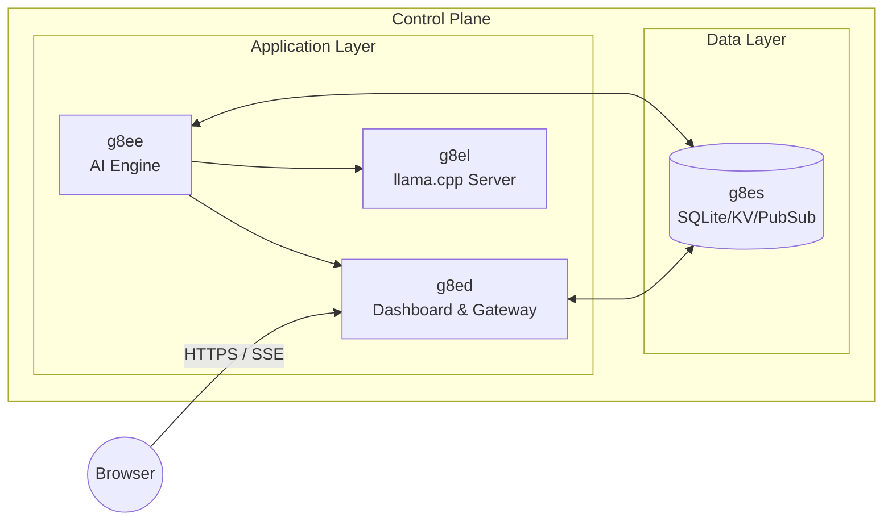

# g8el

g8el is the llama.cpp inference server component for g8e. It provides local LLM inference capabilities using the llama.cpp library, running as a Docker service that exposes an OpenAI-compatible API.

---

## Architecture

g8el is built on the official llama.cpp server image from `ghcr.io/ggml-org/llama.cpp:server`. The component extends this base image with:

- **Custom entrypoint script** (`entrypoint.sh`) that handles model download and server startup with memory locking
- **Configurable environment variables** for model selection, context size, threads, and network settings
- **Docker network integration** with the g8e internal network for service-to-service communication
- **Memory optimization** with `--mlock` flag to keep model weights pinned in RAM

### Component Relationships



- **g8ee** -- AI engine; communicates with g8el via OpenAI-compatible API for LLM inference
- **g8ed** -- Web gateway; relays browser requests to g8ee
- **g8es** -- Multi-purpose persistence layer

---

## Configuration

### Environment Variables

| Variable | Default | Description |
|----------|---------|-------------|
| `G8EL_MODEL_NAME` | `google_gemma-4-E2B-it-Q4_K_M.gguf` | Model filename to use |
| `G8EL_MODEL_URL` | Hugging Face URL | URL to download model from if not present |
| `G8EL_CONTEXT_SIZE` | `8192` | Context window size in tokens |
| `G8EL_THREADS` | `8` | Number of CPU threads for inference (set to physical core count) |
| `G8EL_HOST` | `0.0.0.0` | Host address to bind to |
| `G8EL_PORT` | `11444` | Port to listen on |

### Docker Resource Limits

| Resource | Limit | Reservation |
|----------|-------|-------------|
| CPUs | 8.0 | 2.0 |
| Memory | 16GB | 4GB |
| PIDs | 100 | - |

### Default Model

The default model is **Gemma 4 E2B** (quantized to Q4_K_M), downloaded from Hugging Face on first startup. The model is stored in the mounted volume at `/models`.

### Docker Networking

g8el runs on the `g8e-network` Docker network with the alias `g8el`. This allows g8ee to communicate with it using the endpoint `http://g8el:11444`.

---

## Usage

### Starting g8el

g8el is an optional service. Start it with:

```bash
./g8e platform up g8el
```

Or include it in a full platform start:

```bash
./g8e platform setup
```

### Configuring g8ee to use g8el

In the g8ee settings, configure the llama.cpp provider:

1. Set the LLM provider to `llamacpp`
2. Set the endpoint to `http://g8el:11444`
3. Select the model (e.g., `google_gemma-4-E2B-it-Q4_K_M.gguf`)
4. Optionally set an API key if authentication is enabled

### Health Check

g8el exposes a health endpoint at `http://localhost:11444/health`. The Docker healthcheck verifies this endpoint is accessible.

---

## Model Management

### Adding New Models

To use a different model:

1. Download the GGUF model file to the models volume
2. Update `G8EL_MODEL_NAME` to match the new filename
3. Optionally update `G8EL_MODEL_URL` if you want automatic download
4. Restart the g8el service

### Model Storage

Models are stored in the Docker volume mounted at `/models`. By default, this maps to `./components/g8ee/models` on the host.

---

## Provider Integration

g8el is integrated with g8ee as the `LLAMACPP` LLM provider. The implementation:

- **Provider class**: `LlamaCppProvider` in `components/g8ee/app/llm/providers/llama_cpp.py`
- **API compatibility**: Extends `OpenAIProvider` since llama.cpp provides an OpenAI-compatible API
- **Constants**: Defined in `components/g8ee/app/constants/settings.py` (LLAMACPP_DEFAULT_ENDPOINT, LLAMACPP_DEFAULT_MODEL, etc.)

### Streaming Support

The `LlamaCppProvider` supports streaming via the OpenAI-compatible `/v1/chat/completions` endpoint. Streaming chunks are translated to `StreamChunkFromModel` objects for consistency with other providers.

### Model Configuration

g8el supports any GGUF-format model compatible with llama.cpp. The container uses several performance optimizations:

- `--mlock`: Locks model in RAM, preventing OS swapping and ensuring consistent inference performance
- `--no-mmap`: Loads entire model into RAM before starting for faster inference
- `-b 2048`: Logical batch size for prompt processing
- `-ub 512`: Physical micro-batch size
- `--flash-attn on`: Enables Flash Attention for faster computation

For different use cases:

- **Faster inference**: Use smaller models (Q3_K quantization)
- **Higher quality**: Use larger models (Q5_K or Q6_K quantization)
- **Larger context**: Increase `G8EL_CONTEXT_SIZE` (requires more memory)

For detailed provider documentation, see [docs/components/g8ee.md](g8ee.md#llm-provider-abstraction).

---

## Security Considerations

- **Network exposure**: g8el binds to `0.0.0.0` by default but should only be accessed via the internal Docker network
- **No authentication**: By default, g8el does not require authentication. Consider adding API key authentication for production deployments
- **Resource limits**: Docker resource limits are configured (4 CPUs, 8GB memory) to prevent resource exhaustion
- **Read-only filesystem**: The container runs with a read-only filesystem except for the models volume

---

## Troubleshooting

### Model Download Fails

If the model download fails on startup:

1. Check network connectivity from the container
2. Verify the `G8EL_MODEL_URL` is accessible
3. Manually download the model and place it in the models volume

### Connection Refused

If g8ee cannot connect to g8el:

1. Verify g8el is running: `docker ps | grep g8el`
2. Check the Docker network: `docker network inspect g8e-network`
3. Verify the endpoint configuration in g8ee settings matches the g8el port

### Out of Memory

If g8el runs out of memory:

1. Reduce `G8EL_CONTEXT_SIZE` to use less memory
2. Reduce `G8EL_THREADS` to limit CPU usage
3. Use a smaller quantized model (e.g., Q3_K instead of Q4_K)
