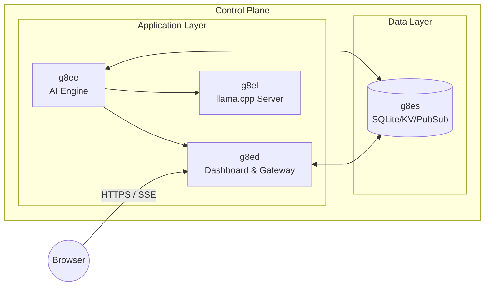

# g8el

g8el is the llama.cpp inference server component for g8e. It provides local LLM inference capabilities using the llama.cpp library, running as a Docker service that exposes an OpenAI-compatible API.

---

## Architecture

g8el extends the official llama.cpp server image (`ghcr.io/ggml-org/llama.cpp:server`) with:

- **Custom entrypoint script** (`entrypoint.sh`) that handles model download and server startup with KV cache optimization flags
- **Configurable environment variables** for model selection, context size, threads, and network settings
- **Docker network integration** with the g8e internal network for service-to-service communication
- **Memory locking** with `--mlock` flag to keep model weights pinned in RAM
- **KV cache optimization** with `--cache-reuse`, `--keep`, and `--parallel` flags for Tribunal pipeline performance

### Component Relationships



- **g8ee** -- AI engine; communicates with g8el via OpenAI-compatible API for LLM inference
- **g8ed** -- Web gateway; relays browser requests to g8ee
- **g8es** -- Multi-purpose persistence layer

---

## Configuration

### Environment Variables

| Variable | Default | Description |
|----------|---------|-------------|
| `G8EL_MODEL_NAME` | `google_gemma-4-E2B-it-Q4_K_M.gguf` | Model filename to use |
| `G8EL_MODEL_URL` | Hugging Face URL | URL to download model from if not present |
| `G8EL_CONTEXT_SIZE` | `49152` | Context window size in tokens |
| `G8EL_THREADS` | `8` | Number of CPU threads for inference |
| `G8EL_HOST` | `0.0.0.0` | Host address to bind to |
| `G8EL_PORT` | `11444` | Port to listen on |

### Docker Configuration

g8el uses the following Docker configuration in `docker-compose.yml`:

- **CPU affinity**: `cpuset: "0-7"` binds the container to CPU cores 0-7
- **Memory locking**: `ulimit memlock: -1` allows unlimited memory locking for `--mlock`
- **Security**: All capabilities dropped, no-new-privileges enabled
- **Network**: Internal `g8e-network` with alias `g8el` for service discovery

No explicit CPU or memory limits are set in docker-compose.yml; resource constraints are managed through CPU affinity and the host's available resources.

### Default Model

The default model is **Gemma 4 E2B** (quantized to Q4_K_M), downloaded from Hugging Face on first startup. The model is stored in the mounted volume at `/models` (host path: `./components/g8ee/models`).

### Docker Networking

g8el runs on the `g8e-network` Docker network with the alias `g8el`. This allows g8ee to communicate with it using the endpoint `http://g8el:11444`.

---

## Usage

### Starting g8el

g8el starts as part of the default platform services. Use the standard platform commands:

```bash
./g8e platform setup    # First-time setup: builds and starts all services
./g8e platform start    # Start all services (including g8el)
./g8e platform stop     # Stop all services
```

g8el is included in the default service set alongside g8es, g8ee, g8ed, and g8ep.

### Configuring g8ee to use g8el

In the g8ee settings, configure the g8el provider:

1. Set the LLM provider to `g8el`
2. Set the endpoint to `http://g8el:11444` (this is the default in `G8EL_DEFAULT_ENDPOINT`)
3. Select the model (e.g., `google_gemma-4-E2B-it-Q4_K_M.gguf`)
4. Optionally set an API key if authentication is enabled

### Health Check

g8el exposes a health endpoint at `http://localhost:11444/health`. The Docker healthcheck verifies this endpoint is accessible with a 300-second start period to account for model download on first startup.

---

## Model Management

### Adding New Models

To use a different model:

1. Download the GGUF model file to the models volume (`./components/g8ee/models/` on the host)
2. Update `G8EL_MODEL_NAME` in docker-compose.yml to match the new filename
3. Optionally update `G8EL_MODEL_URL` if you want automatic download
4. Restart the g8el service: `./g8e platform restart`

### Model Storage

Models are stored in the Docker volume mounted at `/models` in the container, which maps to `./components/g8ee/models/` on the host. This volume is shared with g8ee for model file access.

---

## Provider Integration

g8el is integrated with g8ee as a first-class `G8EL` LLM provider. The implementation:

- **Provider class**: `G8elProvider` in `components/g8ee/app/llm/providers/g8el.py`
- **API compatibility**: Extends `LlamaCppProvider` (which extends `OpenAIProvider`) since g8el provides an OpenAI-compatible API
- **Constants**: Defined in `components/g8ee/app/constants/settings.py`:
  - `G8EL_DEFAULT_ENDPOINT = "http://g8el:11444"`
  - `G8EL_DEFAULT_MODEL = "google_gemma-4-E2B-it-Q4_K_M.gguf"`
- **Factory**: `get_llm_provider()` in `components/g8ee/app/llm/factory.py` instantiates `G8elProvider` when `LLMProvider.G8EL` is selected

### Streaming Support

The `G8elProvider` (via its inheritance from `LlamaCppProvider` and `OpenAIProvider`) supports streaming via the OpenAI-compatible `/v1/chat/completions` endpoint. Streaming chunks are translated to `StreamChunkFromModel` objects for consistency with other providers.

### Performance Optimizations

The entrypoint.sh script includes the following llama.cpp server flags for optimal performance:

- `--mlock`: Locks model in RAM, preventing OS swapping and ensuring consistent inference performance
- `--cache-reuse 256`: Enables KV cache reuse up to 256 tokens for Tribunal pipeline efficiency
- `--keep -1`: Keeps the KV cache between requests (default is to clear after each request)
- `--parallel 6`: Configures 6 parallel processing slots for Tribunal (5 members + 1 auditor)

### Prefix Cache Optimization

The KV cache reuse flags are critical for Tribunal pipeline performance. The Tribunal generator emits 5 parallel members plus 1 auditor per round; without sufficient parallel slots and cache reuse, the static-prefix-first template ordering is defeated.

These flags work in conjunction with the static-prefix-first template ordering documented in `docs/architecture/agent_personas.md`. The entrypoint.sh is pre-configured with these optimizations.

To verify the flags are active, use the prefix cache measurement script:

```bash
./scripts/testing/measure_prefix_cache.sh
```

### Model Selection Guidelines

For different use cases:

- **Faster inference**: Use smaller models (Q3_K quantization)
- **Higher quality**: Use larger models (Q5_K or Q6_K quantization)
- **Larger context**: Increase `G8EL_CONTEXT_SIZE` (requires more memory)

For detailed provider documentation, see [docs/components/g8ee.md](g8ee.md#llm-provider-abstraction).

---

## Security Considerations

- **Network exposure**: g8el binds to `0.0.0.0` by default but should only be accessed via the internal Docker network (`g8e-network`). The port 11444 is also exposed to the host for debugging purposes.
- **No authentication**: By default, g8el does not require authentication. Consider adding API key authentication for production deployments by configuring `llamacpp_api_key` in g8ee settings.
- **Security hardening**: The container drops all capabilities, enables `no-new-privileges`, and runs with a non-root user.
- **Resource constraints**: CPU affinity (`cpuset: "0-7"`) limits g8el to specific CPU cores. No explicit memory limits are set in docker-compose.yml.

---

## Troubleshooting

### Model Download Fails

If the model download fails on startup:

1. Check network connectivity from the container: `docker exec g8el curl -I https://huggingface.co`
2. Verify the `G8EL_MODEL_URL` is accessible from the host
3. Manually download the model and place it in `./components/g8ee/models/` on the host
4. Restart the service: `./g8e platform restart g8el`

### Connection Refused

If g8ee cannot connect to g8el:

1. Verify g8el is running: `docker ps | grep g8el`
2. Check g8el logs: `docker logs g8el`
3. Check the Docker network: `docker network inspect g8e-network`
4. Verify the endpoint configuration in g8ee settings matches `http://g8el:11444`
5. Verify g8el is healthy: `docker inspect g8el --format='{{.State.Health.Status}}'`

### Out of Memory

If g8el runs out of memory:

1. Reduce `G8EL_CONTEXT_SIZE` in docker-compose.yml to use less memory
2. Reduce `G8EL_THREADS` to limit CPU usage
3. Use a smaller quantized model (e.g., Q3_K instead of Q4_K)
4. Check host memory availability: `free -h`

### Slow Inference

If inference is slow:

1. Verify the optimization flags are active: `docker inspect g8el --format='{{.Config.Cmd}}'` should show `--cache-reuse`, `--keep`, and `--parallel`
2. Check CPU affinity is working: `docker inspect g8el --format='{{.HostConfig.CpusetCpus}}'` should show `0-7`
3. Verify memory locking is enabled: `docker exec g8el ulimit -l` should show `unlimited`
4. Consider using a smaller model or quantization level
