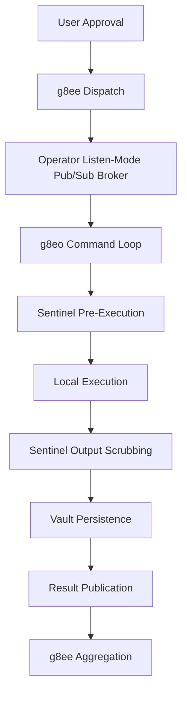

# g8eo — g8e Operator

Last Updated: 2026-05-10
Version: v0.2.2

g8eo is the Go-based reference implementation of the Operator for the g8e platform. It provides language-agnostic, secure, real-time command execution and file management for remote system operations.

> For deep-reference security documentation — CA trust bootstrap, mTLS, fingerprint binding, replay protection, operator binding, Sentinel pre-execution threat detection, output scrubbing patterns, LFAA vault encryption, and the Ledger — see [architecture/security.md](../architecture/security.md).

---

## Core Principles

- **Zero-trust security**: Every operation requires authentication; nothing is implicitly trusted.
- **Protocol-governed execution**: Every command is carried as a serialized Protobuf `UniversalEnvelope` with typed `operator.proto` payload bytes and L1/L2/L3 governance metadata.
- **Data sovereignty**: Command output stays local by default; only metadata travels to the cloud.
- **Defense in depth**: Multiple security layers — mTLS, certificate pinning, and Sentinel platform-wide protection.
- **Outbound-only connectivity**: g8eo initiates all connections; no inbound ports required in default mode.

---

## Operating Modes

g8eo supports four primary operating modes to balance security, performance, and deployment flexibility:

### 1. Outbound Mode (Default)
**The standard deployment.** g8eo acts as a remote Operator that dials into the platform. This enables execution on machines behind strict firewalls without requiring inbound firewall rules.

### 2. Listen Mode (`--listen`)
**Operator listen mode.** In this mode, the Operator binary provides persistence, blob storage, and pub/sub for Dashboard and Engine. Runtime state is rooted at `.g8e/` by the host lifecycle scripts.

### 3. SSH Stream Mode (`stream` subcommand)
**Agentless fleet operations.** A Go-native concurrent SSH engine that allows g8e to "stream" itself onto remote hosts. This is used for temporary operations on hosts where a permanent g8eo installation is not desired.

### 4. OpenClaw Mode (`--openclaw`)
**Gateway integration.** Connects directly to an OpenClaw Gateway as a Node Host, allowing g8eo to be used as a high-performance shell execution engine for third-party platforms.

---

## Lifecycle & Pipeline

### Startup Sequence
g8eo initialization is a two-phase process to ensure security before any core logic is loaded:

1. **Phase 1: Bootstrap (Pre-Auth)**
   - **CA Discovery**: Scans local volume mount paths (`/ssl/ca.crt`, etc.) before falling back to an HTTPS fetch.
   - **Authentication**: Authenticates with the platform using an API key or Device Token.
   - **Configuration**: Receives its Operator ID, Session ID, and a per-operator mTLS certificate.

2. **Phase 2: Service Initialization (Post-Auth)**
   - **Execution Engine**: Starts the shell execution and file editing services.
   - **Storage Layer**: Initializes the local vaults (Scrubbed, Raw, Audit) and the Git-backed Ledger.
   - **Connectivity**: Establishes the persistent WebSocket connection to the pub/sub broker.
   - **Sentinel**: Activates pre-execution threat detection and post-execution output scrubbing.

### Command Pipeline


g8eo treats g8ee as untrusted input at the protocol boundary. The command loop rejects non-envelope command bytes, decodes recognized `UniversalEnvelope.payload` values into typed `operator.proto` request messages, enforces L1 Technical Bedrock gates through reflected `forbidden_patterns` options, verifies the L2 Tribunal signature when configured, and checks `state_merkle_root` when a comparable local root is available. L3 authorization evidence is carried in `governance.l3`; auto-approval is L3 state only and never bypasses L1 or L2.

---

## Storage Architecture

g8eo implements the **Local-First Audit Architecture (LFAA)**, maintaining four independent local stores in the `.g8e/` directory.

| Store | Purpose | Access |
|---|---|---|
| **Scrubbed Vault** | Sentinel-scrubbed command output and file diffs. | AI Engine (g8ee) |
| **Raw Vault** | Unscrubbed full output for forensics. | Local User Only |
| **Audit Vault** | Append-only event timeline (LFAA). | Platform / Audit |
| **Ledger** | Git-backed cryptographic version history for all modified files. | Platform / Audit |

The LFAA Audit Vault (`.g8e/data/g8e.db`) can be queried directly using SQLite for forensic analysis and audit review. See [Storage Architecture - Querying the LFAA Audit Vault](../architecture/storage.md#querying-the-lfaa-audit-vault) for raw SQL queries and the Python CLI tool reference.

*Note: The Ledger requires a functional `git` binary and is automatically disabled if git is unavailable or `--no-git` is passed.*

---

## Canonical Truths

The g8e protocol is defined in `shared/proto/`; shared constants JSON registries remain the source for event names, status values, and channel prefixes. g8eo mirrors those registries as compile-time Go constants in the `constants/` package:

- **Protocol**: generated Go artifacts under `shared/proto/` mirror `shared/proto/common.proto`, `shared/proto/operator.proto`, and `shared/proto/pubsub.proto`.
- **Events**: `constants/events.go` mirrors `shared/constants/events.json`.
- **Status**: `constants/status.go` mirrors `shared/constants/status.json`.
- **Channels**: `constants/channels.go` mirrors `shared/constants/channels.json`.

---

## Internal Platform Authentication

Components (Dashboard, Engine, and Operator listen mode) use a shared `internal_auth_token` for internal traffic.

- **Authoritative Source**: `.g8e/ssl/internal_auth_token` under the repository runtime directory.
- **Generation**: Generated by Operator listen mode on first start.
- **Enforcement**: Required in the `x-internal-auth` header for all internal HTTP requests.

---

## Operational Reference

### CLI Reference
g8eo provides a comprehensive set of flags for runtime configuration. Use the `--help` flag to see all available options for the current version:

```bash
g8e.operator --help
g8e.operator stream --help
```

### Security Exit Codes
If g8eo encounters a critical configuration or security error, it self-terminates with a specific exit code:

| Code | Meaning | Action |
|---|---|---|
| **2** | Auth Failure | Verify API Key / Token |
| **4** | Network Error | Check endpoint connectivity |
| **5** | Config Error | Validate CLI flags / Environment |
| **7** | TLS Cert Failure | CA trust mismatch; check certificates |
