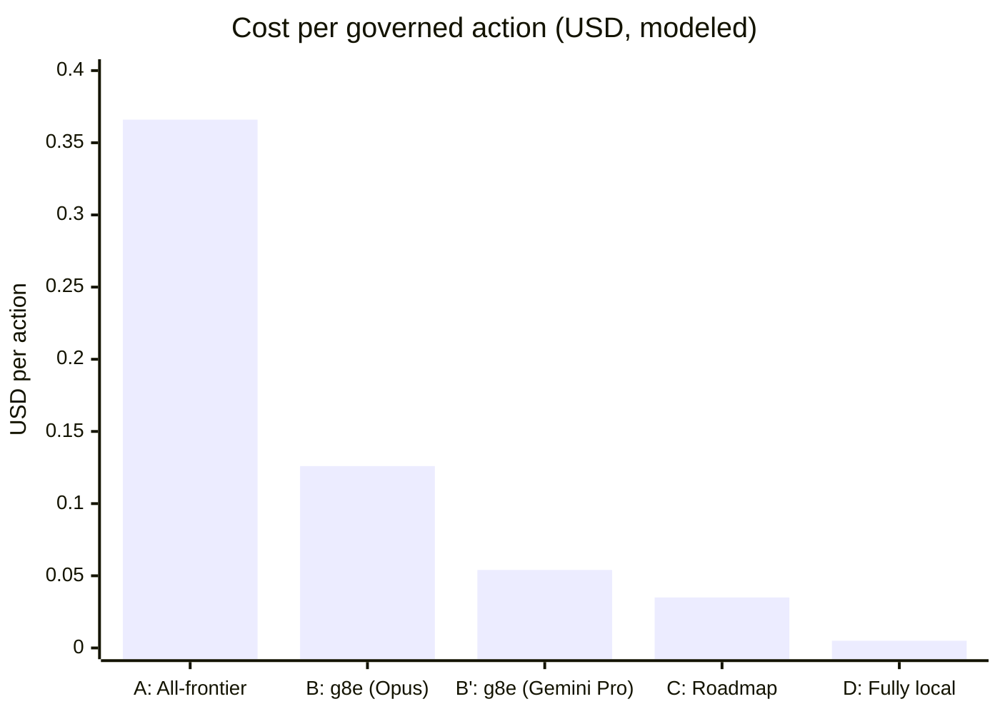

# Position Paper

## The Custody Problem

Every contemporary agent architecture makes the same trade: give the cloud custody of your data to get frontier reasoning. The model needs context to reason. Context is your data. So your data goes to the model. The provider accumulates it, persists it, and may train on it. You get reasoning in exchange for custody. This trade is presented as inevitable. It is not.

The trade exists because current architectures conflate two functions that should be separated: reasoning and state. The model reasons. The host remembers. When both live in the cloud, the provider holds custody by construction. When the host remembers and the cloud only reasons, custody stays with the data owner. The model receives tokenized projections and cryptographic commitments, never raw data. It returns conclusions. The host verifies, executes, and records.

g8e implements this separation. The canonical unit of work is the `GovernanceEnvelope`, a protobuf message that binds identity, intent, state, and governance proofs into a single transaction. The envelope carries the action type, target resource, payload, nonce, expiration timestamp, state Merkle root, and structured intent data. It is the atom of the system: every mutation, every tool call, every file edit is wrapped in one. The cloud functions as a stateless reasoning co-processor that consumes and produces envelopes. The host maintains canonical state, encryption keys, and the audit ledger. The boundary between them carries proofs in one direction and commitments in the other, never custody.

## The Sovereignty Inversion

The architectural mechanism is an inversion of control over state and trust. The gateway can live in the cloud. The operator lives at the site of the data owner. The data owner trusts nobody: not the cloud provider, not the gateway, not the network between them.

The operator opens a single outbound mTLS connection to the gateway, authenticated via SPIFFE workload identities issued by an internal PKI. It listens on no ports. It accepts no inbound connections. It can sit behind NAT, firewalls, or air gaps. The gateway cannot reach into the operator; the operator pulls work when it chooses. No installation is required beyond a single static binary. No firewall rules need to be opened. No listening ports need to be configured on the managed host.

When the operator retrieves an envelope from the gateway, it does not trust the gateway's verification. The `L4Warden` re-derives every proof from scratch against the operator's own local state. The verification pipeline is sequential and fail-closed. First, early tracking and durable nonce reservation prevent replay after verifying the expiration timestamp. Then stateless validation decodes the payload, recomputes the transaction hash via `GenerateMessageID`, and evaluates L1 doctrine rules against the payload, action type, and target resource. Then stateful validation compares the envelope's `state_merkle_root` against the operator's current ledger state. Finally, posture-aware checks verify L2 consensus signatures and L3 human authorization proofs. If any proof is stale, tampered, or missing, the transaction is rejected. The gateway is a relay, not an authority. The operator is the authority, and the operator lives where the data lives.

This inversion is what makes the cloud safe to use as a reasoning utility. A compromised gateway cannot inject actions because the operator re-verifies everything. A compromised cloud provider cannot decrypt host data because vault keys were never shared. A compromised network cannot intercept raw data because only tokenized projections cross the mTLS boundary.

## Commitments, Not Custody

The cloud reasoning layer receives commitments, not data. A commitment is a cryptographic binding to a specific state of the world at a specific moment. The transaction hash binds the intent. The state Merkle root binds the host state. The nonce and expiration timestamp bind the moment. Together, these form a commitment that the model can reason over without ever seeing the underlying values.

Before any intent material crosses the sovereignty boundary, it is tokenized and scrubbed. The `ScrubbingService` applies a sequence of pattern-based scrubbers — API keys, JWTs, cloud provider credentials, private keys, connection strings, email addresses, phone numbers, credit card numbers, IBANs, and custom patterns defined in doctrine — replacing each match with an opaque `{{UEI_N}}` token. The mapping is persisted to an encrypted `TokenStore` with a 24-hour TTL so tokens survive operator restarts. When persistence is required but unavailable, the service fails closed: the token is not issued and the operation is rejected. The transaction hash is computed over the tokenized payload. The model upstream reasons over a safe projection of reality. It sees structure without substance. It can infer, plan, and recommend, but it cannot exfiltrate what it cannot read.

Rehydration happens only at the `L5Actuator`, at the instant of execution, on the host where the data already lives. The actuator inspects the incoming `CommandMessage` payload and calls `RehydratePayload` to recursively replace every `{{UEI_N}}` token with its original value throughout the JSON structure. If rehydration fails, the operation fails closed. The rehydrated payload is injected back into the command message. The actuator executes the verified action and records the result. The real values never leave the host. The cloud model never sees them. The gateway never sees them. Only the operator, running at the site of the data owner, with keys owned by the data owner, performs rehydration.

This is the mechanism that reduces cloud providers to co-processors. The provider supplies reasoning. The host supplies state, keys, and execution. The provider cannot reconstruct the data because it only ever held tokens. The provider cannot replay the action because the commitment is bound to a specific transaction hash, state root, and nonce. The provider cannot escalate because the permissions minted from the envelope are scoped to a single action and dissolved on completion.

## The Unified Context and Control Plane

Current agent architectures separate the control plane (what actions are permitted) from the data plane (what the agent knows). The control plane enforces policy. The data plane provides context. When these are separate, the data plane is a trusted storage layer that can be poisoned, and the control plane is a gate that can be bypassed if the data plane is compromised.

g8e unifies them. The `CommitmentLedger` — a SQLite-backed, hash-chained attestation store — governs execution and serves as the context substrate. Every admitted action produces a commitment attestation containing the transaction ID, transaction hash, state root at commit, L2 signature digest, actuator intent signature digest, human signature digest, action type, and target resource. The attestation is appended atomically: the `AppendCommitmentJSON` method verifies that the `prior_commitment_hash` matches the current ledger head inside a database transaction, preventing two concurrent attestations from chaining to the same predecessor. Every admitted action also writes a signed `ActionReceipt` to a host-local audit store and records file mutations in a git-backed ledger before and after execution. This Local-First Audit Architecture (LFAA) is the enforcement record of the write path and the verifiable memory of the read path. Agents derive context from this chain and verify it against live host state through governed tools.

Context delivery and action governance are the same operation on the same object. An agent whose actions are gated by cryptographic proof and whose beliefs are derived from a verifiable ledger has no trusted storage to poison. The ledger is tamper-evident: each commitment is hash-chained to the previous commitment, and the chain root is included in every subsequent transaction's state binding. An attacker who modifies a historical entry breaks the chain. An attacker who injects a fabricated entry cannot produce a valid Ed25519 signature from the actuator's signing key.

The ledger never leaves the host. The cloud provider sees commitments (transaction hashes, state roots) but not the ledger contents. The gateway sees envelopes but not the audit vault. The audit vault is encrypted at rest with AES-256-GCM using keys owned by the data owner. The ledger is memory, and memory is sovereign.

## Proof of Human Presence

High-risk mutations require proof that a human authorized the exact action being executed. g8e uses a layered L3 Notary model. The `gatewayNotary` requires WebAuthn/FIDO2 passkey assertions as the primary authorization layer. The passkey verifier validates the WebAuthn assertion using the transaction hash as the challenge — the human signs the exact bytes of one transaction. The assertion is bound to the transaction hash, the nonce, the expiration timestamp, and the state Merkle root. It cannot be transplanted to a different action, replayed against a later request, or harvested from a live session.

For CLI callers, a second layer provides transport authentication: if the `L3Proof` includes an mTLS certificate fingerprint, the `CLISessionVerifier` checks user active status, session ownership, fingerprint match via constant-time comparison, and certificate revocation. This is a layered model: passkey proves human presence, mTLS proves transport identity. Browser-only sessions skip the mTLS layer entirely. In outbound mode, the notary verifies a suspended transaction lookup, explicit approval status, a 30-minute approval window, and an Ed25519 signature over the transaction hash against a stored public key.

This is distinct from session-based authentication. A session token grants ongoing authority to act on behalf of a user. A passkey assertion over a transaction hash grants authority for one action, at one moment, against one state of the host. The approval expires with the transaction. There is no standing authorization to revoke because there was never standing authorization to begin with.

Human signatures are rare and expensive. Each one requires a physical interaction with a hardware-backed key: a touch, a face scan, a PIN entry. This cost is intentional. It makes human authorization a non-recoverable bond. When a human signs a transaction, they are expressing genuine belief that the action should proceed. The system does not ask for this belief often, and it does not accept it cheaply. The L3 Notary is fail-closed under notary posture: the `L4Warden`'s `verifyL3Posture` rejects mutations without a valid human proof before execution is dispatched.

## Zero Standing Privileges

The operator holds no permanent administrative credentials. Permissions are minted just-in-time from the verified intent inside the governance envelope. The `L5Actuator` calls `MintCapability` to produce a `Capability` struct scoped to a single action: one tool call, one file edit, one command execution. The capability binds the action type, target resource, transaction hash, operator identity, operator session, expiry timestamp, and a random single-use token signed by the actuator's Ed25519 key. It is injected into the execution context via `ContextWithCapability` so downstream handlers can verify it. The capability is dissolved the moment the action completes — `cap.Dissolve()` is called immediately after the handler returns, whether the action succeeded or failed. There is no credential store to compromise, no token to steal, no role to assume.

This applies to every layer. The gateway does not hold execution authority; it relays envelopes. The operator does not hold standing admin rights; it mints scoped capabilities per action. The human does not hold a session; they sign one transaction. The model does not hold data; it reasons over commitments. No component in the system accumulates privilege over time.

A compromise of any single layer cannot exfiltrate persistent credentials because none exist. A compromised gateway cannot execute actions because it has no execution path. A compromised operator cannot escalate beyond the scoped capability minted from the verified envelope. A compromised cloud provider cannot decrypt host data because the vault keys were never shared. The system's security does not depend on the integrity of any single component. It depends on the fact that no component holds enough privilege to cause harm in isolation.

## Cryptographic Binding

Every proof in the system is rigidly attached to one action, one moment, and one host. The transaction hash is computed by `GenerateMessageID`, which builds a canonical string representation of the governance envelope in protobuf field definition order: action type, target resource, payload (base64-encoded), state Merkle root, nonce, expiration timestamp (UTC RFC3339), intent data (recursively canonicalized), requestor user ID, and acting app ID. Fields are pipe-delimited, absent optional fields are omitted, and the result is hashed with SHA-256 and hex-encoded. Changing any field changes the hash. Changing the hash invalidates every signature attached to it.

The L3 proof is intentionally excluded from the transaction hash. The protocol ordering is L1 → L2 → L3 → L4: the consensus signs the transaction hash before the human is asked. Including L3 in the hash would create a circular dependency — L2 could not sign until the human had already acted, violating the invariant that the human is never bothered until all machine-checkable layers pass. Tamper-evidence for L3 is provided by `verifyL3Posture`, which checks the proof against the envelope's transaction hash at verification time.

This binding prevents replay, tampering, and substitution. A proof valid for one transaction is invalid for every other transaction. A proof valid at one moment is invalid at any other moment because the expiration timestamp is part of the hash. A proof valid against one state of the host is invalid against any other state because the state Merkle root is part of the hash. The operator re-derives the state root from its local state and compares it to the root in the envelope. If the host state has changed since the envelope was created, the proof is stale and the transaction is rejected.

The state Merkle root is the mechanism that binds proofs to the host's actual state. The `GitLedgerService` returns the current git HEAD commit hash as the state Merkle root via `GetStateMerkleRoot`. When an action executes, files change, a new commit is created, and the root changes. The next transaction must commit to the new root. This creates a chain: each transaction is bound to the state that resulted from all previous transactions. An attacker cannot insert a transaction between two existing ones because the state roots would not chain. An attacker cannot modify a past transaction because the hash would change and break the chain.

## The Ledger as Memory

The hash-chained ledger serves two roles simultaneously. It is the enforcement record of the write path: every admitted action, every rejection, every receipt. It is also the verifiable memory of the read path: the context substrate from which agents derive beliefs about the host.

These two roles are unified in a single data structure because they are the same data. The history of what was done is the context for what to do next. An agent that reads the ledger knows what actions were attempted, which succeeded, which were rejected, and what state resulted. An agent that verifies the ledger knows the chain is intact, the signatures are valid, and the state roots are consistent. An agent that extends the ledger must produce a valid envelope, clear the admission pipeline, and receive a signed receipt. Reading, verifying, and writing are governed by the same cryptographic primitives.

The ledger is git-backed via `GitLedgerService`. Every file mutation triggers a two-phase commit: a pre-mutation snapshot and a post-mutation snapshot, each recorded as a git commit in the `files/` repository under the ledger directory. This provides rollback capability and a tamper-evident history trail. The ledger is encrypted at rest. File contents are encrypted with AES-256-GCM before storage, with the `.enc` suffix appended to ciphertext files. A compromised host disk does not reveal file contents. A compromised backup does not reveal file contents. Only the operator, with an unlocked vault, can read the ledger.

The `L5Actuator` enforces a dual-receipt model for every execution. Before dispatch, it signs an initial `ActionReceipt` with status `EXECUTING` and logs it to the audit store. This is the intent-to-execute record. If receipt signing or audit logging fails, the handler is not executed — the system fails closed. After execution, the actuator signs a final `ActionReceipt` with the completion status, result summary, state root before and after, and L2/L3 validation status. If the final signing fails, the initial `EXECUTING` receipt is returned as evidence that execution was attempted. The mutation already happened; evidence must be preserved.

The ledger never leaves the host. The cloud provider sees commitments but not ledger contents. The gateway sees envelopes but not the audit vault. The audit vault is the host's memory, and memory is sovereign.

## Encryption as a Sovereignty Guarantee

All sensitive data at rest is encrypted with AES-256-GCM using keys that never leave the host in plaintext. The vault architecture uses a layered key hierarchy: the operator's private key wraps a key encryption key (KEK), the KEK wraps data encryption keys (DEKs), and DEKs encrypt payloads. Key rotation is supported through rekey operations that re-wrap KEKs without re-encrypting underlying data.

The encryption layer is mandatory, not optional. Storage services fail to initialize without an unlocked vault. The `GitLedgerService` constructor returns an error if `EncryptionVault` is nil. The vault must be unlocked at startup with the master key. If the vault is locked, the operator cannot read the audit store, cannot read the ledger, cannot read the execution vault, cannot read the token store. The system fails closed rather than operating without encryption.

This is the mechanism that makes the data owner's key ownership meaningful. The keys are generated on the host, stored on the host, and never shared with the gateway or cloud provider. A compromised cloud cannot decrypt host data. A compromised gateway cannot decrypt host data. A subpoena to the platform vendor yields no data because the vendor never held the keys. The data owner retains sole control over who can read their data.

## The Gateway-Operator Relationship

The gateway and the operator are two roles implemented by the same binary. The gateway is the Policy Decision Point (PDP): it admits signed envelopes, manages PKI, and enforces freshness and replay defense. The operator is the Policy Execution Point (PEP): it re-verifies proofs locally, executes actions, and maintains the audit ledger. The gateway does not execute. The operator does not admit. The separation is architectural, not configurational.

The `L5Actuator` is the execution boundary. It dispatches verified transactions to the `ExecutionHandler` interface — a single method, `ExecuteVerifiedTransaction`, that receives the execution context carrying the just-in-time capability, event type, and command message. The actuator does not re-verify L2 or L3 proofs; by design, the `L4Warden` performs all pre-dispatch verification and embeds the results in a `VerifiedTransaction`. L5 trusts that structure, records the L2/L3 status in the `ActionReceipt` for audit, and focuses on execution safety: fail-closed receipt signing, JIT capability minting, fail-closed payload rehydration, and audit logging. The separation between L4 (verification) and L5 (execution) is the defense-in-depth boundary — two independent components with distinct responsibilities.

The gateway can run in the cloud. The operator runs at the site of the data owner. The operator initiates a single outbound mTLS connection to the gateway. The gateway does not initiate connections to the operator. The operator pulls work when it chooses and can disconnect at any time. When disconnected, the operator continues to serve the host from its local state. The gateway queues envelopes; the operator retrieves them when connectivity is restored.

This relationship is what makes the platform deployable in environments where inbound connectivity is impossible or prohibited. A hospital network that blocks inbound connections to clinical systems can still run an operator: the operator dials out to the gateway, retrieves pending envelopes, and executes them locally. A tactical edge network with intermittent connectivity can still run an operator: the operator caches work, executes when connected, and syncs receipts when bandwidth is available. An air-gapped facility can still run an operator: the operator runs standalone with locally configured doctrine, and envelopes are transferred via physical media.

The gateway and the operator share no filesystem, no database, no memory. They communicate exclusively through the mTLS channel and the governance envelope. The gateway sees envelopes and commitments. The operator sees envelopes, state, and raw data. The gateway's compromise does not expose data. The operator's compromise does not expose the gateway's PKI. Each component's failure domain is isolated.

## The Economics of Governance

The standard objection to multi-agent consensus before execution is cost: if every mutation requires a quorum of models to deliberate, the inference bill multiplies with the layer count. The objection is empirically grounded — for homogeneous frontier ensembles. Published measurements of multi-agent debate architectures show a 2.1×–3.4× token cost multiplier over single-agent self-correction, frequently for accuracy that is statistically comparable to or worse than the non-communicative baseline, with sycophantic convergence intensifying as model scale increases ([arXiv:2605.00914](https://arxiv.org/pdf/2605.00914)). Running consensus on N copies of the same frontier model buys correlated failure at N times the price.

g8e's admission pipeline inverts the cost structure the same way it inverts custody. The pipeline is heterogeneous by construction: small language models (2–4B effective parameters, self-hosted, g8e-conformant) handle the narrow, structured decisions — triage classification, intent interrogation, and the L2 consensus votes — while frontier models are reserved for the two roles where generalist reasoning is load-bearing: planning and risk audit. This is the architecture NVIDIA's research arm now argues is the correct default for agentic systems generally — SLM-first, LLM-on-demand — on the observation that serving a ~7B model is 10–30× cheaper in latency, energy, and FLOPs than a 70–175B model on narrow, repetitive tasks ([Belcak et al., arXiv:2506.02153](https://arxiv.org/pdf/2506.02153)). A structured admission vote over a scrubbed, tokenized envelope is precisely such a task.

### Where the Tokens Go

The modeled token budget below reflects a moderate-complexity mutation clearing the full pipeline. These are planning estimates, not gateway telemetry; envelope sizes vary by domain and doctrine configuration, and the model should be re-run against measured means for any specific deployment.

| Pipeline stage | Inference calls | Input tokens | Output tokens | Model class |
| --- | --- | --- | --- | --- |
| Triage classification | 1 | 1,500 | 50 | SLM (~2B) |
| Intent interrogation | 1 | 1,000 | 200 | SLM (~2B) |
| Planning (Sage) | 1 | 8,000 | 1,500 | Frontier LLM |
| L2 consensus (5 agents × 2 rounds) | 10 | 30,000 | 3,000 | SLM (~4B) |
| Risk audit (Auditor) | 1 | 5,000 | 800 | Frontier LLM |
| L3 Notary / L4 Warden / L5 Actuator | 0 | 0 | 0 | Human / deterministic |
| **Total** | **14** | **45,500** | **5,550** | |

The distribution is the point. The consensus layer — the part of the pipeline that looks expensive on an architecture diagram — accounts for roughly 70% of input tokens and 10 of the 14 inference calls, and it runs entirely on the cheapest compute in the system. The frontier spend is confined to two calls totaling ~13K input / ~2.3K output tokens. Governance is verification-heavy and reasoning-light, and the topology prices it accordingly.

### Cost per Governed Action

Reference API rates, July 2026 (published list prices, per million input/output tokens): Claude Opus 4.8 $5/$25, Claude Sonnet 5 $3/$15, Gemini 3.1 Pro $2/$12, Gemini 3.5 Flash $1.50/$9. Self-hosted SLM cost on a single 24 GB consumer GPU is dominated by hardware amortization, not energy — marginal electricity for a 2–4B-class model runs on the order of $0.001 per million tokens, with fully amortized cost near $0.10 per million tokens at moderate utilization, and lower with batching.

| Configuration | Frontier tokens (in/out) | Cost / action | Cost / 10K actions·mo |
| --- | --- | --- | --- |
| A. All-frontier pipeline (Opus 4.8 everywhere) | 45.5K / 5.55K | $0.366 | $3,660 |
| B. g8e topology — Sage + Auditor on Opus 4.8 | 13K / 2.3K | $0.126 | $1,260 |
| B′. g8e topology — Sage + Auditor on Gemini 3.1 Pro | 13K / 2.3K | $0.054 | $540 |
| C. Roadmap — Auditor on SLM + vector retrieval; Sage only frontier | 8K / 1.5K | $0.035 | $350 |
| D. Fully local (4B-class planner, degraded reasoning) | 0 / 0 | ~$0.005 | ~$50 |

Three observations fall out of the table.

First, the local ensemble's share of the bill in configurations B and C is approximately $0.004 per action — about 3% of the total. The entire five-agent, two-round consensus mechanism, plus triage and interrogation, costs less per action than a single frontier API call's tool-use overhead. The multi-agent cost multiplier that the debate literature measures at 2.1×–3.4× collapses to noise when the quorum runs on hardware whose marginal cost rounds to zero.

Second, the frontier line item is further compressible through prompt caching. The planner's system prompt, doctrine context, and tool schemas are static across transactions; cached input bills at roughly 10% of the list rate across providers. Realistic cached operation lands configuration B near $0.08 per action and B′ near $0.04.

Third, the delta between configuration C and an ungoverned single-model agent is the honest headline number. A bare frontier agent making one planning call per action costs ~$0.030 at Gemini 3.1 Pro rates. The fully governed pipeline in configuration C costs ~$0.035. Full five-layer admission — deterministic doctrine, heterogeneous consensus, human notarization, fail-closed re-verification, and tamper-evident receipts — adds roughly $0.005 and 15% to the cost of the reasoning it governs.

### Comparables

| System / study | Architecture | Reported economics |
| --- | --- | --- |
| Homogeneous multi-agent debate ([arXiv:2605.00914](https://arxiv.org/pdf/2605.00914)) | N frontier-class agents, iterative debate | 2.1×–3.4× token cost vs. single-agent self-correction; accuracy comparable or worse; sycophancy up to 95.4% at 32B scale |
| Multi-Agent Judge ([arXiv:2511.06396](https://arxiv.org/pdf/2511.06396)) | Debate-based safety judging on 14B open-weight backbones | κ = 0.7331, within 0.026 of GPT-4o agreement, at 46% of GPT-4o's per-query cost |
| SLM-first agentic systems ([arXiv:2506.02153](https://arxiv.org/pdf/2506.02153)) | Heterogeneous SLM/LLM routing | 10–30× cost reduction on narrow subtasks; recommended default architecture |
| g8e admission pipeline (modeled, this paper) | 5-agent heterogeneous SLM quorum + 2 frontier roles | Consensus ≈ 3% of per-action cost; full governance overhead ≈ $0.005/action |

The Multi-Agent Judge result is the closest published analogue to the L2 layer — heterogeneous small-model consensus rendering a verdict before a decision is committed — and it demonstrates that small-backbone quorums can match frontier single-judge agreement at half the cost even at 14B scale, on an open-ended judging task. The g8e vote is narrower still: a signed, single-round verdict over a canonical SHA-256 transaction hash and a scrubbed payload, not an iterative debate over free text. Narrower task, smaller viable model, lower cost. The heterogeneity of the quorum is also the documented mitigation for the conformity collapse that degrades homogeneous ensembles: agents with different weights do not share failure modes, which is the property that makes k-of-n voting meaningful in the first place.

### Latency

| Stage | Modeled latency | Notes |
| --- | --- | --- |
| Triage + interrogation | < 1 s | 2B-class, ~200 output tokens combined |
| L2 consensus | 3–6 s | 5 agents concurrent, 2 sequential rounds, 100–200 tok/s per agent |
| Planning (frontier) | 5–15 s | ~1.5K output tokens |
| Risk audit | 3–8 s frontier; sub-second on roadmap SLM + retrieval | Retrieval replaces reasoning over the risk corpus |
| Machine-layer total (pre-L3) | ~10–25 s | |
| L3 human notarization | Unbounded | Dominates wall-clock for high-risk mutations by design |

The latency budget clarifies why the consensus layer is effectively free in time as well as money. For any mutation that reaches the L3 Notary, wall-clock time is bounded by a human touching a hardware key — an interval measured in minutes or hours, not seconds. Spending 3–6 seconds of that interval on ten additional verification calls costs nothing the transaction would otherwise recover. The pipeline's expensive resource is human attention, and the machine layers exist to spend it as rarely as possible; the protocol ordering (L1 → L2 → L3) guarantees the human is never asked until every machine-checkable layer has passed.

The economics and the sovereignty argument are the same argument. The consensus quorum runs on the operator's hardware because that is where trust is cheapest to establish and where inference is cheapest to run. The frontier model runs in the cloud because that is where generalist reasoning is cheapest to rent — and because the scrubbing and commitment architecture makes it safe to rent. Verification is local, abundant, and nearly free. Reasoning is remote, metered, and minimized. The pipeline routes each to where its economics are best, and the result is that governing an action costs a rounding error more than performing it.

## Domain Applications

The gateway-operator architecture is domain-agnostic. The same binary, the same protocol, and the same five-layer verification pipeline governs actions across industries. What changes between domains is the doctrine configuration, the target data, and the governance posture. The data owner configures these to match their regulatory and operational requirements.

In healthcare, the operator governs clinical AI actions on electronic health record systems. Doctrine rules enforce PHI scrubbing patterns and prior authorization workflow gates. The `ScrubbingService` replaces diagnoses, procedures, and identifiers with `{{UEI_N}}` tokens before any data crosses the boundary. The cloud model reasons over tokenized clinical data and returns treatment recommendations. The operator rehydrates tokens locally via `RehydratePayload`, executes the verified action against the EHR, and records the result in an encrypted, tamper-evident ledger. Patient data never leaves the hospital network. The cloud provider never sees PHI. The gateway never sees clinical notes.

In government and defense, the operator governs actions on classified document stores and tactical sensor systems. Doctrine rules enforce classification markings, exfiltration prevention, GPS spoofing defense, and weapons safety constraints. The operator runs on tactical edge hardware with intermittent connectivity. The gateway runs in a secure cloud or on-premises. Sensor data, RF environment data, and payload manifests remain on the edge. The cloud model reasons over tokenized projections and returns targeting or cueing recommendations. The operator re-verifies all proofs locally before any actuator command is dispatched.

In financial services, the operator governs algorithmic trading actions. Doctrine rules enforce trade limits, dual-control triggers, and counterparty exposure constraints. The cloud model reasons over tokenized market data and position information. The operator executes verified trades locally and records every action in a tamper-evident ledger that satisfies regulatory audit requirements. Trading positions and counterparty information never leave the trading floor.

In critical infrastructure, the operator governs process control actions on SCADA and industrial control systems. Doctrine rules enforce safety interlocks, configuration change controls, and operational boundaries. The operator runs on the plant floor. The gateway runs in a corporate or cloud environment. Process data, operational telemetry, and facility configurations remain on the plant network. The cloud model reasons over tokenized projections and returns optimization recommendations. The operator re-verifies all proofs before any control command is dispatched to the physical system.

In each domain, the same architectural invariants hold: state remains local, keys are owned by the data owner, the cloud is a stateless reasoning co-processor, and every action is governed by the same five-layer verification pipeline. The platform does not need domain-specific code. It needs domain-specific doctrine, which is data, not code. The data owner writes the rules. The platform enforces them.

## The Inversion in Practice

Consider a hospital that wants to use a frontier model to assist with prior authorization decisions. The model runs in the cloud. The patient records live in the hospital's EHR system. Current architectures require the hospital to send patient data to the cloud so the model can reason over it. The hospital must trust the cloud provider with PHI. The hospital must accept that the provider may persist, log, or train on that data.

With g8e, the hospital deploys an operator on the hospital network. The operator connects outbound via mTLS to a gateway, which may also run on the hospital network or in a cloud the hospital controls. The clinical AI agent submits a prior authorization request as a `GovernanceEnvelope`. The envelope contains the tokenized clinical context: diagnoses and procedures are represented as `{{UEI_N}}` tokens, not raw text. The `ScrubbingService` replaced every PHI element before the envelope crossed the boundary. The transaction hash was computed over the tokenized payload via `GenerateMessageID`. The model in the cloud reasons over the tokenized context and returns a recommendation. The recommendation is wrapped in a governance envelope and sent to the operator.

The operator's `L4Warden` re-derives the transaction hash, evaluates L1 doctrine, checks the expiration and state Merkle root against the local ledger state, and verifies L2 consensus and L3 notary proofs according to the configured posture. If the posture requires human authorization, the attending physician signs a WebAuthn passkey assertion over the transaction hash. The `L5Actuator` signs an initial `ActionReceipt` with status `EXECUTING`, rehydrates the tokens to real clinical values via `RehydratePayload`, mints a JIT capability scoped to this single action, executes the prior authorization against the EHR, dissolves the capability, signs the final `ActionReceipt`, and appends a commitment to the hash-chained ledger.

The cloud model never saw the patient's name, diagnosis, or treatment plan. It saw tokens. The gateway never saw the clinical data. It saw envelopes. The operator, running on the hospital network, with keys owned by the hospital, performed the rehydration and execution. The audit ledger, encrypted with the hospital's AES-256-GCM vault keys, records exactly what was done, when, and by whose authority. If the cloud provider is compromised, the attacker finds tokens they cannot resolve. If the gateway is compromised, the attacker finds envelopes they cannot execute. If the network is intercepted, the attacker finds mTLS-encrypted traffic they cannot decrypt.

This is the sovereignty inversion in practice. The hospital gets frontier reasoning without surrendering custody. The cloud provider is reduced to a co-processor. The data owner retains state, keys, and audit. The platform enforces this not through policy or promise, but through cryptographic construction.

## Related Documentation

- [About g8e](./about.md): Platform overview and architectural differentiators.
- [Gateway Architecture](../architecture/gateway.md): Gateway role, capabilities, and port topology.
- [Operator Architecture](../architecture/operator.md): Operator role, native tools, and local audit.
- [Authentication](../architecture/auth.md): mTLS, SPIFFE, PKI, and the five-layer verification sequence.
- [Encryption](../architecture/encryption.md): Vault architecture, key hierarchy, and cryptographic primitives.
- [Storage Architecture](../architecture/storage.md): Audit store, ledger, execution vault, and data flow.
- [Network Architecture](../architecture/network.md): PKI, mTLS, enrollment, and outbound-only connectivity.
- [Governance](../architecture/governance.md): Five-layer pipeline, posture configurations, and transaction flow.
- [Consensus](../architecture/consensus.md): L2 multi-agent consensus deliberation and vote verification.
- [AI Agents](../architecture/agents.md): Untrusted AI client surface, MCP/A2A boundary, and five-layer interlock.
- [Protocol Specification](../../protocol/docs/spec.md): Wire contract, schemas, and verification rules.
