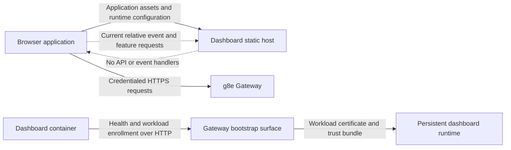

# Architecture

## Purpose

g8ed is the first-party browser interface for g8e. The current runtime separates application delivery, browser authentication, and container workload identity into distinct security boundaries. The dashboard host serves the browser application, the browser authenticates directly to the Gateway, and the dashboard container enrolls its own workload identity before it begins serving.

The current dashboard is not a complete operational control plane. It restores existing Gateway browser sessions and exposes user-interface modules for chat, Operator management, approvals, audit, settings, and terminal activity, but the running dashboard host does not provide the API backend required by those modules.

## Runtime Boundaries

### Dashboard Host

The Node.js and Express process serves the checked-in browser application over plain HTTP. It publishes the required browser-reachable Gateway origin as runtime configuration, applies browser security headers, logs requests, serves static assets, and returns the single-page document for unknown `GET` requests that accept HTML. The HTML fallback is rate-limited.

The host does not terminate TLS, authenticate browser users, store browser sessions, proxy Gateway traffic, or mount dashboard API and event routes. Deployments that require HTTPS on the dashboard origin terminate TLS in an external proxy or load balancer.

### Browser Application

The browser application uses native JavaScript modules, checked-in styles, and static HTML templates without a frontend compilation step. Shared authentication, event delivery, and feature components exchange state through an in-browser event bus rather than a framework store.

The Gateway remains the authority for browser identity and session validity. Gateway requests include browser credentials so the Gateway-issued Secure, HttpOnly session cookie is sent automatically; dashboard JavaScript does not read the cookie or create replacement bearer, session, cookie, or API-key headers for these requests.

### Container Workload

Before the static host listens, the dashboard loads an installed `g8ed` workload identity or starts owner-approved enrollment through the Gateway's plain-HTTP bootstrap surface. Enrollment state and issued credentials reside in the persistent dashboard runtime directory. The dashboard remains unavailable while approval is pending; an unexpected identity-read failure or an enrollment failure stops startup.

The workload certificate is separate from browser authentication. The current static host does not use the resolved workload identity for outbound Gateway requests after startup. See [Authentication](auth.md#container-startup-enrollment) for the enrollment lifecycle and current credential-validation limits.

## Startup and Deployment

The unified container deployment starts the dashboard only after the Gateway health check succeeds and platform owner bootstrap is available. Startup proceeds as follows:

1. The container waits for the Gateway's plain-HTTP health surface.
2. The dashboard loads its existing workload identity, resumes a pending enrollment request, or submits a new request and persists the resumable state.
3. An owner approves a new request through the Gateway console while the dashboard remains unavailable.
4. The dashboard stores the issued certificate, private key, and trust bundle in its persistent runtime volume, then removes the pending enrollment state.
5. The static host begins listening and publishes the browser-facing Gateway origin to the browser application.

The deployment uses separate addresses for browser and container traffic:

| Configuration | Purpose |
| --- | --- |
| `G8E_GATEWAY_URL` | HTTPS Gateway origin reachable from the user's browser; required for startup and allowed by the dashboard Content Security Policy |
| `G8E_GATEWAY_HTTP_URL` | Plain-HTTP Gateway bootstrap origin reachable from the dashboard container for workload enrollment |
| `G8E_RUNTIME_DIR` | Writable, persistent location for pending and issued workload identity material |
| `GATEWAY_HEALTH_URL` and `GATEWAY_HEALTH_PATH` | Plain-HTTP Gateway health location polled by the container entrypoint |
| `PORT` | Dashboard host port; defaults to `3000` |

Browser authentication also requires the exact dashboard origin in the Gateway's credentialed CORS and WebAuthn relying-party configuration. The browser must trust the Gateway certificate, and the dashboard must run in a WebAuthn secure context, either HTTPS or the browser's localhost development exception. See [Gateway Integration](gateway.md#deployment-requirements) for the complete deployment requirements.

## Request Ownership

Browser requests currently fall into three groups:

| Request group | Owner | Current status |
| --- | --- | --- |
| Static assets, feature templates, and runtime Gateway configuration | Dashboard host | Operational |
| Current-user lookup, public session lookup, logout, and passkey ceremonies | Gateway | Session restoration and logout are operational; interactive registration and sign-in are not operational in the current interface |
| Chat, cases, Operator management, approvals, device links, audit, settings, console, and terminal actions | Dashboard-origin API surface | Not operational because the static host mounts no handlers for these requests |

The browser contains passkey registration and authentication ceremonies, but the live sign-in flow does not supply the user identifier required by the Gateway. As a result, the current interface can restore and log out an existing valid Gateway browser session but cannot establish a new one. See [Authentication](auth.md#current-passkey-limitation) for the exact limitation.

Server-side routes, services, middleware, models, and rendered views remain in the source tree, but the live static host does not activate them. Their presence and unit tests do not make their interfaces available in a deployed dashboard.

## Event Delivery

The browser creates a credentialed event client after restoring an authenticated session and obtaining its public web-session identifier. The event manager tracks activity, closes stale connections, retries failures with bounded exponential backoff and jitter, and forwards decoded application events through the browser event bus.

Event delivery is not operational in the standard deployment. The client requests a relative event URL, so the browser sends it to the dashboard origin rather than `G8E_GATEWAY_URL`; the static host provides no event handler or proxy. The selected path is also the Gateway's finite polling endpoint rather than its live stream, and the client expects a different event envelope from the Gateway stream. See [Server-Sent Events](sse.md#current-url-resolution-constraint) for the three integration constraints.

The browser cannot use the Gateway's mTLS WebSocket surface because it does not hold a workload certificate. The Gateway provides a credentialed SSE surface for browser event delivery, but the current dashboard client does not connect to it correctly.

## Security Properties

- Browser sessions terminate at the Gateway. The dashboard host neither reads nor validates the Gateway's HttpOnly session cookie.
- The container workload private key remains in the persistent dashboard runtime and is never included in browser configuration or static assets.
- Content Security Policy limits browser connections to the dashboard and configured Gateway origins, prevents framing, and disables plugin content.
- The dashboard does not expose a browser-accessible mTLS proxy or place workload credentials in the browser.
- The dashboard is a control surface, not a governance or execution authority. Requests that enter a supported governed Gateway path remain subject to L1 Doctrine validation, L2 Consensus when required, L3 Notary authorization when required, L4 Warden pre-dispatch verification, and L5 Actuator execution and receipt production. See the [Governance Pipeline](../architecture/governance.md).

## Verification Model

Browser assets are served directly from the repository without bundling or transpilation. The dashboard test suite covers the static host, browser authentication logic, event connection behavior, startup enrollment, model parsing, and feature modules. Unit coverage of retained modules does not prove that their routes are mounted or that they work against a live Gateway.

Deployment verification therefore checks the complete browser path: Gateway certificate trust, exact CORS and WebAuthn origins, session-cookie behavior, runtime Gateway configuration, workload enrollment, and the active request owner for each feature. See [Testing](tests.md) for the dashboard test scope and [Development](development.md) for local verification commands.

## Related

- [Authentication](auth.md): Browser sessions, passkey limitations, and workload enrollment.
- [Gateway Integration](gateway.md): Request ownership, cross-origin configuration, and deployment requirements.
- [Server-Sent Events](sse.md): Event lifecycle and current integration constraints.
- [Operator Surfaces](operators.md): Current status of Operator, approval, and terminal interfaces.
- [Platform-level Dashboard Architecture](../architecture/dashboard.md): g8ed's role in the platform and its trust boundaries.
- [Gateway Architecture](../architecture/gateway.md): Gateway component design, protocol surfaces, and PKI authority.
- [Network Architecture](../architecture/network.md): Gateway protocol surfaces, ports, and network topology.
- [Authentication and Authorization](../architecture/auth.md): Platform mTLS, WebAuthn, workload identity, and trust bundles.
- [Governance Pipeline](../architecture/governance.md): Verification and execution controls for governed operations.
- [PKI and Trust](../ensemble/pki.md): Platform PKI hierarchy, certificate lifecycle, and workload enrollment.
