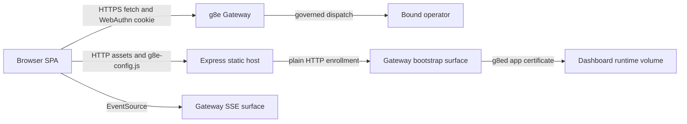

# Architecture

## Overview

g8ed separates static application delivery, browser identity, and container workload identity. The Express process is not a browser API backend: it serves files and configuration, while the browser communicates with the gateway directly. The container independently enrolls an app identity that is available to prepared server-side clients but is not currently wired into the running Express application.



## Runtime Components

### Container Entrypoint

`dashboard/entrypoint.sh` polls `GATEWAY_HEALTH_URL` plus `GATEWAY_HEALTH_PATH` before starting Node. This is a reachability gate against the gateway's plain-HTTP health surface; it does not authenticate the browser or establish the dashboard app identity.

### Express Static Host

`dashboard/server.js` owns the live server boundary. `createApp({ gatewayOrigin })` requires an explicit gateway origin, publishes it through `/g8e-config.js`, emits Content Security Policy and security headers, logs requests, serves `dashboard/public/`, and applies a rate-limited HTML fallback to `index.html`.

The host has no TLS terminator, session store, browser authentication middleware, WebSocket proxy, or mounted API routers. Production TLS for the dashboard origin, when required, belongs outside this process. Browser API TLS terminates at the gateway origin configured by `G8E_GATEWAY_URL`.

### Startup Enrollment

Before `app.listen()`, `runStartupEnrollment()` loads an installed `g8ed` app identity or invokes `AppEnrollmentService.enroll()`. Expected configuration failures such as a missing or expired identity enter enrollment. Unexpected identity-read failures and enrollment failures invoke the fatal callback and prevent startup. The resulting `AppIdentity` is stored in `services/infra/app-identity.js` for server-side consumers.

No live server-side consumer currently reads that identity. `services/clients/g8eg_http_client.js` and `services/clients/g8eg_pubsub_client.js` support certificate paths, but `server.js` does not construct them.

### Browser Application

`dashboard/public/js/app.js` is the browser composition root. It creates one `EventBus`, one `AuthManager`, one `SSEConnectionManager`, and the header, chat, operator-panel, and footer components. Authentication initialization controls subsequent SSE and operator-panel startup. Components exchange state changes through typed event-name constants rather than a framework store.

`dashboard/public/index.html` is the only page document. Unknown HTML routes resolve to this file through the Express fallback. Feature UI is assembled from JavaScript components and HTML templates under `public/js/components/templates/`; EJS views under `dashboard/views/` are not rendered by the live server.

## Request Routing

The frontend service abstraction has two origin classes:

| Service name | Origin | Current use |
| --- | --- | --- |
| `ServiceName.GATEWAY` | `window.G8E_GATEWAY_URL` | Active authentication, session, user, and passkey requests |
| `ServiceName.g8ed` | `window.location.origin` | Retained operator, chat, audit, settings, approval, template, and device-link calls |

Every `fetch` uses `credentials: 'include'`. For gateway requests the client intentionally adds no session, bearer, cookie, or API-key headers; the gateway-issued HttpOnly cookie is the browser credential.

The static host mounts no `/api/*` routes. Calls assigned to `ServiceName.g8ed` do not have a live handler in the current runtime. Server-side route, service, middleware, model, and view directories remain in the tree as migration inventory and testable modules, but they are outside the application assembled by `server.js`.

## Source Layout

```text
dashboard/
├── server.js                         # Static host and startup enrollment
├── entrypoint.sh                     # Gateway health wait and Node entrypoint
├── public/
│   ├── index.html                    # Single page document
│   ├── css/                          # Checked-in styles
│   └── js/
│       ├── app.js                    # Browser composition root
│       ├── components/               # Feature controllers and templates
│       ├── constants/                # Browser constants and API path builders
│       ├── models/                   # Browser-side typed model classes
│       └── utils/                    # HTTP, SSE, events, rendering, and session helpers
├── services/infra/                   # App enrollment and identity holder
├── services/clients/                 # Prepared g8eg HTTP and pub/sub clients
├── routes/, middleware/, models/     # Retained server-side migration surface
├── test/                             # Vitest suite and browser harness
├── Dockerfile                        # Node 22 non-root runtime image
└── package.json                      # Runtime and test dependencies
```

## Security Boundaries

- The browser session cookie belongs to the gateway origin and is not readable by dashboard JavaScript.
- The container app private key remains in the dashboard runtime volume and is never exposed through `/g8e-config.js` or static assets.
- CSP restricts browser connections to the dashboard and configured gateway origins and disables plugins, embedding, and framing.
- The browser cannot use the gateway's mTLS WebSocket surface. Browser event delivery uses SSE.
- g8ed does not bypass governance. UI requests that lead to host mutations remain gateway- and operator-governed.

## Related

- [Authentication](auth.md)
- [Gateway Integration](gateway.md)
- [Server-Sent Events](sse.md)
- [Operator Surfaces](operators.md)
- [Platform-level Dashboard Architecture](../architecture/dashboard.md)
