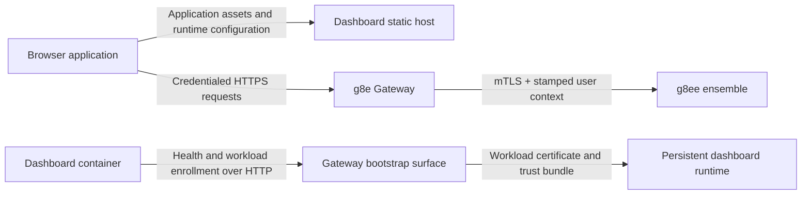

# Architecture

## Purpose

g8ed is the first-party browser interface for g8e. Application delivery, browser authentication, and container workload identity are separate security boundaries. The dashboard host serves the browser application and runtime configuration. The browser authenticates directly to the Gateway. The dashboard container enrolls its own workload identity before it begins serving.

The dashboard is a static host plus Gateway-direct browser client. Feature modules call the Gateway for sessions, passkeys, SSE, operators, chat, settings, cases, investigations, approvals, audit, and terminal actions. The dashboard host does not implement platform APIs.



## Runtime Boundaries

### Dashboard Host

The Node.js 22 and Express 5 process serves the checked-in browser application over plain HTTP. It publishes the browser-reachable Gateway origin through `/g8e-config.js`, applies browser security headers, logs requests, serves static assets, and returns the single-page document for unknown `GET` requests that accept HTML. The HTML fallback is rate-limited to 100 requests per minute.

`G8E_GATEWAY_URL` is required at startup and has no fallback. The host does not terminate TLS, authenticate browser users, store browser sessions, or proxy Gateway traffic. Deployments that require HTTPS on the dashboard origin terminate TLS in an external proxy or load balancer.

Active server code is limited to `server.js` and `services/infra/app-enrollment-service.js`.

### Browser Application

The browser application uses native JavaScript modules, checked-in styles, and static HTML templates without a frontend compilation step. Shared authentication, event delivery, and feature components exchange state through an in-browser event bus.

The Gateway is the authority for browser identity and session validity. Gateway requests use `credentials: 'include'` so the Gateway-issued Secure, HttpOnly session cookie is sent automatically. Dashboard JavaScript does not read the cookie or add bearer, session, cookie, or API-key headers for Gateway requests.

All platform HTTP calls go through `window.serviceClient` with `ServiceName.GATEWAY` against `window.G8E_GATEWAY_URL`.

### Container Workload

Before the static host listens, the dashboard loads an installed `g8ed` workload identity or starts owner-approved enrollment through the Gateway's plain-HTTP bootstrap surface. Enrollment state and issued credentials reside in the persistent dashboard runtime directory. The dashboard remains unavailable while approval is pending. Unexpected identity-read failures and enrollment failures stop startup.

The workload certificate is separate from browser authentication. The static host does not use the resolved workload identity for outbound Gateway requests after startup. See [Authentication](auth.md#container-startup-enrollment) for enrollment lifecycle and credential-validation limits.

## Startup and Deployment

The unified container deployment starts the dashboard only after the Gateway health check succeeds. Gateway owner bootstrap may still be incomplete at that point; enrollment request submission retries while owner bootstrap completes.

1. The container entrypoint waits for the Gateway's plain-HTTP health surface, polling up to 30 times at two-second intervals, then exits if the health surface never becomes ready.
2. The dashboard loads its existing workload identity, resumes an unexpired pending enrollment request, or creates a P-256 key and certificate signing request for a new request and persists the pending state.
3. An owner approves a new request through the Gateway console while the dashboard remains unavailable. If the Gateway has not been bootstrapped, request submission retries for up to 30 minutes.
4. After approval, the dashboard proves possession of the private key, stores the issued certificate, private key, and trust bundle in its persistent runtime volume, then removes the pending enrollment state.
5. The static host begins listening and publishes the browser-facing Gateway origin to the browser application.

| Configuration | Purpose |
| --- | --- |
| `G8E_GATEWAY_URL` | HTTPS Gateway origin reachable from the user's browser; required for startup and allowed by the dashboard Content Security Policy |
| `G8E_GATEWAY_HTTP_URL` | Plain-HTTP Gateway bootstrap origin reachable from the dashboard container for workload enrollment |
| `G8E_RUNTIME_DIR` | Writable, persistent location for pending and issued workload identity material |
| `GATEWAY_HEALTH_URL` and `GATEWAY_HEALTH_PATH` | Plain-HTTP Gateway health location polled by the container entrypoint |
| `PORT` | Dashboard host port; defaults to `3000` |

Browser authentication also requires the exact dashboard origin in the Gateway's credentialed CORS and WebAuthn relying-party configuration. The browser must trust the Gateway certificate, and the dashboard must run in a WebAuthn secure context (HTTPS or the browser's localhost development exception). See [Gateway Integration](gateway.md#deployment-requirements).

In the root Compose deployment, the dashboard is the `bootstrapped`-profile `dashboard` service. It publishes host port `3000` to container port `3000`, runs as the non-root `g8e` user, mounts the component-local `g8e-dashboard-data` volume at `/data`, and uses `/data` as `G8E_RUNTIME_DIR`. That volume owns enrollment state and credentials; it is not shared with the Gateway or an Operator. The container health check probes `http://localhost:3000/` from the dashboard container.

## Request Ownership

| Request group | Owner |
| --- | --- |
| Static assets, feature templates, and runtime Gateway configuration | Dashboard host |
| Current-user lookup, public session lookup, logout, and passkey ceremonies | Gateway |
| SSE stream and stored-event polling | Gateway (`/api/v1/sse/stream`, `/api/v1/sse/events`; `RouteAuthDual`) |
| Operator list, bind, unbind, stop | Gateway (`/api/v1/operators`; `RouteAuthDual`) |
| Chat, settings, cases, investigations, operator approval/command | Gateway→g8ee ensemble proxy (`RouteAuthWebSession`) |
| Audit REST read paths | Gateway (`GET /api/v1/audit/events`, `/summary`, `/verify`; `RouteAuthWebSession`) |
| Device links and Operator API keys from browser | Not available; service methods reject the calls |
| Operator binary download | Gateway (`/.well-known/g8e/bin/{os}/{arch}`) |

`make dashboard-boundary-check` and `test/unit/architecture/test_g8ed_gateway_boundary.test.js` enforce that the static host does not mount API routers and that browser code does not call dashboard-origin platform paths.

## Event Delivery

The browser creates a credentialed event client to `${G8E_GATEWAY_URL}/api/v1/sse/stream` after restoring an authenticated session and obtaining its public web-session identifier. The event manager normalizes Gateway push envelopes, tracks activity, closes stale connections, retries failures with bounded exponential backoff and jitter, and falls back to polling `GET /api/v1/sse/events` after exhausting reconnect attempts. Decoded application events are forwarded through the browser event bus.

The browser cannot use the Gateway's mTLS WebSocket surface because it does not hold a workload certificate. See [Server-Sent Events](sse.md).

## Security Properties

- Browser sessions terminate at the Gateway. The dashboard host neither reads nor validates the Gateway's HttpOnly session cookie.
- The container workload private key remains in the persistent dashboard runtime and is never included in browser configuration or static assets.
- Content Security Policy limits browser connections to the dashboard and configured Gateway origins, prevents framing, and disables plugin content.
- The dashboard does not expose a browser-accessible mTLS proxy or place workload credentials in the browser.
- The dashboard is a control surface, not a governance or execution authority. Requests that enter a supported governed Gateway path remain subject to L1 Doctrine validation, L2 Consensus when required, L3 Notary authorization when required, L4 Warden pre-dispatch verification, and L5 Actuator execution and receipt production. See the [Governance Pipeline](../architecture/governance.md).

## Verification

Browser assets are served directly from the repository without bundling or transpilation. The dashboard test suite covers the static host, browser authentication logic, event connection behavior, startup enrollment, model parsing, feature modules, and architecture boundary guards.

```bash
make dashboard-lint
make dashboard-boundary-check
make dashboard-test
./g8e gw connect http://localhost:3000
```

See [Testing](tests.md) and [Development](devs.md).

## Related

- [Authentication](auth.md)
- [Gateway Integration](gateway.md)
- [Server-Sent Events](sse.md)
- [Operator Surfaces](operators.md)
- [Platform-level Dashboard Architecture](../architecture/dashboard.md)
- [Gateway Architecture](../architecture/gateway.md)
- [Network Architecture](../architecture/network.md)
- [Authentication and Authorization](../architecture/auth.md)
- [Governance Pipeline](../architecture/governance.md)
- [PKI and Trust](../ensemble/pki.md)
