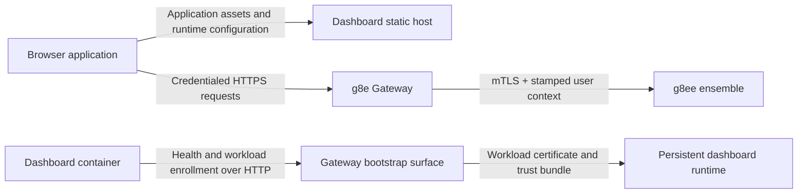

# Dashboard Architecture

## Purpose

g8ed is the first-party browser interface for g8e. Application delivery, browser authentication, and container workload identity form separate security boundaries. The dashboard host serves the browser application and runtime configuration over plain HTTP. The browser authenticates directly to the Gateway over HTTPS. The dashboard container enrolls its own workload identity before it begins serving.

The dashboard is a static host plus Gateway-direct browser client. Feature modules call the Gateway for sessions, passkeys, SSE, operators, chat, settings, cases, investigations, approvals, audit, and terminal actions. The dashboard host does not implement platform APIs.


```mermaid
flowchart LR
    Browser[Browser application] -->|Application assets and runtime configuration| Host[Dashboard static host]
    Browser -->|Credentialed HTTPS requests| Gateway[g8e Gateway]
    Gateway -->|mTLS + stamped user context| Ensemble[g8ee ensemble]
    Container[Dashboard container] -->|Health and workload enrollment over HTTP| Bootstrap[Gateway bootstrap surface]
    Bootstrap -->|Workload certificate and trust bundle| Runtime[Persistent dashboard runtime]
```

## Quick index

- [Purpose](#purpose)
- [Quick index](#quick-index)
- [Invariants](#invariants)
- [Owned surfaces](#owned-surfaces)
- [Procedures](#procedures)
- [Anti-patterns](#anti-patterns)
- [Links out](#links-out)

## Invariants

| ID | Rule |
| --- | --- |
| INV-DASHBOARD-01 | The dashboard host serves the browser application over plain HTTP without TLS termination, browser session storage, or Gateway request proxying. |
| INV-DASHBOARD-02 | The browser authenticates to the Gateway directly over HTTPS using credentials: 'include' for Gateway-issued HttpOnly session cookies. The dashboard host never reads or validates the session cookie. |
| INV-DASHBOARD-03 | The dashboard container workload private key remains in the persistent runtime directory and is never included in browser configuration, static assets, or environment variables visible to browser code. |
| INV-DASHBOARD-04 | The HTML fallback route (unknown GET requests that accept text/html) is rate-limited to 100 requests per minute per client IP to prevent DoS via repeated file system access. |
| INV-DASHBOARD-05 | Content Security Policy permits browser connections only to the dashboard origin and configured Gateway origin. WebSocket and plugin content are prohibited. |
| INV-DASHBOARD-06 | The startup enrollment phase completes before the Express server listens. Enrollment failure stops the startup with exit code 1. |

## Owned surfaces

| Surface | Path | Responsibility |
| --- | --- | --- |
| Static SPA host | [dashboard/server.js](dashboard/server.js) | Serves browser assets, injects Gateway origin, logs requests, applies security headers |
| Workload enrollment | [dashboard/services/infra/app-enrollment-service.js](dashboard/services/infra/app-enrollment-service.js) | Loads or generates dashboard app identity before server startup |
| Browser configuration | [dashboard/public/](dashboard/public/) | HTML templates and JavaScript modules loaded without bundling or transpilation |
| Runtime identity storage | `G8E_RUNTIME_DIR` env var (default: `/data`) | Persistent volume for pending and issued workload credentials |

## Procedures

### Dashboard Host

The Node.js 22 and Express 5 process serves the checked-in browser application over plain HTTP. It publishes the browser-reachable Gateway origin through `/g8e-config.js`, applies browser security headers, logs requests, serves static assets, and returns the single-page document for unknown `GET` requests that accept HTML. The HTML fallback is rate-limited to 100 requests per minute.

`G8E_GATEWAY_URL` is required at startup and has no fallback. The host does not terminate TLS, authenticate browser users, store browser sessions, or proxy Gateway traffic. Deployments that require HTTPS on the dashboard origin terminate TLS in an external proxy or load balancer.

Active server code is limited to [server.js](dashboard/server.js) and [services/infra/app-enrollment-service.js](dashboard/services/infra/app-enrollment-service.js).

### Browser Application

The browser application uses native JavaScript modules, checked-in styles, and static HTML templates without a frontend compilation step. Shared authentication, event delivery, and feature components exchange state through an in-browser event bus.

The Gateway is the authority for browser identity and session validity. Gateway requests use `credentials: 'include'` so the Gateway-issued Secure, HttpOnly session cookie is sent automatically. Dashboard JavaScript does not read the cookie or add bearer, session, cookie, or API-key headers for Gateway requests.

All platform HTTP calls go through `window.serviceClient` with `ServiceName.GATEWAY` against `window.G8E_GATEWAY_URL`.

Browser code is located in [dashboard/public/](dashboard/public/). See [devs.md](devs.md) for JavaScript patterns and [tests.md](tests.md) for browser test setup.

### Container Workload

Before the static host listens, the dashboard loads an installed `g8ed` workload identity or starts owner-approved enrollment through the Gateway's plain-HTTP bootstrap surface. Enrollment state and issued credentials reside in the persistent dashboard runtime directory. The dashboard remains unavailable while approval is pending. Unexpected identity-read failures and enrollment failures stop startup.

The workload certificate is separate from browser authentication. The static host does not use the resolved workload identity for outbound Gateway requests after startup. See [auth.md](auth.md) for enrollment lifecycle and credential-validation limits.

### Startup and Deployment

The unified container deployment starts the dashboard only after the Gateway health check succeeds. Gateway owner bootstrap may still be incomplete at that point; enrollment request submission retries while owner bootstrap completes.

1. The container entrypoint waits for the Gateway's plain-HTTP health surface, polling up to 30 times at two-second intervals, then exits if the health surface never becomes ready.
2. [server.js](dashboard/server.js) invokes [AppEnrollmentService.loadIdentity()](dashboard/services/infra/app-enrollment-service.js) to load an existing identity or [AppEnrollmentService.enroll()](dashboard/services/infra/app-enrollment-service.js) to start enrollment if no usable identity is found.
3. During enrollment, the service generates a P-256 key and certificate signing request (CSR), submits a platform enrollment request with the CSR to the plain-HTTP Gateway bootstrap surface, and persists the private key, requester token, request ID, and CSR fingerprints with 0600 permissions.
4. An owner approves the enrollment request through the Gateway console (`/console/`) while the dashboard remains unavailable. If the Gateway has not been bootstrapped, request submission retries for up to 30 minutes with bounded exponential backoff.
5. After approval, the service signs a canonical completion transcript with the private key, validates the Gateway response against the pinned trust bundle and expected SANs, and stores the issued certificate, private key, and trust bundle in the persistent runtime volume.
6. The enrollment state is removed and the Express server begins listening, publishing the browser-facing Gateway origin to the browser application.

Enrollment implementation is in [dashboard/services/infra/app-enrollment-service.js](dashboard/services/infra/app-enrollment-service.js). Mirrors the ensemble `app_enrollment_service.py` for platform consistency.

#### Configuration

| Variable | Purpose | Required |
| --- | --- | --- |
| `G8E_GATEWAY_URL` | HTTPS Gateway origin reachable from the user's browser; published to browser via `/g8e-config.js` | Yes |
| `G8E_GATEWAY_HTTP_URL` | Plain-HTTP Gateway bootstrap origin reachable from the dashboard container for workload enrollment | Yes |
| `G8E_RUNTIME_DIR` | Writable, persistent directory for pending and issued workload identity material | Yes (default: `/data`) |
| `GATEWAY_HEALTH_URL` | Plain-HTTP Gateway health origin polled by the container entrypoint | Yes |
| `GATEWAY_HEALTH_PATH` | Plain-HTTP Gateway health path (default: `/health`) | No |
| `PORT` | Dashboard host port (default: `3000`) | No |

Browser authentication also requires the exact dashboard origin in the Gateway's credentialed CORS and WebAuthn relying-party configuration. The browser must trust the Gateway certificate, and the dashboard must run in a WebAuthn secure context (HTTPS or the browser's localhost development exception). See [gateway.md](gateway.md).

In the root Compose deployment, the dashboard is the `bootstrapped`-profile `dashboard` service. It publishes host port `3000` to container port `3000`, runs as the non-root `g8e` user, mounts the component-local `g8e-dashboard-data` volume at `/data`, and uses `/data` as `G8E_RUNTIME_DIR`. That volume owns enrollment state and credentials; it is not shared with the Gateway or Operator. The container health check probes `http://localhost:3000/` from the dashboard container.

#### Request Ownership

| Request group | Owner |
| --- | --- |
| Static assets, feature templates, and runtime Gateway configuration | Dashboard host |
| Current-user lookup, public session lookup, logout, and passkey ceremonies | Gateway |
| SSE stream and stored-event polling | Gateway (`/api/v1/sse/stream`, `/api/v1/sse/events`) |
| Operator list, bind, unbind, stop | Gateway (`/api/v1/operators`) |
| Chat, settings, cases, investigations, operator approval/command | Gateway→g8ee ensemble proxy |
| Audit REST read paths | Gateway (`GET /api/v1/audit/events`, `/summary`, `/verify`) |
| Device links and Operator API keys from browser | Not available; service methods reject calls |
| Operator binary download | Gateway (`/.well-known/g8e/bin/{os}/{arch}`) |

Architecture boundary enforcement is in [dashboard/test/unit/architecture/test_g8ed_gateway_boundary.test.js](dashboard/test/unit/architecture/test_g8ed_gateway_boundary.test.js). Run `make dashboard-boundary-check` to verify the static host does not mount API routers and that browser code does not call dashboard-origin platform paths.

### Event Delivery

The browser creates a credentialed event client to `${G8E_GATEWAY_URL}/api/v1/sse/stream` after restoring an authenticated session and obtaining its public web-session identifier. The event manager normalizes Gateway push envelopes, tracks activity, closes stale connections, retries failures with bounded exponential backoff and jitter, and falls back to polling `GET /api/v1/sse/events` after exhausting reconnect attempts. Decoded application events are forwarded through the browser event bus.

The browser cannot use the Gateway's mTLS WebSocket surface because it does not hold a workload certificate. See [sse.md](sse.md).

### Security Properties

- Browser sessions terminate at the Gateway. The dashboard host neither reads nor validates the Gateway's HttpOnly session cookie.
- The container workload private key remains in the persistent dashboard runtime and is never included in browser configuration or static assets.
- Content Security Policy limits browser connections to the dashboard and configured Gateway origins, prevents framing, and disables plugin content.
- The dashboard does not expose a browser-accessible mTLS proxy or place workload credentials in the browser.
- The dashboard is a control surface, not a governance or execution authority. Requests that enter a supported governed Gateway path remain subject to platform governance layers. See [docs/architecture/governance.md](docs/architecture/governance.md).

## Anti-patterns

- Serving the browser over HTTPS directly from the dashboard container instead of terminating TLS in an external proxy or load balancer. This couples the browser and workload deployment and makes credential rotation complex.
- Hand-editing environment variables or mounting additional volumes to override workload enrollment state. Enrollment state is managed by [AppEnrollmentService](dashboard/services/infra/app-enrollment-service.js); use the standard configuration variables.
- Calling dashboard-origin platform paths from browser code. Architecture boundary check ([dashboard/test/unit/architecture/test_g8ed_gateway_boundary.test.js](dashboard/test/unit/architecture/test_g8ed_gateway_boundary.test.js)) enforces this separation.
- Adding bearer tokens, custom headers, or session identifiers to browser requests. Use `credentials: 'include'` so Gateway-issued HttpOnly cookies are sent automatically.
- Exposing the workload private key or pending enrollment state in browser logs or configuration. These remain only in the persistent `G8E_RUNTIME_DIR`.

## Procedures

### Verification and Testing

Browser assets are served directly from the repository without bundling or transpilation. The dashboard test suite covers the static host, browser authentication logic, event connection behavior, startup enrollment, model parsing, feature modules, and architecture boundary guards.

Run all dashboard checks:
```bash
make dashboard-lint
make dashboard-boundary-check
make dashboard-test
```

Test the full browser flow:
```bash
./g8e gw connect http://localhost:3000
```

See [tests.md](tests.md) for test scope and [devs.md](devs.md) for development patterns.

## Links out

- [Authentication](auth.md) — Browser session lifecycle and workload enrollment detail
- [Gateway Integration](gateway.md) — CORS, WebAuthn, and deployment requirements
- [Server-Sent Events](sse.md) — Event client implementation and retry logic
- [Operator Surfaces](operators.md) — Operator download and lifecycle
- [Development](devs.md) — JavaScript patterns and browser code organization
- [Testing](tests.md) — Test scope and test execution
- [Platform Dashboard Architecture](../architecture/dashboard.md) — Platform-level dashboard design
- [Gateway Architecture](../architecture/gateway.md) — Gateway request routing and authentication
- [Network Architecture](../architecture/network.md) — Container network and security boundaries
- [Authentication and Authorization](../architecture/auth.md) — Platform auth architecture
- [Governance Pipeline](../architecture/governance.md) — Doctrine, consensus, and notary layers
- [PKI and Trust](../ensemble/pki.md) — Certificate and trust bundle management
