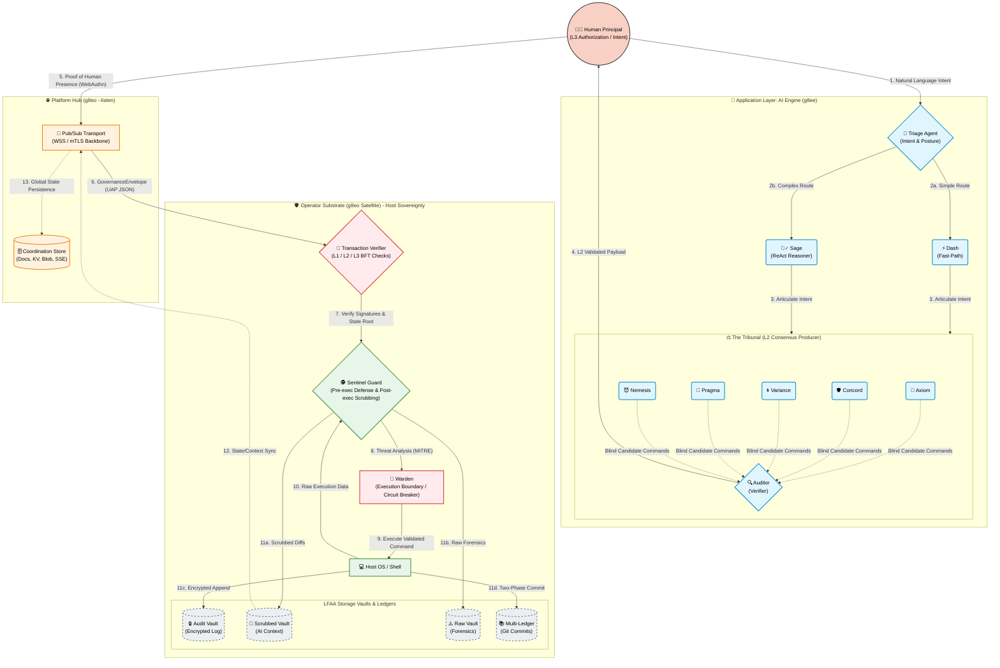

```mermaid
graph TD
    classDef human fill:#f9d0c4,stroke:#333,stroke-width:2px,color:#000;
    classDef engine fill:#e1f5fe,stroke:#0288d1,stroke-width:2px,color:#000;
    classDef hub fill:#fff3e0,stroke:#f57c00,stroke-width:2px,color:#000;
    classDef operator fill:#e8f5e9,stroke:#388e3c,stroke-width:2px,color:#000;
    classDef vault fill:#eceff1,stroke:#607d8b,stroke-width:2px,stroke-dasharray: 5 5,color:#000;
    classDef critical fill:#ffebee,stroke:#d32f2f,stroke-width:2px,color:#000;

    %% PRINCIPAL
    Human(("🧑‍💻 Human Principal<br/>(L3 Authorization / Intent)")):::human

    %% ENGINE (g8ee)
    subgraph Engine["🧠 Application Layer: AI Engine (g8ee)"]
        direction TB
        Triage{"🚦 Triage Agent<br/>(Intent & Posture)"}:::engine
        Dash("⚡ Dash<br/>(Fast-Path)"):::engine
        Sage("🧙‍♂️ Sage<br/>(ReAct Reasoner)"):::engine

        subgraph Tribunal["⚖️ The Tribunal (L2 Consensus Producer)"]
            direction LR
            Axiom("📐 Axiom"):::engine
            Concord("🛡️ Concord"):::engine
            Variance("🌀 Variance"):::engine
            Pragma("📘 Pragma"):::engine
            Nemesis("😈 Nemesis"):::engine
            Auditor{"🔍 Auditor<br/>(Verifier)"}:::engine
        end
    end

    %% PLATFORM HUB
    subgraph Hub["🌐 Platform Hub (g8eo --listen)"]
        direction TB
        PubSub["📡 Pub/Sub Transport<br/>(WSS / mTLS Backbone)"]:::hub
        CoordStore[("🗄️ Coordination Store<br/>(Docs, KV, Blob, SSE)")]:::hub
    end

    %% OPERATOR (g8eo)
    subgraph Operator["🛡️ Operator Substrate (g8eo Satellite) - Host Sovereignty"]
        direction TB
        Verifier{"🔐 Transaction Verifier<br/>(L1 / L2 / L3 BFT Checks)"}:::critical
        Sentinel{"🕵️ Sentinel Guard<br/>(Pre-exec Defense & Post-exec Scrubbing)"}:::operator
        Warden["🛑 Warden<br/>(Execution Boundary / Circuit Breaker)"]:::critical
        HostShell["💻 Host OS / Shell"]:::operator

        subgraph Storage["LFAA Storage Vaults & Ledgers"]
            direction LR
            AuditVault[("🔒 Audit Vault<br/>(Encrypted Log)")]:::vault
            ScrubVault[("🧹 Scrubbed Vault<br/>(AI Context)")]:::vault
            RawVault[("⚠️ Raw Vault<br/>(Forensics)")]:::vault
            Ledger[("📚 Multi-Ledger<br/>(Git Commits)")]:::vault
        end
    end

    %% DATA FLOWS (Logical Intent & Execution)
    Human -- "1. Natural Language Intent" --> Triage
    Triage -- "2a. Simple Route" --> Dash
    Triage -- "2b. Complex Route" --> Sage
    Dash & Sage -- "3. Articulate Intent" --> Tribunal
    
    Axiom & Concord & Variance & Pragma & Nemesis -. "Blind Candidate Commands" .-> Auditor
    Auditor -- "4. L2 Validated Payload" --> Human
    
    Human -- "5. Proof of Human Presence (WebAuthn)" --> PubSub
    PubSub -- "6. GovernanceEnvelope (UAP JSON)" --> Verifier

    Verifier -- "7. Verify Signatures & State Root" --> Sentinel
    Sentinel -- "8. Threat Analysis (MITRE)" --> Warden
    Warden -- "9. Execute Validated Command" --> HostShell

    HostShell -- "10. Raw Execution Data" --> Sentinel
    Sentinel -- "11a. Scrubbed Diffs" --> ScrubVault
    Sentinel -- "11b. Raw Forensics" --> RawVault
    HostShell -- "11c. Encrypted Append" --> AuditVault
    HostShell -- "11d. Two-Phase Commit" --> Ledger

    ScrubVault -. "12. State/Context Sync" .-> PubSub
    PubSub -. "13. Global State Persistence" .-> CoordStore
```