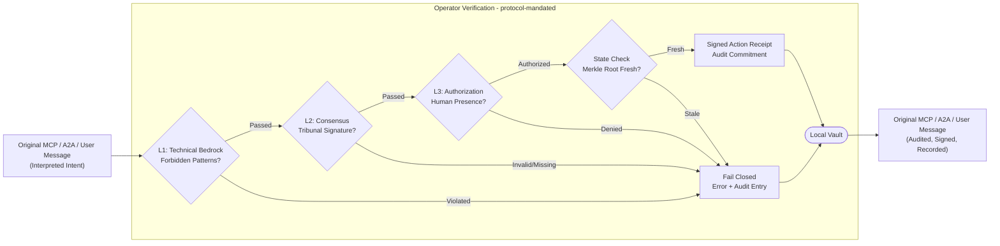
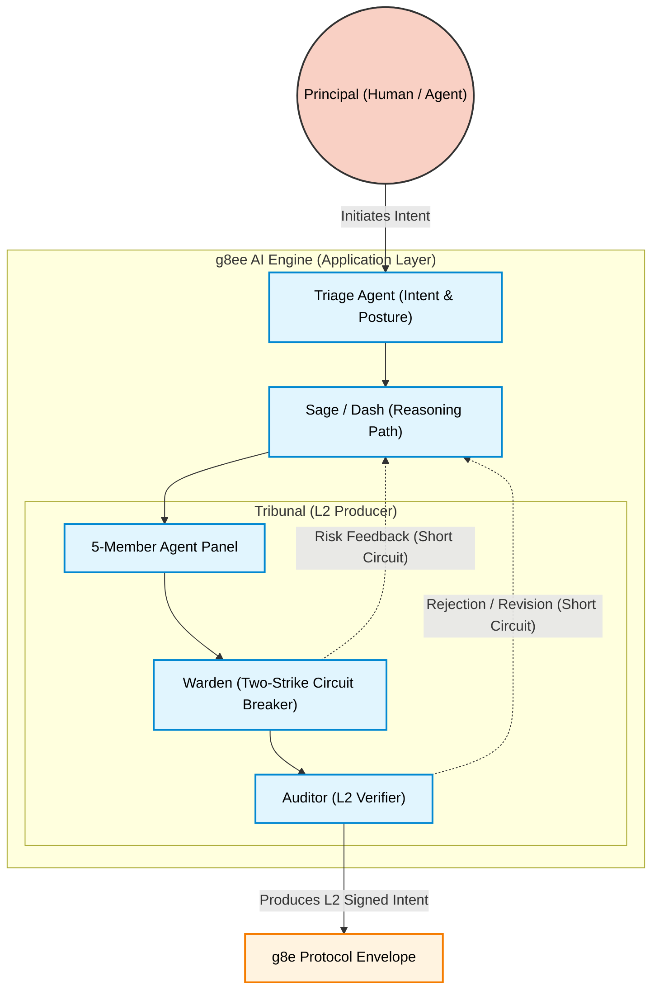

# g8e Architecture & Protocol Visualization

This document provides a visual mapping of the g8e platform, highlighting the protocol substrate as the foundational mandatory layer.

## 1. The g8e Protocol (Foundational Substrate)
The g8e protocol is a typed, signed, state-bound transaction layer. It is the single source of truth for all system mutations and the only mandatory component for interoperability.

## 2. AI Reasoning Engine (Using the Protocol)
The reference AI engine (g8ee) or any BYO agentic system consumes the protocol to articulate intent and produce verifiable transactions.

### 3-Layer Governance Summary
Every mutation must pass all three layers in sequence at the substrate boundary.

| Layer | Name | Mechanism | Responsibility |
|---|---|---|---|
| **L1** | **Technical Bedrock** | Static Analysis / Reflection | Forbidden patterns, regex threat matching, and policy enforcement. |
| **L2** | **Consensus** | Ed25519 Signatures | Cryptographic proof that an independent ensemble (Tribunal) co-validated the intent. |
| **L3** | **Authorization** | WebAuthn / FIDO2 | Hardware-bound proof of human presence for mutations. |

### Implementation Reference
- **Protocol Schemas**: `protocol/proto/*.proto`
- **Governance Logic**: `services/g8eo/internal/services/governance/`
- **Audit Storage**: `services/g8eo/internal/services/storage/audit_vault.go`