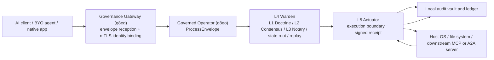

# Flowchart: System Overview (Left-to-Right)

First appeared in commit `8feca744`. High-level left-to-right flowchart tracing a request from an AI client through the Governance Gateway, the Operator verification pipeline (L4 Warden), the L5 Actuator execution boundary, and into the local audit vault and target system.

The Gateway receives signed `GovernanceEnvelope` messages via two paths: MCP and A2A tool calls are translated into envelopes by the MCP gateway layer (`internal/services/mcp/gateway.go`), while BYO clients POST protojson envelopes directly to `/api/v1/governance/envelopes` (`internal/services/gateway/governance_controller.go`). Both paths perform mTLS identity binding before forwarding to the Operator.

The L4 Warden (`internal/services/governance/l4_warden.go`) performs pre-dispatch verification: nonce reservation and replay prevention, expiry validation, stateless validation (transaction hash and L1 Doctrine pattern matching), stateful validation (state Merkle root), and posture-aware L2 Consensus and L3 Notary checks.

The L5 Actuator (`internal/services/governance/l5_actuator.go`) is the single execution boundary. It signs and logs an initial receipt to the audit vault, mints a just-in-time capability, dispatches to the registered execution handler, dissolves the capability, then signs and logs the final receipt.
