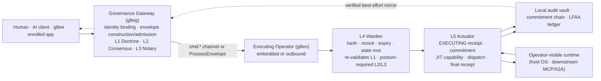

# Flowchart: System Overview (Left-to-Right)

High-level left-to-right flowchart tracing governed intent from a client through Gateway admission (L1-L3 coordination), Operator verification (L4 Warden), L5 Actuator execution, local audit evidence, and the target runtime. See [Platform Architecture Overview](../architecture/overview.md) and [Governance](../architecture/governance.md).

## Ingress Surfaces

The Gateway receives governed work through distinct authenticated surfaces:

- **MCP and A2A**: `tools/call`, `resources/read`, `prompts/get`, and `a2a/call` are translated into canonical `GovernanceEnvelope` messages by the MCP gateway layer (`internal/services/mcp/gateway.go`). Under `consensus`, `ratify`, or `notary`, the Gateway may coordinate L2 deliberation or suspend supported L3 flows before dispatch.
- **Governed HTTP dispatch**: Enrolled apps (including g8ee) post a registered request `event_type` and serialized protobuf payload to `POST /api/v1/operators/commands` (`internal/services/gateway/dispatch_service.go`). The Gateway constructs the envelope and publishes to the bound Operator session. This path does not manufacture missing L2 votes or suspend for L3.
- **Direct envelope**: Authorized CLI or Operator identities POST complete protojson envelopes to `POST /api/v1/governance/envelopes` (`internal/services/gateway/governance_controller.go`). In gateway mode this calls `ProcessEnvelope` synchronously on the embedded Operator substrate.

## Verification and Execution

The L4 Warden (`internal/services/governance/l4_warden.go`) performs pre-dispatch verification in a fixed order: nonce reservation and replay prevention, expiry validation, action-type and payload decoding, local L1 Doctrine validation, transaction hash integrity, state Merkle root comparison, and posture-gated L2 Consensus and L3 Notary checks.

The L5 Actuator (`internal/services/governance/l5_actuator.go`) is the single execution boundary. It signs and persists an `EXECUTING` receipt, appends a signed `CommitmentAttestation` when the SQL commitment ledger is configured, rehydrates scrubbed payload values, mints a transaction-bound just-in-time capability, dispatches to the registered execution handler, dissolves the capability, and signs and persists the final `COMPLETED` or `FAILED` receipt with persistence attestation. Remote Operators publish the final receipt to `receipts:<operator-id>:<operator-session-id>` on a best-effort basis; the local vault remains authoritative.
