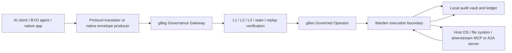

# Flowchart: System Overview (Left-to-Right)

First appeared in commit `8feca744`. High-level left-to-right flowchart tracing a request from AI client through protocol translation, gateway verification, operator, warden, and into the local vault and target system.

