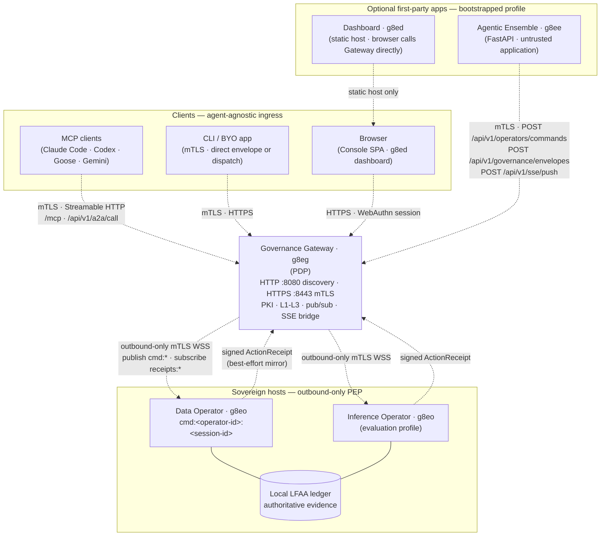

# Graph: Gateway Fleet — Unified Stack Topology

Depicts the standard unified Docker Compose topology from [Unified Docker Stack](../guides/unified_stack.md): a central Governance Gateway (PDP) with optional first-party applications and one or more outbound Governed Operators (PEP) on sovereign hosts. See [Platform Architecture Overview](../architecture/overview.md) for the full suite map.

## Ingress Paths

| Path | Typical caller | Gateway surface | Executing PEP |
| --- | --- | --- | --- |
| **Gateway MCP/A2A** | MCP clients, `g8e mcp agent run` | `/mcp`, `/api/v1/a2a/call` — Gateway constructs the envelope and may coordinate L2/L3 | Gateway in-process Operator or configured downstream service |
| **Governed HTTP dispatch** | g8ee, enrolled apps | `POST /api/v1/operators/commands` — Gateway constructs the envelope; does not add missing L2/L3 proofs | Bound outbound Operator on the named session |
| **Direct envelope** | CLI, Operator transport identity | `POST /api/v1/governance/envelopes` — caller supplies the complete envelope | Gateway in-process Operator |
| **SSE telemetry** | g8ee, platform workflows | `POST /api/v1/sse/push` (mTLS app identity) | Not an execution path — delivery telemetry only |

## Key Boundaries

- **Single binary, two roles**: The same `g8e` binary runs as Gateway (`g8e gw start`) or Operator (`g8e operator start`). Gateway mode also embeds an in-process Operator for Gateway-local ingress.
- **Outbound-only Operators**: Remote Operators dial the Gateway over mTLS WebSocket, subscribe to an exact `cmd:<operator-id>:<operator-session-id>` channel, and publish results to `receipts:<operator-id>:<operator-session-id>`. No inbound management port is required on managed hosts.
- **Sovereign evidence**: Each Operator owns authoritative local audit and ledger state (LFAA). Gateway receipt copies are verified, best-effort mirrors.
- **g8ee and g8ed are optional**: `docker compose up` starts the Gateway only. The `bootstrapped` profile adds the Data Operator, ensemble, and dashboard after owner enrollment. The `evaluation` profile adds the Inference Operator.

See [graph-system-50k.md](./graph-system-50k.md) for the layered zoom-in series and [sequence-principal-ensemble-gateway-operator-v3.md](./sequence-principal-ensemble-gateway-operator-v3.md) for the outbound transaction sequence.
