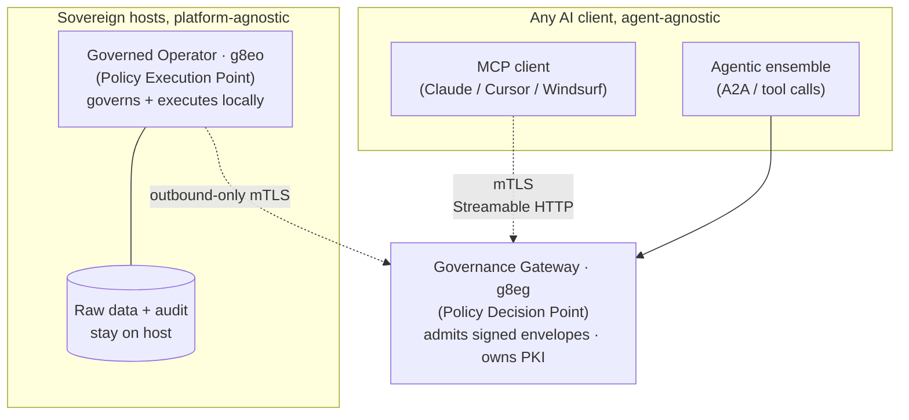

# Graph: Gateway to Single-Host Fleet (mTLS Streamable HTTP)

First appeared in commit `8e12e57f`. Adds "mTLS, Streamable HTTP" annotation on the MCP client edge and lists Windsurf as a supported client.

