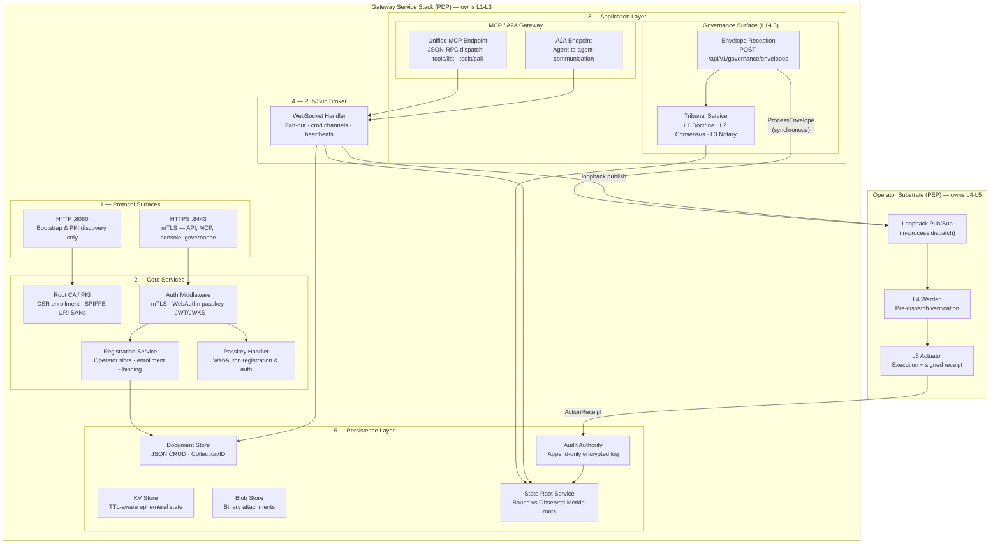

# Graph: Gateway Service Stack (PDP Overlay)

Depicts the Gateway service stack that sits on top of the Operator substrate ([graph-operator-pipeline-l1-l5.md](./graph-operator-pipeline-l1-l5.md)) in gateway mode. The Gateway is the Policy Decision Point (PDP): it owns PKI, persistence, pub/sub brokering, and the governance envelope entry point. The Operator substrate beneath it provides L4 Warden verification and L5 Actuator execution via loopback pub/sub.

See [graph-system-50k.md](./graph-system-50k.md) for how this layer relates to the Operator substrate at the 50k ft level.

## Service Stack Composition

The Gateway service stack (`GatewayModeService` in `internal/services/gateway/gateway_service.go`) is constructed by `RunGateway` (`internal/cli/serve/gateway.go`) and layered on top of the in-process `OperatorPubSubService`. The Gateway (PDP) owns layers L1-L3 (Doctrine, Consensus, Notary) as policy decisions and all inbound surfaces. The Operator substrate (PEP) owns layers L4-L5 (Warden, Actuator) for verification and execution.

### Protocol Surfaces

Two HTTP servers are started on distinct ports to separate TLS requirements:

- **HTTP :8080**: Plain HTTP for bootstrap enrollment, PKI discovery, trust script download, and health checks. No MCP or governance routes.
- **HTTPS :8443**: mTLS for all API, MCP, console, passkey, and governance routes. Client certs are accepted and verified when present; mTLS enforcement for protected routes happens at the application layer via `RouteAuthRegistry`.

### Core Services

- **PKI / Root CA**: Issues mTLS certificates via CSR-based enrollment with SPIFFE URI SAN identity. The Gateway is the only entity permitted to sign certificates.
- **Auth Middleware**: Unified middleware dispatching based on route auth mode: `RouteAuthNone` (public), `RouteAuthMTLS` (operator/CLI/app), `RouteAuthWebSession` (browser), `RouteAuthDual` (mTLS or web session).
- **Registration Service**: Manages operator slots, CSR-based device enrollment, operator-to-session binding/unbinding, and termination.
- **Passkey Handler**: Browser-facing WebAuthn registration and authentication, creating web sessions with cookies.

### Persistence Layer

- **Document Store**: JSON document CRUD on a Collection/ID pattern (`/api/v1/data/*`).
- **KV Store**: TTL-aware ephemeral state with GLOB pattern scanning (`/api/v1/kv/*`).
- **Blob Store**: Binary persistence for attachments and certificate material (`/api/v1/blobs/*`).
- **Audit Authority**: Append-only encrypted log of every event and signed `ActionReceipt`.
- **State Root Service**: Incremental state tracking with bound vs observed Merkle root tiering. The bound root gates transaction admission; the observed root chains into the audit ledger.

### Pub/Sub Broker

The WebSocket handler (`GatewayWebSocketHandler`) provides high-performance fan-out via `/api/v1/pubsub/stream`. Mutation channels (`cmd:*`) are governed. Heartbeat publications from operators update the operator document's `latest_heartbeat_snapshot` in the database.

### MCP / A2A Gateway

- **Unified MCP Endpoint**: Single-URL JSON-RPC dispatch at `/mcp` for standard MCP clients. Supports `initialize`, `ping`, `tools/list`, `tools/call`, `resources/*`, `prompts/*`.
- **A2A Endpoint**: Agent-to-agent communication at `/api/v1/a2a/call`.

### Governance Surface

- **Envelope Reception**: `POST /api/v1/governance/envelopes` is the only customer-facing mutation entry point. Envelopes are processed synchronously via `ProcessEnvelope` on the in-process Operator substrate.
- **Tribunal Service**: Constructed in-process for `consensus` and `notary` postures. Handles L2 deliberation via the `Deliberate` endpoint, producing Ed25519 signed votes.

## Relationship to Operator Substrate

The Gateway does not perform verification or execution itself. It delegates to the in-process `OperatorPubSubService` via:

1. **Loopback Pub/Sub**: `NewInProcessPubSubClient` creates a loopback client that dispatches directly to the gateway's WebSocket handler, bypassing the network entirely.
2. **`ProcessEnvelope`**: The envelope processor (`SetEnvelopeProcessor`) wires the command service as the synchronous fail-closed mutation gate. BYO clients POST envelopes and receive signed `ActionReceipt` as HTTP 200 JSON.
3. **Governance Deps**: The Gateway's stores (ReplayStore, StateRootProvider, SignerStore, AppPolicyStore, TribunalStore, L3Notary) are injected into the Operator substrate via `GetGovernanceDeps()`.

See [graph-operator-pipeline-l1-l5.md](./graph-operator-pipeline-l1-l5.md) for the L1–L5 verification and execution sequence that runs beneath this service stack.
