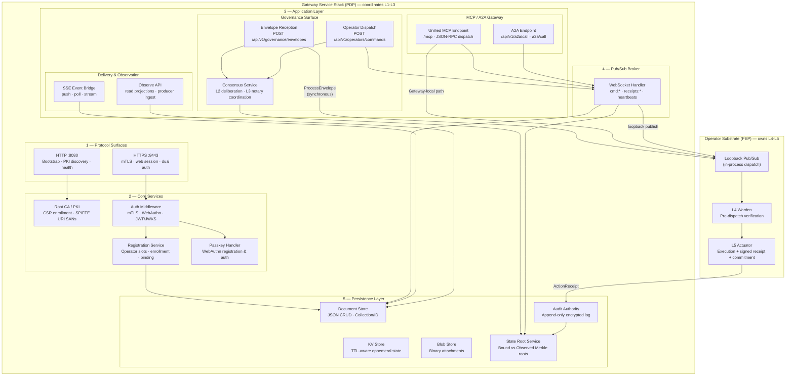

# Graph: Gateway Service Stack (PDP Overlay)

Depicts the Gateway service stack that sits on top of the Operator substrate ([graph-operator-pipeline-l1-l5.md](./graph-operator-pipeline-l1-l5.md)) in gateway mode. The Gateway is the Policy Decision Point (PDP): it owns PKI, persistence, pub/sub brokering, SSE delivery, and the governance envelope entry point. The Operator substrate beneath it provides L4 Warden verification and L5 Actuator execution via loopback pub/sub.

See [graph-system-50k.md](./graph-system-50k.md) for how this layer relates to the Operator substrate at the 50k ft level.

## Service Stack Composition

The Gateway service stack (`GatewayModeService` in `internal/services/gateway/gateway_service.go`) is constructed by `RunGateway` (`internal/cli/serve/gateway.go`) and layered on top of the in-process `OperatorPubSubService`. The Gateway (PDP) coordinates L1 through L3 policy decisions and all inbound surfaces. The Operator substrate (PEP) owns L4 Warden and L5 Actuator for verification and execution.

### Protocol Surfaces

Two HTTP servers are started on distinct ports to separate TLS requirements:

- **HTTP :8080**: Plain HTTP for health and state checks, bootstrap and PKI discovery, token-scoped CLI recovery and platform-enrollment flows, deploy scripts, and g8e binary distribution. No MCP or governed API routes.
- **HTTPS :8443**: TLS 1.3 for the Console SPA, browser WebAuthn endpoints, APIs, MCP/A2A, operator management, governance, SSE, and observe routes. Client certificates are optional at the TLS handshake; route middleware applies public, web-session, dual, mTLS, or configured JWT requirements per route via `RouteAuthRegistry`.

### Core Services

- **PKI / Root CA**: Issues mTLS certificates via CSR-based enrollment with SPIFFE URI SAN identity under the `g8e.local` trust domain. The Gateway is the only entity permitted to sign certificates.
- **Auth Middleware**: Unified middleware dispatching based on route auth mode: `RouteAuthNone` (public), `RouteAuthMTLS` (operator/CLI/app), `RouteAuthWebSession` (browser), `RouteAuthDual` (mTLS or web session).
- **Registration Service**: Manages operator slots, CSR-based device enrollment, operator-to-session binding/unbinding, termination, and revocation.
- **Passkey Handler**: Browser-facing WebAuthn registration and authentication, creating web sessions with cookies.

### Persistence Layer

- **Document Store**: JSON document CRUD on a Collection/ID pattern (`/api/v1/data/*`).
- **KV Store**: TTL-aware ephemeral state with GLOB pattern scanning (`/api/v1/kv/*`).
- **Blob Store**: Binary persistence for attachments and certificate material (`/api/v1/blobs/*`).
- **Audit Authority**: Append-only encrypted log of sessions, events, file mutations, signed `ActionReceipt` records, and commitment evidence.
- **State Root Service**: Incremental state tracking with bound vs observed Merkle root tiering. The bound root gates transaction admission; the observed root chains into the audit ledger without invalidating in-flight envelopes.

### Pub/Sub Broker

The WebSocket handler (`GatewayWebSocketHandler`) provides fan-out via `/api/v1/pubsub/stream`. Channel patterns include:

- `cmd:<operator-id>:<operator-session-id>` — Gateway-internal dispatch only (`POST /api/v1/operators/commands`); WebSocket publishers cannot inject command intent on `cmd:` channels.
- `receipts:<operator-id>:<operator-session-id>` — Operator-published signed `ActionReceipt` relay; the Gateway verifies and mirrors accepted receipts to SQL audit storage.
- Heartbeat publications update the operator document's `latest_heartbeat_snapshot` via `handleHeartbeatPublish` (`internal/services/gateway/gateway_service.go`).

### MCP / A2A Gateway

- **Unified MCP Endpoint**: Single-URL JSON-RPC dispatch at `/mcp` for standard MCP clients. Supports `initialize`, `ping`, `tools/list`, `tools/call`, `resources/*`, `prompts/*`, and `a2a/call`.
- **A2A Endpoint**: JSON-RPC `a2a/call` at `/api/v1/a2a/call` (also available through the unified MCP endpoint).

### Governance Surface

- **Envelope Reception**: `POST /api/v1/governance/envelopes` admits complete envelopes from authorized CLI or Operator transport identities. Processing is synchronous via `ProcessEnvelope` on the in-process Operator substrate.
- **Operator Dispatch**: `POST /api/v1/operators/commands` constructs governed envelopes for enrolled app and CLI callers and fans out typed actions to explicit operator sessions. The dispatch path does not synthesize missing L2 votes or suspend for L3.
- **Consensus Service**: Handles L2 deliberation when configured under `consensus` or `notary` posture, producing Ed25519 signed votes. Coordinates supported L3 suspension and WebAuthn approval flows for Gateway MCP/A2A ingress.

### SSE Event Bridge and Observe API

- **SSE Event Bridge**: `POST /api/v1/sse/push` (mTLS app identity), `GET /api/v1/sse/events`, and `GET /api/v1/sse/stream` (dual auth). SSE is delivery telemetry, not governance state.
- **Observe API**: Browser-scoped read projections under `/api/v1/observe/` and mTLS producer ingest at `/api/v1/observe/producer/agent-state` and `/api/v1/observe/producer/run-state`. See [SSE Streaming](../architecture/sse.md).

## Relationship to Operator Substrate

The Gateway does not perform L4-L5 verification or execution itself for remote-bound work. It delegates to the in-process `OperatorPubSubService` for Gateway-local ingress and to outbound Operators via pub/sub for remote runtime work:

1. **Loopback Pub/Sub**: `NewInProcessPubSubClient` creates a loopback client that dispatches directly to the gateway's WebSocket handler, bypassing the network entirely.
2. **`ProcessEnvelope`**: The envelope processor (`SetEnvelopeProcessor`) wires the command service as the synchronous fail-closed mutation gate for direct envelope admission.
3. **Governance Deps**: The Gateway's stores (ReplayStore, StateRootProvider, SignerStore, AppPolicyStore, ConsensusStore, L3Notary) are injected into the Operator substrate via `GetGovernanceDeps()`.

See [graph-operator-pipeline-l1-l5.md](./graph-operator-pipeline-l1-l5.md) for the L1–L5 verification and execution sequence that runs beneath this service stack.
