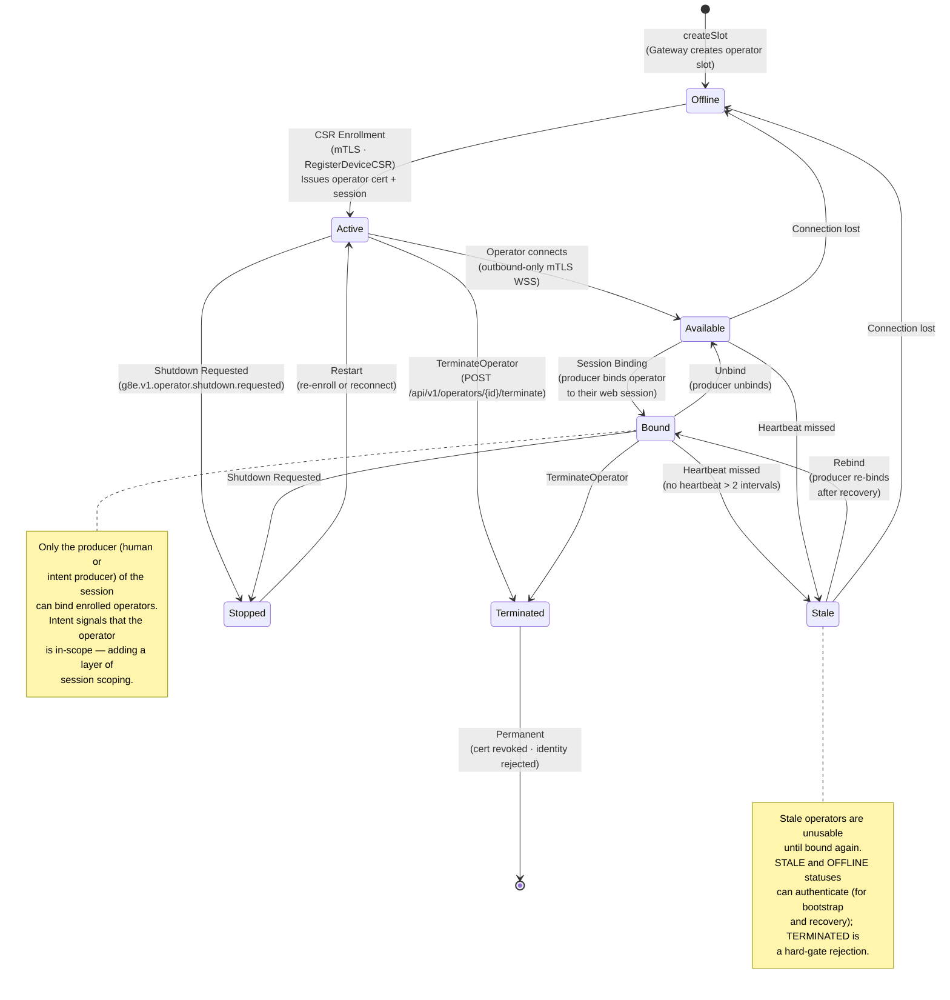

# Graph: Operator Lifecycle — Enrollment, Binding, Heartbeats, Stop

Depicts the Operator lifecycle from enrollment through binding, heartbeat monitoring, stale detection, and remote stop. This is the deepest zoom level — see [graph-system-50k.md](./graph-system-50k.md) for how the Operator relates to the Gateway at the 50k ft level.

## Lifecycle Phases

### 1. Enrollment (CSR-Based)

Enrollment authenticates the Operator but does not make it usable. An enrolled Operator has an mTLS certificate and an operator session, but cannot receive work until it is bound to a specific session with a specific type.

**Flow** (`internal/services/gateway/registration_service.go`):

1. The Gateway creates an **operator slot** (`createSlot`) with status `offline`. Slots are pre-allocated placeholders.
2. The remote host submits a CSR via `RegisterDeviceCSR` over mTLS. The Gateway resolves the slot by fingerprint match, offline slot reuse, or creates a new one.
3. The Gateway signs the Operator CSR, issues an operator certificate with SPIFFE URI SAN identity, creates an operator session, and marks the slot as `active` (`OperatorStatusActive`).
4. If a CLI CSR is provided, a CLI session is also created and linked to the operator session.

**Key invariant**: Enrollment only authenticates identity. Nothing can happen with an enrolled Operator until it is bound to a session.

### 2. Connection

The Operator initiates an **outbound-only, asynchronous streaming pull-style mTLS WebSocket connection** to the Gateway:

- **Transport**: WSS (WebSocket Secure) over TLS with mutual authentication.
- **Direction**: Outbound only. No inbound ports are required on the managed host.
- **Channel**: The Operator subscribes to its unique `cmd:*` pub/sub channel.
- **URL construction**: `wss://{hostname}:{httpsPort}` (`internal/config/config.go`).

Once connected, the Operator's status transitions to `available` or `bound` depending on session state.

### 3. Session Binding

Only the **producer** (the human or intent producer who owns the session) can bind enrolled Operators to their session. This adds a layer of session scoping that is required before the Operator can receive work.

**Flow** (`internal/services/gateway/registration_service.go`):

1. The producer calls `POST /api/v1/operators/bind` with their `web_session_id`, `user_id`, and a list of `operator_ids`.
2. The Gateway verifies each operator belongs to the requesting user (`op.UserID != req.UserID` → rejected).
3. The Gateway creates KV bindings:
   - `g8e:sessions:operator:{operatorSessionId}:bind` → `webSessionId`
   - `g8e:sessions:web:{webSessionId}:bind` → `[operatorSessionId, ...]`
4. The operator status transitions to `bound` (`OperatorStatusBound`).

**Unbinding**: `POST /api/v1/operators/unbind` removes the KV bindings. The operator returns to `available` status.

**Key invariant**: Intent signals that the Operator is in-scope. Only the session producer can bind. An operator without a binding cannot receive dispatched work.

### 4. Heartbeats

Bound Operators emit heartbeat telemetry every **30 seconds** (default; configurable via `--heartbeat-interval`).

- **Heartbeat interval**: `heartbeatIntervalOrDefault` defaults to 30s (`internal/config/config.go`).
- **Heartbeat scheduler**: `HeartbeatService.StartScheduler` runs a periodic ticker (`internal/services/pubsub/heartbeat_service.go`).
- **Heartbeat payload**: System telemetry wrapped in a `GovernanceEnvelope` with `operator_id`.
- **Gateway handling**: `handleHeartbeatPublish` updates the operator document's `latest_heartbeat_snapshot` and `updated_at` in the database (`internal/services/gateway/gateway_service.go`).
- **Protocol events**:
  - `g8e.v1.operator.heartbeat.sent` — Operator sent heartbeat
  - `g8e.v1.operator.heartbeat.received` — Gateway received heartbeat
  - `g8e.v1.operator.heartbeat.missed` — Heartbeat missed (interval elapsed without receipt)
  - `g8e.v1.operator.heartbeat.requested` — Gateway requested on-demand heartbeat

### 5. Stale Detection

If a heartbeat is not received after **60 seconds** (2 × 30s default interval), the Operator transitions to `stale` status.

- **Status**: `OperatorStatusStale` (`internal/constants/status.go`).
- **Protocol event**: `g8e.v1.operator.status.updated.stale`.
- **Impact**: Stale Operators are **unusable** until they are bound again. However, `STALE` and `OFFLINE` statuses can still authenticate (to support bootstrap and recovery) — only `TERMINATED` is a hard-gate rejection (`internal/services/gateway/gateway_auth.go`).
- **Recovery**: A stale operator that reconnects and is re-bound by its producer transitions back to `bound`.

### 6. Remote Stop

Operators can be stopped remotely via stop event signals:

- **Protocol event**: `g8e.v1.operator.shutdown.requested` (`EventOperatorShutdownRequested`).
- **Acknowledgment**: `g8e.v1.operator.shutdown.acknowledged` (`EventOperatorShutdownAcknowledged`).
- **Status transition**: The Operator transitions to `stopped` (`OperatorStatusStopped`).
- **Recovery**: A stopped Operator can be restarted (re-enroll or reconnect), transitioning back to `active`.

### 7. Termination

Termination is a permanent, irreversible action:

- **API**: `POST /api/v1/operators/{id}/terminate` (`internal/services/gateway/operator_controller.go`).
- **Implementation**: `TerminateOperator` in `RegistrationService` (`internal/services/gateway/registration_service.go`).
- **Authorization**: Only the operator's owner (`op.UserID`) can terminate. Wrong owner → rejected.
- **Status**: `OperatorStatusTerminated` (`internal/constants/status.go`).
- **Protocol event**: `g8e.v1.operator.status.updated.terminated`.
- **Impact**: The operator's identity is permanently rejected at the auth middleware. Terminated operators cannot authenticate, connect, or be recovered.

## Operator Status Reference

| Status | Description | Can Authenticate? | Can Receive Work? |
|---|---|---|---|
| `offline` | Slot created but not enrolled, or connection lost | Yes (for recovery) | No |
| `active` | Enrolled, certificate issued | Yes | No (must be bound) |
| `available` | Connected, not bound to a session | Yes | No |
| `bound` | Connected and bound to a producer session | Yes | Yes |
| `stale` | Heartbeat missed (>60s) | Yes (for recovery) | No |
| `stopped` | Remote shutdown received | No | No |
| `terminated` | Permanently terminated | No (hard-gate) | No |
| `unavailable` | Manually marked unavailable | No | No |

## Protocol Events Reference

| Event | Constant | Description |
|---|---|---|
| `g8e.v1.operator.heartbeat.sent` | `EventOperatorHeartbeatSent` | Operator sent heartbeat |
| `g8e.v1.operator.heartbeat.received` | `EventOperatorHeartbeatReceived` | Gateway received heartbeat |
| `g8e.v1.operator.heartbeat.missed` | `EventOperatorHeartbeatMissed` | Heartbeat interval elapsed without receipt |
| `g8e.v1.operator.heartbeat.requested` | `EventOperatorHeartbeatRequested` | Gateway requested on-demand heartbeat |
| `g8e.v1.operator.shutdown.requested` | `EventOperatorShutdownRequested` | Remote stop signal sent to operator |
| `g8e.v1.operator.shutdown.acknowledged` | `EventOperatorShutdownAcknowledged` | Operator acknowledged shutdown |
| `g8e.v1.operator.status.updated.stale` | `EventOperatorStatusUpdatedStale` | Operator transitioned to stale |
| `g8e.v1.operator.status.updated.stopped` | `EventOperatorStatusUpdatedStopped` | Operator transitioned to stopped |
| `g8e.v1.operator.status.updated.terminated` | `EventOperatorStatusUpdatedTerminated` | Operator transitioned to terminated |
| `g8e.v1.operator.status.updated.bound` | `EventOperatorStatusUpdatedBound` | Operator bound to session |
| `g8e.v1.operator.status.updated.offline` | `EventOperatorStatusUpdatedOffline` | Operator went offline |
| `g8e.v1.operator.status.updated.active` | `EventOperatorStatusUpdatedActive` | Operator became active |
| `g8e.v1.operator.unbound` | `EventOperatorUnbound` | Operator unbound from session |
