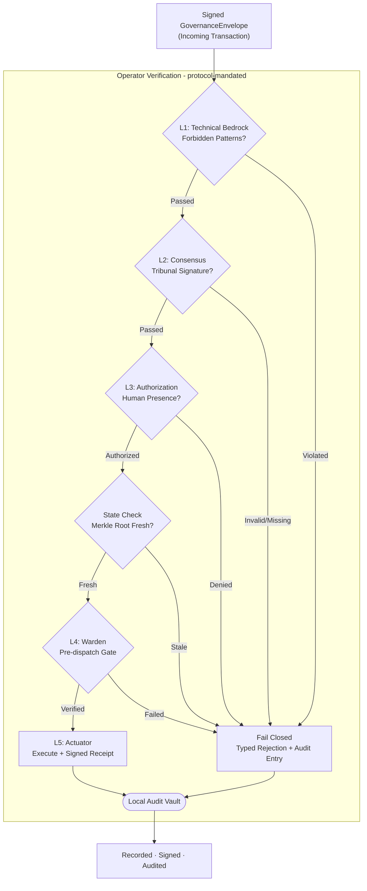

# Graph: Operator Pipeline (L1–L4 + L5 Actuator, Full Five Layers)

First appeared in commit `8992215d`. First version to show all five layers explicitly: L1 Doctrine, L2 Consensus, L3 Authorization, State Check, L4 Warden, and L5 Actuator.

