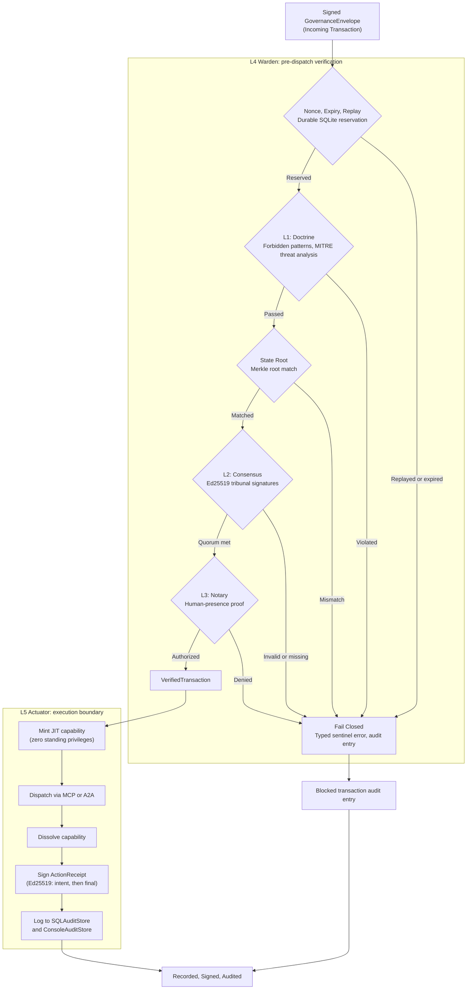

# Graph: Operator Pipeline (L1 through L4 + L5 Actuator, Full Five Layers)

First appeared in commit `8992215d`. Depicts the full five-layer interlock sequence as orchestrated by L4 Warden: L1 Doctrine, state Merkle root verification, L2 Consensus, L3 Notary, and L5 Actuator execution.

## Verification Sequence

L4 Warden (`internal/services/governance/l4_warden.go`) orchestrates all pre-dispatch checks in a fixed order. Each stage returns a typed sentinel error on failure, causing the transaction to be rejected and logged as a blocked transaction.

1. **Nonce, Expiry, Replay**: The nonce is durably reserved in SQLite before any expensive cryptography. Expired or replayed nonces are rejected immediately.
2. **L1 Doctrine**: Stateless validation in `internal/services/governance/l1_doctrine.go`. Checks protobuf `forbidden_patterns` field extensions and performs MITRE-based threat detection on command, MCP, A2A, and file-edit payloads.
3. **State Root**: Stateful validation comparing `envelope.StateMerkleRoot` against the current root from `StateRootProvider` (`internal/services/gateway/state_root_service.go`). The bound root incorporates config, governance, filesystem mutations, and the token keymap hash.
4. **L2 Consensus**: Posture-gated Ed25519 signature verification against tribunal policy. Verifies quorum of distinct tribunal member signatures over the transaction hash.
5. **L3 Notary**: Posture-gated human-presence verification (`internal/services/governance/l3_notary.go`). Runs only after L2 passes, preserving the invariant that a human is never asked to authorize content the machines have not vetted.

## Governance Posture

The `GovernancePosture` interface (`internal/services/governance/posture.go`) determines which layers are enforced as fail-closed gates versus audited:

- **doctrine**: L1 enforced; L2 and L3 audited but do not gate execution.
- **consensus**: L1 and L2 enforced; L3 audited but does not gate execution.
- **notary**: L1, L2, and L3 all strictly enforced as fail-closed gates.

## L5 Actuator Execution

L5 Actuator (`internal/services/governance/l5_actuator.go`) is the single execution boundary for verified transactions. The execution sequence is:

1. Sign initial `ActionReceipt` (intent to execute); fail-closed if signing or audit logging fails.
2. Rehydrate scrubbed payload if `ScrubbingService` is available.
3. Mint a just-in-time capability scoped to the single transaction, bound to the transaction hash.
4. Dispatch to the registered `ExecutionHandler` via MCP or A2A.
5. Dissolve the capability immediately after execution (zero standing privileges).
6. Sign the final `ActionReceipt` with execution result and state root after.
7. Log the final receipt to `SQLAuditStore` and `ConsoleAuditStore`.
