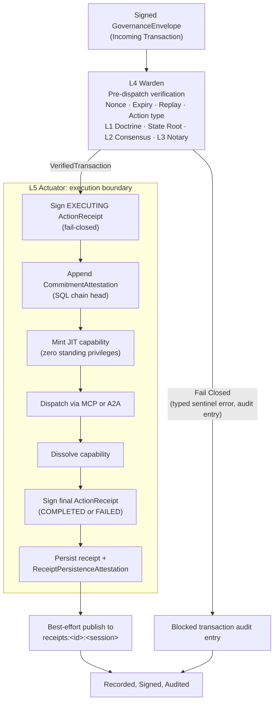

# Graph: Operator Pipeline — L1 through L5 (PEP Substrate)

Depicts the full five-layer interlock sequence as orchestrated by L4 Warden: local L1 Doctrine re-validation, state Merkle root verification, L2 Consensus, L3 Notary, and L5 Actuator execution with commitment and signed receipts.

This is the **Operator substrate** — the Policy Execution Point (PEP) that runs beneath every deployment mode. In **gateway mode** (PDP), the Gateway service stack ([graph-gateway-services.md](./graph-gateway-services.md)) sits on top of this substrate in the same process, connected via loopback pub/sub. In **outbound mode**, this same pipeline runs on a remote host, connected to the Gateway via outbound-only mTLS WebSocket. See [graph-system-50k.md](./graph-system-50k.md) for the 50k ft layering view.

## Verification Sequence

L4 Warden (`internal/services/governance/l4_warden.go`) orchestrates all pre-dispatch checks in a fixed order. Each stage returns a typed sentinel error on failure, causing the transaction to be rejected and logged as a blocked transaction.

1. **Nonce, Expiry, Replay**: The nonce is durably reserved in SQLite before any expensive cryptography. Expired or replayed nonces are rejected immediately.
2. **Action Type and Payload**: The known action type is validated and its typed protobuf payload is decoded.
3. **L1 Doctrine**: Stateless validation in `internal/services/governance/l1_doctrine.go`. The executing Operator re-runs L1 locally even when the Gateway already screened the payload.
4. **Transaction Hash**: The envelope `id` must match the deterministic transaction hash recomputed from envelope content.
5. **State Root**: Stateful validation comparing `envelope.StateMerkleRoot` against the current root from `StateRootProvider` (`internal/services/gateway/state_root_service.go`). Outbound Operators compare against the Gateway state root, not a substituted local ledger root.
6. **L2 Consensus**: Posture-gated Ed25519 signature verification against consensus policy. Verifies quorum of distinct consensus member signatures over the transaction hash.
7. **L3 Notary**: Posture-gated human-presence verification (`internal/services/governance/l3_notary.go`). Runs only after L2 when both are required.

## Governance Posture

The `GovernancePosture` interface (`internal/services/governance/posture.go`) determines which layers are enforced as fail-closed gates versus audited:

- **doctrine**: L1 enforced; L2 and L3 audited but do not gate execution.
- **consensus**: L1 and L2 enforced; L3 audited but does not gate execution.
- **ratify**: L1 and L3 enforced for mutations; L2 audited but does not gate execution.
- **notary**: L1, L2, and L3 all strictly enforced as fail-closed gates for mutations.

Read-only actions do not require L3 proof under `ratify` or `notary`.

## L5 Actuator Execution

L5 Actuator (`internal/services/governance/l5_actuator.go`) is the single execution boundary for verified transactions. It accepts the `VerifiedTransaction` from L4 and does not re-run L2 or L3. The execution sequence is:

1. Sign initial `ActionReceipt` (`EXECUTING`); fail-closed if signing or audit logging fails.
2. Append a signed `CommitmentAttestation` against the current SQLite chain head when the SQL audit store is enabled.
3. Rehydrate scrubbed payload if `ScrubbingService` is available.
4. Mint a just-in-time capability scoped to the single transaction, bound to the transaction hash.
5. Dispatch to the registered `ExecutionHandler` via MCP or A2A.
6. Dissolve the capability immediately after execution (zero standing privileges).
7. Sign the final `ActionReceipt` with execution result and state root after.
8. Log the final receipt to `SQLAuditStore` and `ConsoleAuditStore`, with `ReceiptPersistenceAttestation` when configured.
9. Publish the final receipt to the Gateway on a best-effort basis. The local vault remains authoritative even when publication fails.
