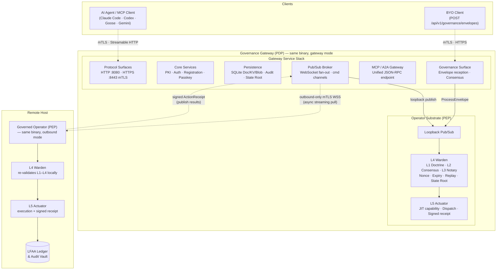

# Graph: System Overview — 50k ft (Gateway on Operator Substrate)

The 50k ft view. The g8e binary file deploys as two logical roles from a single binary:

- **Governance Gateway (PDP)**: The Policy Decision Point. Sits on top of the Operator substrate in the same process. Owns PKI, persistence, pub/sub brokering, and the governance envelope entry point. Listens for inbound work and publishes it via pub/sub.
- **Governed Operator (PEP)**: The Policy Execution Point. The substrate beneath every deployment. Runs L4 Warden verification and L5 Actuator execution. In gateway mode, it receives work via loopback pub/sub. In outbound mode, it runs on a remote host and pulls work from the Gateway via outbound-only mTLS WebSocket.

The Gateway is not a separate program — it is the Operator with a service stack layered on top.

## Zoom Levels

This diagram is the top of a zoom-in series:

1. **50k ft** (this diagram): Gateway (PDP) layered on Operator (PEP) substrate. Remote Operator connects via outbound-only mTLS WebSocket.
2. **Gateway services** ([graph-gateway-services.md](./graph-gateway-services.md)): The service stack that sits on top of the Operator substrate — protocol surfaces, core services, persistence, pub/sub broker, MCP/A2A gateway, governance surface.
3. **Operator pipeline** ([graph-operator-pipeline-l1-l5.md](./graph-operator-pipeline-l1-l5.md)): The L1–L5 verification and execution sequence that runs in the substrate beneath both modes.
4. **Operator lifecycle** ([graph-operator-lifecycle.md](./graph-operator-lifecycle.md)): Enrollment, session binding, heartbeats, stale detection, and remote stop signals.

## Key Architectural Points

- **Single binary, two roles**: The same g8e binary file runs as Gateway (PDP) when started with `--posture`, and as Operator (PEP) when started in standard mode. In gateway mode, both roles run in the same process.
- **Gateway sits on Operator**: The Gateway service stack is layered on top of the in-process `OperatorPubSubService`. The Gateway owns inbound surfaces and policy decisions; the Operator substrate handles verification and execution.
- **Loopback pub/sub**: In gateway mode, command dispatch never leaves the process. `NewInProcessPubSubClient` creates a loopback that routes directly to the WebSocket handler.
- **Outbound-only for remote Operators**: Remote Operators initiate an outbound-only mTLS WebSocket connection to the Gateway. No inbound ports are required on managed hosts. The Operator pulls work from its unique pub/sub channel.
- **Pub/sub is the dispatch boundary**: The Gateway publishes work to operator-specific `cmd:*` channels. Only operators on the approved hosts list receive work — this is a security boundary enforced by channel subscription.
