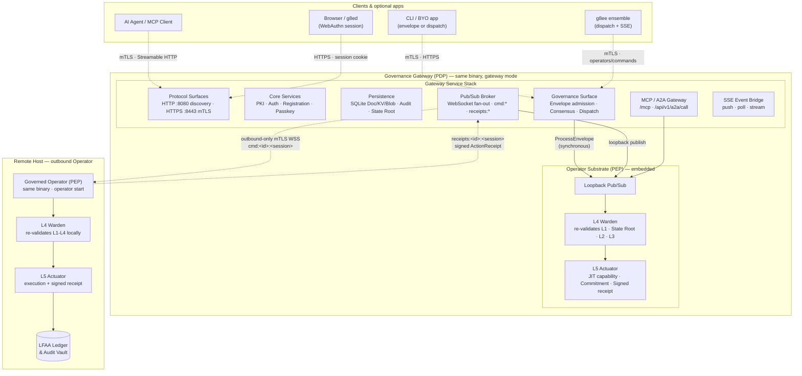

# Graph: System Overview — 50k ft (Gateway on Operator Substrate)

The 50k ft view. The g8e binary deploys as two logical roles from a single static binary:

- **Governance Gateway (PDP)**: The Policy Decision Point. Sits on top of the Operator substrate in the same process when run in gateway mode. Owns PKI, persistence, pub/sub brokering, SSE delivery, and client-facing admission for L1 through L3. Listens for inbound work and publishes to exact session-specific `cmd:*` channels.
- **Governed Operator (PEP)**: The Policy Execution Point. The substrate beneath every deployment. Runs L4 Warden verification and L5 Actuator execution. In gateway mode, it receives Gateway-local work via loopback pub/sub. In outbound mode, it runs on a remote host and pulls work from the Gateway via outbound-only mTLS WebSocket.

The Gateway is not a separate program — it is the Operator with a service stack layered on top.

## Zoom Levels

This diagram is the top of a zoom-in series:

1. **50k ft** (this diagram): Gateway (PDP) layered on Operator (PEP) substrate. Remote Operator connects via outbound-only mTLS WebSocket.
2. **Fleet topology** ([graph-gateway-fleet-single-host-http-mtls.md](./graph-gateway-fleet-single-host-http-mtls.md)): Unified Compose stack with optional g8ee, g8ed, and evaluation Operators.
3. **Gateway services** ([graph-gateway-services.md](./graph-gateway-services.md)): The service stack on top of the Operator substrate — protocol surfaces, core services, persistence, pub/sub broker, MCP/A2A gateway, governance surface, SSE bridge.
4. **Operator pipeline** ([graph-operator-pipeline-l1-l5.md](./graph-operator-pipeline-l1-l5.md)): The L1–L5 verification and execution sequence in the substrate beneath both modes.
5. **Operator lifecycle** ([graph-operator-lifecycle.md](./graph-operator-lifecycle.md)): Enrollment, session binding, heartbeats, stale detection, and remote stop signals.

## Key Architectural Points

- **Single binary, two roles**: The same g8e binary runs as Gateway (PDP) with `g8e gw start --posture <doctrine|consensus|ratify|notary>`, and as Operator (PEP) with `g8e operator start`. In gateway mode, both roles run in the same process.
- **Gateway sits on Operator**: The Gateway service stack is layered on top of the in-process `OperatorPubSubService`. The Gateway owns inbound surfaces and L1-L3 coordination; the Operator substrate handles L4-L5 verification and execution.
- **Loopback pub/sub**: In gateway mode, Gateway-local command dispatch never leaves the process. `NewInProcessPubSubClient` routes directly to the WebSocket handler.
- **Outbound-only for remote Operators**: Remote Operators initiate outbound-only mTLS WebSocket connections. No inbound ports are required on managed hosts. Work is pulled from an exact `cmd:<operator-id>:<operator-session-id>` channel; receipts publish to `receipts:<operator-id>:<operator-session-id>`.
- **Session-scoped dispatch**: The Gateway binds work to one authenticated Operator session. No broadcast occurs.
- **Sovereign hosts**: Each remote Operator is authoritative for its local audit ledger and state root. The Gateway never reaches into Operators.
