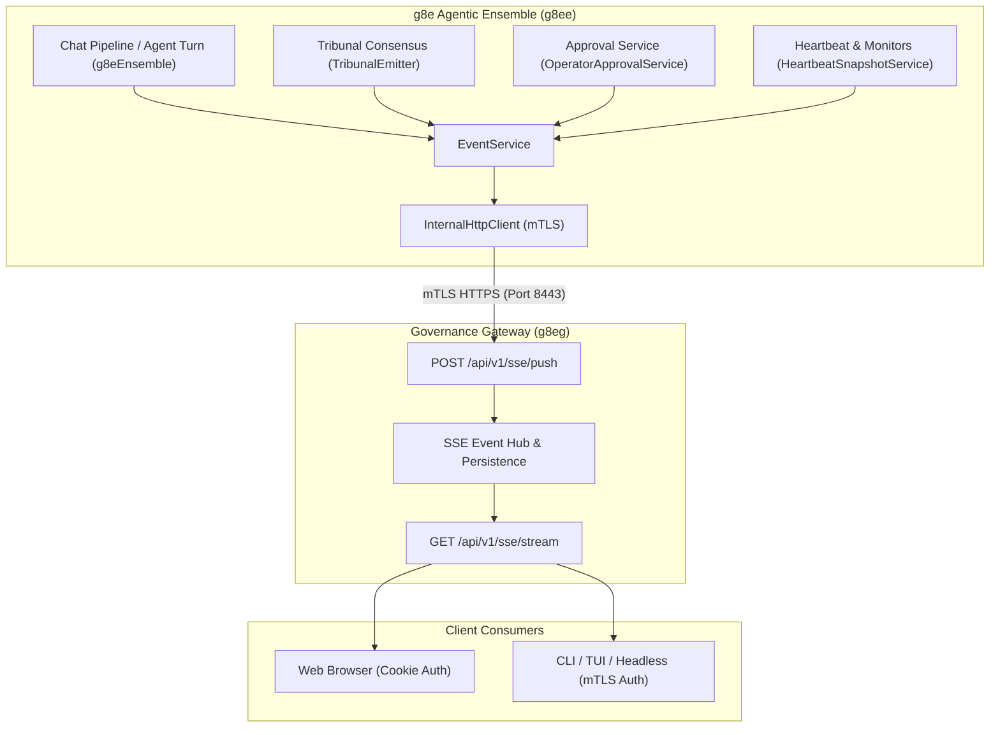
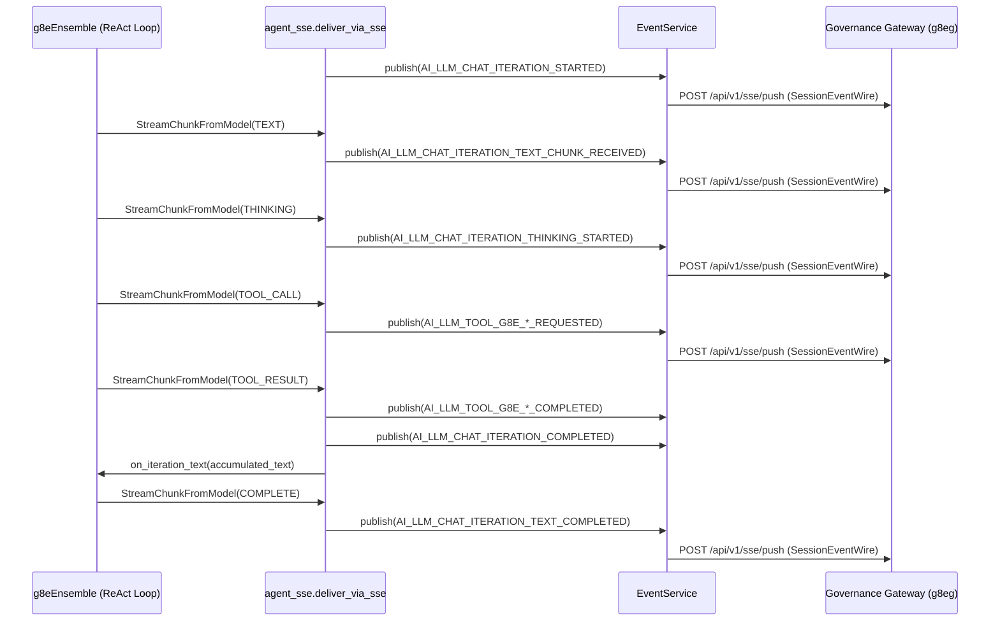

# Server-Sent Events (SSE)

## Overview

The g8e Agentic Ensemble (`g8ee`) uses Server-Sent Events (SSE) as its primary real-time push mechanism to stream live progress, intermediate reasoning, tool lifecycle transitions, multi-agent Tribunal deliberations, human-in-the-loop approval challenges, and operator telemetry to client interfaces. Rather than maintaining direct WebSocket or SSE consumer connections with web browsers or CLI terminals, `g8ee` acts as an authenticated event producer. It pushes typed event envelopes over mTLS to the Governance Gateway's ingestion endpoint (`POST /api/v1/sse/push`), which acts as the centralized event distribution broker.

The Gateway validates the incoming event, records telemetry, and dispatches the payload to connected consumers over `GET /api/v1/sse/stream` or `GET /api/v1/sse/events`. Because `g8ee` operates with an enrolled app workload identity (`spiffe://g8e.local/app/g8ee`), the Gateway authorizes it as the centralized event broker, allowing it to publish events to any active user session.



## Event Routing Model

Every event emitted by `g8ee` is structured as a typed envelope defined in `app.models.events`. The model enforces a strict dual-dimension routing scheme: an ownership dimension (`user_id`) and a delivery dimension (`web_session_id` or `cli_session_id`).

### SessionEvent vs. BackgroundEvent

The ensemble differentiates between targeted interactive events and broadcast background events:

- **`SessionEvent` (`app.models.events.SessionEvent`)** — Used when an event originates from or targets a specific client session. It requires `user_id` and exactly one delivery target: either `web_session_id` (browser clients) or `cli_session_id` (CLI/BYO clients). Setting neither or both session identifiers raises a validation error during model instantiation, preventing ambiguous routing before wire serialization.
- **`BackgroundEvent` (`app.models.events.BackgroundEvent`)** — Used for system-initiated background operations where no single client session initiated the event. It requires `user_id` and carries optional correlation hints (`investigation_id`, `case_id`, `task_id`). When received by the Gateway, the event is fanned out to all active SSE streams belonging to that authenticated user.

### Target Validation Guard

The Gateway's `/api/v1/sse/push` endpoint requires a valid routing target and rejects targetless events with HTTP 400 Bad Request. In `EventService.publish()`, `g8ee` inspects outgoing events before transmission. If an event lacks both `web_session_id` and `cli_session_id` (and is not an intentional user fan-out), `EventService` skips the network push entirely. This defensive check prevents 400 responses from tripping the client circuit breaker and blocking critical downstream notifications, such as interactive approval prompts.

### Wire Envelopes

Internal `SessionEvent` and `BackgroundEvent` objects are converted into protocol wire envelopes (`SessionEventWire` and `BackgroundEventWire`) by `app.models.events`. These wire models subclass definitions from the `g8e` protocol package, packaging the payload into an `_SSEEventBody` structure containing the canonical `type` string and nested `data` dictionary.

| Routing Model | Required Identifiers | Target Delivery | Primary Use Cases |
| --- | --- | --- | --- |
| `SessionEvent` | `user_id`, and exactly one of `web_session_id` or `cli_session_id` | Single targeted client session | AI chat token streaming, thinking progress, tool executions, approval challenges, clarification questions |
| `BackgroundEvent` | `user_id` | All active sessions owned by the user | Unbound operator heartbeat updates, background task completions, stale operator status transitions |

### Reputation Updates

Post-execution reputation resolution uses the same authenticated session-event route as interactive ensemble events. `EventService.publish_reputation_event()` converts the originating `RequestContext` into a typed `SessionEvent`, preserving its user, web or CLI session, case, investigation, and task correlation before posting to `POST /api/v1/sse/push` over the enrolled g8ee app mTLS channel.

Each affected agent publishes `g8e.v1.operator.reputation.state.updated` with a typed `StakeResolutionPayload`. A non-zero slash additionally publishes `g8e.v1.operator.reputation.slash.tier1`, `.tier2`, or `.tier3` with the same payload and request context. The event is not serialized through an ad hoc reputation-specific transport, so the Gateway applies the same ownership and single-session delivery checks as other `SessionEvent` messages.

## Core Infrastructure

The SSE subsystem in `g8ee` is built on two primary infrastructure layers: `EventService` and `InternalHttpClient`.

### EventService

The `EventService` class (`app/services/infra/event_service.py`) implements `EventServiceProtocol` and provides the high-level publishing interface consumed across the ensemble. It exposes three primary methods:

- **`publish(event)`** — Validates routing targets and delegates the wire model transmission to `InternalHttpClient.push_sse_event()`.
- **`publish_command_event(event_type, data, g8e_context, *, task_id)`** — Packages command execution telemetry and status updates into a `BackgroundEvent` bound to the context's user and investigation.
- **`publish_investigation_event(investigation_id, event_type, payload, web_session_id, case_id, user_id, *, cli_session_id)`** — Constructs a `RequestContext` and publishes a targeted `SessionEvent` containing investigation and case correlation metadata.

### InternalHttpClient Transport and Resiliency

The `InternalHttpClient` class (`app/services/infra/internal_http_client.py`) executes the HTTP transport over mTLS:

- **mTLS Credential Management** — Mounts the ensemble's app certificate and private key. It calls `_ensure_mtls()` before dispatching requests, caching on-disk certificate paths and refreshing credentials dynamically if paths change.
- **Circuit Breaker Protection** — Uses an integrated circuit breaker configured with a threshold of 5 consecutive failures and a 60-second recovery timeout. This prevents runaway network storms if the Gateway SSE ingestion pipeline becomes temporarily unavailable.
- **Delivery Confirmation** — Deserializes the Gateway's response into `SSEPushResponse` (`app.models.internal_api.SSEPushResponse`), logging delivery confirmation and the count of active listeners reached.

## AI Chat Streaming and Turn Lifecycle

The streaming delivery pipeline in `app/services/ai/agent_sse.py` (`deliver_via_sse`) bridges the core agent ReAct loop (`g8eEnsemble.stream_response()`) and the SSE publishing layer.



### Stream Chunk Translation

Before consuming chunks, `deliver_via_sse` emits an initial iteration start event (`EventType.AI_LLM_CHAT_ITERATION_STARTED`). As `g8eEnsemble` yields `StreamChunkFromModel` objects, `deliver_via_sse` translates each chunk type into its corresponding protocol event and typed payload:

| Model Chunk Type / Phase | Emitted SSE Event Type | Payload Class | Description |
| --- | --- | --- | --- |
| Iteration Start | `g8e.v1.ai.llm.chat.iteration.started` | `ChatProcessingStartedPayload` | Signals processing has started for the active turn and records the current agent mode. |
| `TEXT` | `g8e.v1.ai.llm.chat.iteration.text.chunk.received` | `ChatResponseChunkPayload` | Incremental visible text token from the model. |
| `THINKING` | `g8e.v1.ai.llm.chat.iteration.thinking.started` | `ChatThinkingPayload` | Thinking reasoning chunk with action type (`START` or `UPDATE`). |
| `THINKING_END` | `g8e.v1.ai.llm.chat.iteration.thinking.started` | `ChatThinkingPayload` | End of model reasoning phase (`action_type="END"`). |
| `RETRY` | `g8e.v1.ai.llm.chat.iteration.retry` | `ChatRetryPayload` | Provider error retry notification with attempt number and maximum retries. |
| `TOOL_CALL` | `g8e.v1.ai.llm.tool.g8e.*.requested` | `AIToolLifecyclePayload` | Universal tool invocation start (`status="STARTED"`) carrying display metadata, icon, and execution ID. |
| `TOOL_RESULT` | `g8e.v1.ai.llm.tool.g8e.*.completed` | `AIToolLifecyclePayload` | Universal tool completion (`status="COMPLETED"`) with tool output content or search results. |
| `TOOL_RESULT` | `g8e.v1.ai.llm.chat.iteration.completed` | `ChatTurnCompletePayload` | Turn completion marker indicating tool results were folded into context. |
| `CITATIONS` | `g8e.v1.ai.llm.chat.iteration.citations.received` | `ChatCitationsReadyPayload` | Grounding and search citation metadata for web search tools. |
| `COMPLETE` | `g8e.v1.ai.llm.chat.iteration.text.completed` | `ChatResponseCompletePayload` | Final turn completion event carrying total response text, token usage, finish reason, and citation status. |
| `ERROR` | `g8e.v1.ai.llm.chat.iteration.failed` | `ChatErrorPayload` | Provider execution failure. Suppresses subsequent text completion events. |
| `CancelledError` | `g8e.v1.ai.llm.chat.iteration.stopped` | `AiProcessingStoppedPayload` | User cancellation signal emitted when the background turn task is cancelled. |

For universal tools (`query_investigation_context`, `get_command_constraints`, `g8e_search_web`), `deliver_via_sse` emits dedicated lifecycle events: `g8e.v1.ai.llm.tool.g8e.investigation.query.requested` and `...completed`, `g8e.v1.ai.llm.tool.g8e.command.constraints.requested` and `...completed`, and `g8e.v1.ai.llm.tool.g8e.web.search.requested` and `...completed`.

### Stream State and Narrative Persistence

The streaming consumer maintains state in `AgentStreamState` (`app.models.agent.AgentStreamState`), accumulating visible text, token usage counts, finish reasons, tool usage metrics, and grounding metadata. When a tool iteration completes (`TOOL_RESULT`), `deliver_via_sse` invokes the `on_iteration_text` callback with the accumulated text before clearing the text buffer. This ensures intermediate narrative reasoning produced by the model prior to invoking a tool is persisted to the database and preserved across conversation history.

## AI Interrogation and Clarification Protocol

When reasoning agents (Sage or Dash) encounter underspecified requests or missing host context, they emit an interrogation block containing three binary questions.

`ChatPipelineService` evaluates completed responses using `extract_interrogation_questions()` (`app/utils/interrogation.py`). If clarifying questions are detected, it emits an `AI_TRIAGE_CLARIFICATION_QUESTIONS` event (`g8e.v1.ai.triage.clarification.questions`):

- **Payload** — `TriageClarificationQuestionsPayload` containing the question list, triage complexity classification, intent summary, request posture, and associated confidence scores.
- **Workflow State** — Halts automatic tool dispatch and presents the questions to the user in the frontend UI. User responses are ingested via the chat API (`AI_TRIAGE_CLARIFICATION_ANSWERED`, `AI_TRIAGE_CLARIFICATION_SKIPPED`, or `AI_TRIAGE_CLARIFICATION_TIMEOUT`), resuming the investigation.

## AI Tribunal Consensus Lifecycle

The 5-member AI Tribunal (Axiom, Concord, Variance, Pragma, Nemesis) and the Auditor emit fine-grained SSE events during command derivation and consensus deliberation. Events are managed by `TribunalEmitter` (`app/services/ai/tribunal/emitter.py`).

### Fail-Closed Terminal vs. Progress Events

The `TribunalEmitter` classifies events into terminal and progress categories:

- **Terminal Events** — Events that define the ultimate success or failure of a consensus session (`AI_CONSENSUS_SESSION_STARTED`, `AI_CONSENSUS_SESSION_COMPLETED`, `AI_CONSENSUS_SESSION_DISABLED`, `AI_CONSENSUS_SESSION_MODEL_NOT_CONFIGURED`, `AI_CONSENSUS_SESSION_PROVIDER_UNAVAILABLE`, `AI_CONSENSUS_SESSION_SYSTEM_ERROR`, `AI_CONSENSUS_SESSION_GENERATION_FAILED`, `AI_CONSENSUS_SESSION_AUDITOR_FAILED`). If publishing a terminal event fails, `TribunalEmitter` re-raises the exception to fail closed.
- **Progress Events** — Intermediate telemetry events (`AI_CONSENSUS_VOTING_PASS_COMPLETED`, `AI_CONSENSUS_VOTING_CONSENSUS_REACHED`, `AI_CONSENSUS_VOTING_CONSENSUS_NOT_REACHED`, `AI_CONSENSUS_VOTING_CONSENSUS_FAILED`, `AI_CONSENSUS_VOTING_DISSENT_RECORDED`, `AI_CONSENSUS_VOTING_AUDIT_STARTED`, `AI_CONSENSUS_VOTING_AUDIT_COMPLETED`, `AI_CONSENSUS_SESSION_WARDEN_BLOCKED`). Failures to publish progress events are logged as warnings and swallowed to allow deliberation to continue.

### Tribunal Event Sequence

```
1. AI_CONSENSUS_SESSION_STARTED          (Session begins with intent and candidate count)
2. AI_CONSENSUS_VOTING_PASS_COMPLETED    (Emitted as each member finishes command generation)
3. AI_CONSENSUS_VOTING_CONSENSUS_REACHED (Cluster analysis resolves winning command)
   -- or AI_CONSENSUS_VOTING_CONSENSUS_FAILED / AI_CONSENSUS_VOTING_DISSENT_RECORDED
4. AI_CONSENSUS_VOTING_AUDIT_STARTED     (Auditor reviews winning command candidate)
5. AI_CONSENSUS_VOTING_AUDIT_COMPLETED   (Auditor issues ok, revised, or swap verdict)
6. AI_CONSENSUS_SESSION_COMPLETED        (Final approved command ready for execution)
```

## Human-in-the-Loop Approvals

State-changing operations requiring human authorization trigger interactive approval events managed by `OperatorApprovalService` (`app/services/operator/approval_service.py`).

### Pre-Publish Registration Invariant

To eliminate race conditions in fast or automated test environments (where an auto-approver responds almost instantaneously), `OperatorApprovalService` registers the `PendingApproval` record in memory **before** publishing the approval request SSE event. If the network push fails, the pending entry is removed. This ensures that any incoming approval response matches an existing pending approval ID rather than being rejected as an unknown request.

### Supported Approval Events

| Approval Domain | Request Event Type | Resolution Event Types | Trigger Condition |
| --- | --- | --- | --- |
| Command Execution | `g8e.v1.operator.command.approval.requested` | `...approval.granted`, `...approval.rejected` | High-risk shell command or destructive operation proposed. Emits `...approval.preparing` during synthesis. |
| File Mutation | `g8e.v1.operator.file.edit.approval.requested` | `...approval.granted`, `...approval.rejected` | Target host file edit or patch application proposed. Emits `...approval.feedback` if new context arrives. |
| Operator Streaming | `g8e.v1.operator.stream.approval.requested` | `...approval.granted`, `...approval.rejected` | Request to open a direct operator live streaming channel. |
| Intent Authorization | `g8e.v1.operator.intent.approval.requested` | `...approval.granted`, `...approval.rejected` | Operator capability intent grant or privilege expansion. |
| Agent Continuation | `g8e.v1.ai.agent.continue.approval.requested` | `...approval.granted`, `...approval.rejected` | Tool loop exceeds maximum turn limit (`AGENT_MAX_TOOL_TURNS`). |

## Operator Lifecycle and Telemetry Events

The ensemble surfaces host operator connectivity, status changes, and execution results through SSE telemetry:

- **Heartbeat Reception (`HeartbeatSnapshotService`)** — Ingests periodic operator heartbeats from pub/sub channels (`heartbeat:*`) and emits `OPERATOR_HEARTBEAT_RECEIVED` (`g8e.v1.operator.heartbeat.received`). If the operator is bound to an active web session, it emits a targeted `SessionEvent`; if unbound, SSE push is skipped because targetless events cannot route to a client.
- **Status Transitions (`HeartbeatStaleMonitorService`)** — Scans operator liveness and heartbeat recency. When heartbeats lag or resume, it emits `OPERATOR_STATUS_UPDATED_ACTIVE`, `OPERATOR_STATUS_UPDATED_BOUND`, `OPERATOR_STATUS_UPDATED_STALE`, `OPERATOR_STATUS_UPDATED_OFFLINE`, `OPERATOR_STATUS_UPDATED_STOPPED`, `OPERATOR_STATUS_UPDATED_TERMINATED`, or `OPERATOR_STATUS_UPDATED_UNAVAILABLE` to update dashboard topology in real time.
- **Direct Command and File Execution** — Status updates (`OPERATOR_COMMAND_STATUS_UPDATED_QUEUED`, `...RUNNING`, `...COMPLETED`, `...FAILED`, `...CANCELLED`), lifecycle status updates (`OPERATOR_COMMAND_STARTED`, `OPERATOR_COMMAND_COMPLETED`, `OPERATOR_COMMAND_FAILED`, `OPERATOR_COMMAND_CANCELLED`), file operations (`OPERATOR_FILE_EDIT_*`, `OPERATOR_FILE_HISTORY_FETCH_*`, `OPERATOR_FILE_DIFF_FETCH_*`, `OPERATOR_FILE_RESTORE_*`), filesystem operations (`OPERATOR_FILESYSTEM_LIST_*`, `OPERATOR_FILESYSTEM_GREP_*`, `OPERATOR_FILESYSTEM_READ_*`), and network port checks (`OPERATOR_NETWORK_PORT_CHECK_*`) are broadcast to provide live execution receipts.
- **Case and Investigation Updates (`CaseDataService` / `InvestigationDataService`)** — Broadcasts `APP_CASE_CREATED`, `APP_CASE_UPDATED`, `APP_CASE_DELETED`, `APP_INVESTIGATION_CREATED`, `APP_INVESTIGATION_UPDATED`, and `APP_INVESTIGATION_DELETED` events as case and investigation metadata evolves.

## Resiliency and Concurrency Patterns

The SSE architecture in `g8ee` incorporates several defensive concurrency patterns:

- **Non-Blocking UI Side-Channel** — SSE streaming is treated as an informative telemetry side-channel. Network failures during streaming event publication log warnings but do not abort core execution pipelines or database transactions. The database remains the primary durable record of truth.
- **Coroutine Context Isolation** — In `g8eEnsemble.run_with_sse()`, context token lifecycles are owned by a standard coroutine rather than an async generator. This avoids Python `ContextVar.reset()` exceptions caused by Python dispatching async-generator cleanup across distinct asyncio execution contexts.
- **Task Lifecycle and Stop Interlocks** — `BackgroundTaskManager` (`app/services/ai/chat_task_manager.py`) tracks active background chat tasks by investigation ID. When a user requests a stop, the manager cancels the active asyncio task and publishes `AI_LLM_CHAT_ITERATION_STOPPED` to notify the UI immediately.

## Contract Testing and Verification

To prevent schema drift across platform components, `g8ee` includes contract integration test suites in `ensemble/tests/integration/test_sse_event_contract_integration.py` and `ensemble/tests/unit/models/test_sse_wire_contract.py`. These tests validate that every event type and payload emitted by `deliver_via_sse`, `TribunalEmitter`, and `OperatorApprovalService` conforms strictly to the protocol fixture definitions in `protocol/test-fixtures/sse-events.json`.

Tests verify required routing dimensions, payload type safety, error event suppression behavior, and fixture constant alignment.

## Related Documentation

- [Architecture](architecture.md) — Overall ensemble architecture, protocol surfaces, and model hierarchy.
- [Agents](agents.md) — Persona architecture, reasoning agents, and Tribunal structure.
- [Governance](governance.md) — Five-layer verification pipeline and envelope transaction pipeline.
- [Thinking](thinking.md) — Provider reasoning tokens, thought signatures, and thinking SSE events.
- [Protocol](protocol.md) — Canonical wire contracts and GovernanceEnvelope schemas.
- [Constants](constants.md) — Application constants and event type registries.
- [Gateway SSE Streaming](../architecture/sse.md) — Gateway-side SSE push ingestion, filtering, and consumer endpoints.
- [Dashboard SSE](../dashboard/sse.md) — Browser EventSource lifecycle, event dispatch, and reconnect behavior for dashboard consumers.
