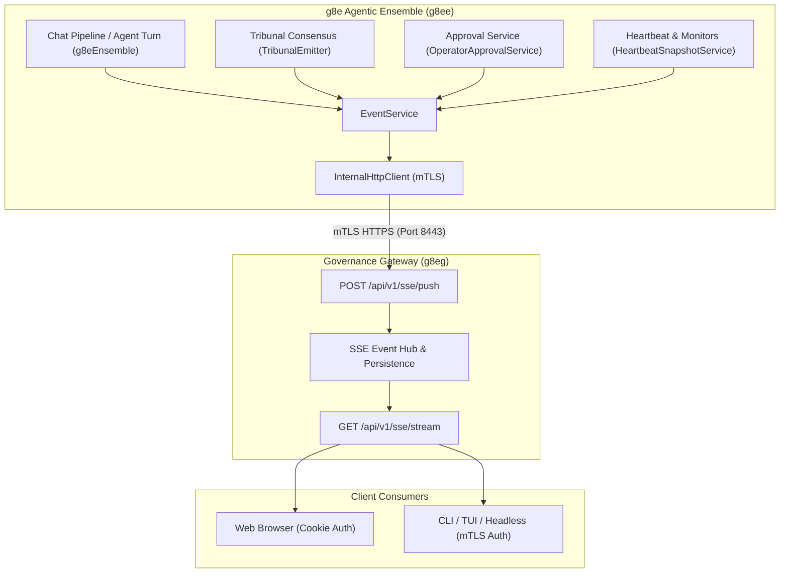
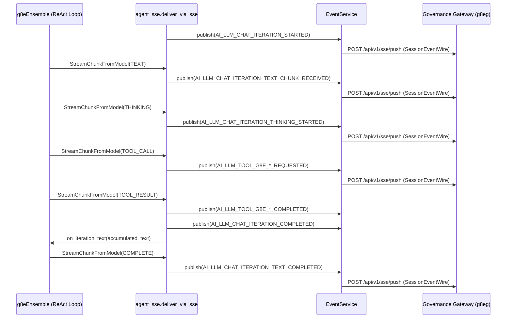

# Server-Sent Events (SSE)

## Overview

The g8e Agentic Ensemble (`g8ee`) uses Server-Sent Events (SSE) as a real-time delivery side channel for live progress, intermediate reasoning, tool lifecycle transitions, Tribunal deliberations, human-in-the-loop approval challenges, and operator telemetry. `g8ee` does not maintain consumer connections to browsers or CLI clients. It publishes typed event envelopes over mTLS to the Governance Gateway's `POST /api/v1/sse/push` endpoint.

The Gateway authenticates the app workload, authorizes the target session, persists accepted events in its SQLite event history, and publishes them to the target session's live channel. Consumers use `GET /api/v1/sse/stream` for replay plus live delivery or `GET /api/v1/sse/events` for finite polling. The first-party ensemble identity (`spiffe://g8e.local/app/g8ee`) is allowed to publish to authorized targets, but the Gateway does not provide user-wide fan-out: every accepted event must identify exactly one web or CLI session.



## Gateway Delivery Contract

The ensemble publishes to `POST /api/v1/sse/push` using the Gateway app workload mTLS certificate. The push body contains `user_id`, exactly one of `web_session_id` or `cli_session_id`, and an `event` envelope whose nested `type` identifies the application event. The Gateway accepts app SPIFFE identities under `/app/` except the reserved Gateway and Operator identities. The first-party `g8ee` app identity is authorized as an ensemble producer; other app identities must be authorized for the target Operator session.

The Gateway stores the complete push envelope before publishing a session-scoped pub/sub message. `GET /api/v1/sse/stream` emits replayed and live frames with the persisted row ID in `id` and the complete push envelope in `data`; it does not emit an SSE `event` field. Consumers read the application event type from `data.event.type`. `GET /api/v1/sse/events` returns the same retained rows as JSON. Consumers can resume with `Last-Event-ID` or `since_id`; stream connections receive a comment heartbeat every 30 seconds. History is retained for approximately one hour, and live queues are bounded, so SSE is not an audit record.

The Gateway also exposes `POST /api/v1/observe/producer/agent-state` and `POST /api/v1/observe/producer/run-state`. `EventService.publish_agent_state()` and `publish_run_state()` use these typed projection endpoints rather than the generic SSE push route. The Gateway persists a valid projection before emitting `app.agent.status.updated` or `app.run.status.updated` to the session.

## Event Routing Model

Every event emitted by `g8ee` is structured as a typed envelope defined in `app.models.events`. The model enforces a strict dual-dimension routing scheme: an ownership dimension (`user_id`) and a delivery dimension (`web_session_id` or `cli_session_id`).

### SessionEvent vs. BackgroundEvent

The ensemble has two internal event envelope types, but the current Gateway transport accepts only session-targeted routes:

- **`SessionEvent` (`app.models.events.SessionEvent`)** — Used for a specific client session. It requires `user_id` and exactly one delivery target: either `web_session_id` (browser clients) or `cli_session_id` (CLI/BYO clients). Setting neither or both session identifiers raises a validation error during model instantiation.
- **`BackgroundEvent` (`app.models.events.BackgroundEvent`)** — Represents a system-initiated event with `user_id` and optional correlation hints (`investigation_id`, `case_id`, `task_id`), but no delivery target. Its wire form cannot satisfy the Gateway route contract. `EventService.publish()` therefore skips targetless events, and the Gateway would reject a direct targetless push with HTTP 400. It is not a user-wide fan-out mechanism in the current implementation.

### Target Validation Guard

The Gateway's `/api/v1/sse/push` endpoint requires `user_id` and exactly one routing target and rejects targetless or ambiguous events with HTTP 400 Bad Request. In `EventService.publish()`, `g8ee` inspects outgoing events before transmission and skips any event lacking both `web_session_id` and `cli_session_id`. This prevents a targetless internal event from tripping the client circuit breaker and blocking later targeted notifications, such as interactive approval prompts.

### Wire Envelopes

Internal `SessionEvent` and `BackgroundEvent` objects are converted into protocol wire envelopes (`SessionEventWire` and `BackgroundEventWire`) by `app.models.events`. These wire models subclass definitions from the `g8e` protocol package, packaging the payload into an `_SSEEventBody` structure containing the canonical `type` string and nested `data` dictionary.

| Routing Model | Required Identifiers | Target Delivery | Primary Use Cases |
| --- | --- | --- | --- |
| `SessionEvent` | `user_id`, and exactly one of `web_session_id` or `cli_session_id` | Single targeted client session | AI chat token streaming, thinking progress, tool executions, approval challenges, clarification questions |
| `BackgroundEvent` | `user_id` plus optional correlation IDs | Not delivered by the current Gateway route; `EventService` skips it without a session target | Internal representation for unbound/background work; not user-wide fan-out |

### Reputation Updates

Post-execution reputation resolution uses the same authenticated session-event route as interactive ensemble events. `EventService.publish_reputation_event()` converts the originating `RequestContext` into a typed `SessionEvent`, preserving its user, web or CLI session, case, investigation, and task correlation before posting to `POST /api/v1/sse/push` over the enrolled g8ee app mTLS channel.

Each affected agent publishes `g8e.v1.operator.reputation.state.updated` with a typed `StakeResolutionPayload`. A non-zero slash additionally publishes `g8e.v1.operator.reputation.slash.tier1`, `.tier2`, or `.tier3` with the same payload and request context. The event is not serialized through an ad hoc reputation-specific transport, so the Gateway applies the same ownership and single-session delivery checks as other `SessionEvent` messages.

## Core Infrastructure

The SSE subsystem in `g8ee` is built on two primary infrastructure layers: `EventService` and `InternalHttpClient`.

### EventService

The `EventService` class (`app/services/infra/event_service.py`) implements `EventServiceProtocol` and provides the high-level publishing interface consumed across the ensemble. Its publishing methods are:

- **`publish(event)`** — Validates routing targets and delegates the wire model transmission to `InternalHttpClient.push_sse_event()`.
- **`publish_command_event(event_type, data, g8e_context, *, task_id)`** — Packages command execution telemetry into a targetless `BackgroundEvent`. `EventService.publish()` skips this event because the Gateway requires a session target; it is not delivered over SSE.
- **`publish_investigation_event(investigation_id, event_type, payload, web_session_id, case_id, user_id, *, cli_session_id)`** — Constructs a `RequestContext` and publishes a targeted `SessionEvent` containing investigation and case correlation metadata.
- **`publish_reputation_event(event_type, payload, g8e_context)`** — Converts the application context into a targeted `SessionEvent` and publishes reputation updates through the same route.
- **`publish_agent_state(request)` / `publish_run_state(request)`** — Sends typed observe projections to the Gateway's separate mTLS producer endpoints. These calls are best-effort, skip targetless requests, swallow transport failures, and preserve cancellation.

### Observe State Producers

The `EventService` also exposes two best-effort observe state producer methods that push typed agent and run state projections to the Gateway's mTLS producer endpoints. These methods are the sole call-site boundary for lifecycle projection updates; lifecycle code never accesses `_internal_http_client` directly.

- **`publish_agent_state(request)`** — Calls `InternalHttpClient.push_agent_state` with a typed `ObserveProducerAgentStateRequest`. Skips targetless requests (no `web_session_id` and no `cli_session_id`). Catches all exceptions except `asyncio.CancelledError` (which propagates), logs one warning with safe identifiers (`agent_id`, `status`), and returns without raising. Projection failures cannot abort primary workload behavior.
- **`publish_run_state(request)`** — Calls `InternalHttpClient.push_run_state` with a typed `ObserveProducerRunStateRequest`. Same best-effort semantics: skips targetless requests, catches exceptions except `CancelledError`, logs a warning, and returns without raising.

The producer request types are protocol-owned (`ObserveProducerAgentStateRequest`, `ObserveProducerRunStateRequest` from `g8e.models.observe_api`) with typed `Literal` enums for lifecycle status and run kind and `extra="forbid"` for unknown-field rejection. The ensemble imports these types via aliases in `app.models.internal_api` rather than redefining them.

### Identity and Payload Helpers

Pure helpers in `app/services/observe/` construct deterministic producer payloads from typed domain objects:

- **`resolve_persona(persona_id)`** — Validates against `PERSONA_REGISTRY`, raises `UnknownPersonaError` for unknown personas.
- **`build_agent_id(user_id, persona_id)`** — Constructs `f"{user_id}:{persona_id}"`. No email, session, or host data is embedded in agent IDs.
- **`persona_display_name(persona_id)` / `persona_role(persona_id)`** — Registry-owned values. Never accept caller-supplied display metadata when the registry owns it.
- **`routing_target(g8e_context)`** — Returns the `(web_session_id, cli_session_id)` pair from the request context. Exactly one target reaches the Gateway; if neither is present, projection push is skipped.
- **`build_agent_state_request(...)`** — Builds a typed `ObserveProducerAgentStateRequest` from registry-owned metadata. Returns `None` for unknown persona or targetless routing.
- **`build_investigation_run_state_request(...)`** — Builds a typed `ObserveProducerRunStateRequest` with truthful zero task counts (no task document creation path is implemented in the ensemble). Returns `None` for targetless routing.
- **`map_investigation_status_to_run_lifecycle(status)`** — Maps `InvestigationStatus` to `RunLifecycleStatus`.
- **`resolve_chat_persona_id(active_agent)`** — Maps `ReasoningAgent` to registered persona id, returns `None` for unknown/None.

### InternalHttpClient Transport and Resiliency

The `InternalHttpClient` class (`app/services/infra/internal_http_client.py`) executes the HTTP transport over mTLS:

- **mTLS Credential Management** — Mounts the ensemble's app certificate and private key. It calls `_ensure_mtls()` before dispatching requests, caching on-disk certificate paths and refreshing credentials dynamically if paths change.
- **Circuit Breaker Protection** — Uses an integrated circuit breaker configured with a threshold of 5 consecutive failures and a 15-second recovery timeout. This prevents runaway network storms if the Gateway SSE ingestion pipeline becomes temporarily unavailable.
- **Delivery Confirmation** — Deserializes the Gateway's response into `SSEPushResponse` (`app.models.internal_api.SSEPushResponse`). The response acknowledges one accepted event with `success: true` and `delivered: 1`; it is not a count of connected listeners.

## AI Chat Streaming and Turn Lifecycle

The streaming delivery pipeline in `app/services/ai/agent_sse.py` (`deliver_via_sse`) bridges the core agent ReAct loop (`g8eEnsemble.stream_response()`) and the SSE publishing layer.



### Stream Chunk Translation

Before consuming chunks, `deliver_via_sse` emits an initial iteration start event (`EventType.AI_LLM_CHAT_ITERATION_STARTED`). As `g8eEnsemble` yields `StreamChunkFromModel` objects, `deliver_via_sse` translates each chunk type into its corresponding protocol event and typed payload:

| Model Chunk Type / Phase | Emitted SSE Event Type | Payload Class | Description |
| --- | --- | --- | --- |
| Iteration Start | `g8e.v1.ai.llm.chat.iteration.started` | `ChatProcessingStartedPayload` | Signals processing has started for the active turn and records the current agent mode. |
| `TEXT` | `g8e.v1.ai.llm.chat.iteration.text.chunk.received` | `ChatResponseChunkPayload` | Incremental visible text token from the model. |
| `THINKING` | `g8e.v1.ai.llm.chat.iteration.thinking.started` | `ChatThinkingPayload` | Thinking reasoning chunk with action type (`START` or `UPDATE`). |
| `THINKING_END` | `g8e.v1.ai.llm.chat.iteration.thinking.started` | `ChatThinkingPayload` | End of model reasoning phase (`action_type="END"`). |
| `RETRY` | `g8e.v1.ai.llm.chat.iteration.retry` | `ChatRetryPayload` | Provider error retry notification with attempt number and maximum retries. |
| `TOOL_CALL` | `g8e.v1.ai.llm.tool.g8e.*.requested` | `AIToolLifecyclePayload` | Universal tool invocation start (`status="STARTED"`) carrying display metadata, icon, and execution ID. |
| `TOOL_RESULT` | `g8e.v1.ai.llm.tool.g8e.*.completed` | `AIToolLifecyclePayload` | Universal tool completion (`status="COMPLETED"`) with tool output content or search results. |
| `TOOL_RESULT` | `g8e.v1.ai.llm.chat.iteration.completed` | `ChatTurnCompletePayload` | Turn completion marker indicating tool results were folded into context. |
| `CITATIONS` | `g8e.v1.ai.llm.chat.iteration.citations.received` | `ChatCitationsReadyPayload` | Grounding and search citation metadata for web search tools. |
| `COMPLETE` | `g8e.v1.ai.llm.chat.iteration.text.completed` | `ChatResponseCompletePayload` | Final turn completion event carrying total response text, token usage, finish reason, and citation status. |
| `ERROR` | `g8e.v1.ai.llm.chat.iteration.failed` | `ChatErrorPayload` | Provider execution failure. Suppresses subsequent text completion events. |
| `CancelledError` | `g8e.v1.ai.llm.chat.iteration.stopped` | `AiProcessingStoppedPayload` | User cancellation signal emitted when the background turn task is cancelled. |

For universal tools (`query_investigation_context`, `get_command_constraints`, `g8e_search_web`), `deliver_via_sse` emits dedicated lifecycle events: `g8e.v1.ai.llm.tool.g8e.investigation.query.requested` and `...completed`, `g8e.v1.ai.llm.tool.g8e.command.constraints.requested` and `...completed`, and `g8e.v1.ai.llm.tool.g8e.web.search.requested` and `...completed`.

### Stream State and Narrative Persistence

The streaming consumer maintains state in `AgentStreamState` (`app.models.agent.AgentStreamState`), accumulating visible text, token usage counts, finish reasons, tool usage metrics, and grounding metadata. When a tool iteration completes (`TOOL_RESULT`), `deliver_via_sse` invokes the `on_iteration_text` callback with the accumulated text before clearing the text buffer. This ensures intermediate narrative reasoning produced by the model prior to invoking a tool is persisted to the database and preserved across conversation history.

## AI Interrogation and Clarification Protocol

When reasoning agents (Sage or Dash) encounter underspecified requests or missing host context, they emit an interrogation block containing three binary questions.

`ChatPipelineService` evaluates completed responses using `extract_interrogation_questions()` (`app/utils/interrogation.py`). If clarifying questions are detected, it emits an `AI_TRIAGE_CLARIFICATION_QUESTIONS` event (`g8e.v1.ai.triage.clarification.questions`):

- **Payload** — `TriageClarificationQuestionsPayload` containing the question list, triage complexity classification, intent summary, request posture, and associated confidence scores.
- **Workflow State** — Halts automatic tool dispatch and presents the questions to the user in the frontend UI. User responses are ingested via the chat API (`AI_TRIAGE_CLARIFICATION_ANSWERED`, `AI_TRIAGE_CLARIFICATION_SKIPPED`, or `AI_TRIAGE_CLARIFICATION_TIMEOUT`), resuming the investigation.

## AI Tribunal Consensus Lifecycle

The 5-member AI Tribunal (Axiom, Concord, Variance, Pragma, Nemesis), Marshal, and the Auditor emit fine-grained SSE events during command derivation and consensus deliberation. Events are managed by `TribunalEmitter` (`app/services/ai/tribunal/emitter.py`).

### Fail-Closed Terminal vs. Progress Events

The `TribunalEmitter` classifies events into terminal and progress categories:

- **Terminal Events** — Events that define the ultimate success or failure of a consensus session (`AI_CONSENSUS_SESSION_STARTED`, `AI_CONSENSUS_SESSION_COMPLETED`, `AI_CONSENSUS_SESSION_DISABLED`, `AI_CONSENSUS_SESSION_MODEL_NOT_CONFIGURED`, `AI_CONSENSUS_SESSION_PROVIDER_UNAVAILABLE`, `AI_CONSENSUS_SESSION_SYSTEM_ERROR`, `AI_CONSENSUS_SESSION_GENERATION_FAILED`, `AI_CONSENSUS_SESSION_AUDITOR_FAILED`). If publishing a terminal event fails, `TribunalEmitter` re-raises the exception to fail closed.
- **Progress Events** — Intermediate telemetry events (`AI_CONSENSUS_VOTING_PASS_COMPLETED`, `AI_CONSENSUS_VOTING_CONSENSUS_REACHED`, `AI_CONSENSUS_VOTING_CONSENSUS_NOT_REACHED`, `AI_CONSENSUS_VOTING_CONSENSUS_FAILED`, `AI_CONSENSUS_VOTING_DISSENT_RECORDED`, `AI_CONSENSUS_VOTING_AUDIT_STARTED`, `AI_CONSENSUS_VOTING_AUDIT_COMPLETED`, `AI_CONSENSUS_SESSION_MARSHAL_BLOCKED`). Failures to publish progress events are logged as warnings and swallowed to allow deliberation to continue.

### Tribunal Event Sequence

```
1. AI_CONSENSUS_SESSION_STARTED          (Session begins with intent and candidate count)
2. AI_CONSENSUS_VOTING_PASS_COMPLETED    (Emitted as each member finishes command generation)
3. AI_CONSENSUS_VOTING_CONSENSUS_REACHED (Cluster analysis resolves winning command)
   -- or AI_CONSENSUS_VOTING_CONSENSUS_FAILED / AI_CONSENSUS_VOTING_DISSENT_RECORDED
4. AI_CONSENSUS_SESSION_MARSHAL_BLOCKED  (Optional: Marshal classifies HIGH risk and returns feedback)
5. AI_CONSENSUS_VOTING_AUDIT_STARTED     (Auditor reviews winning command candidate)
6. AI_CONSENSUS_VOTING_AUDIT_COMPLETED   (Auditor issues ok, revised, or swap verdict)
7. AI_CONSENSUS_SESSION_COMPLETED        (Final approved command ready for execution)
```

`AI_CONSENSUS_SESSION_MARSHAL_BLOCKED` uses wire value `g8e.v1.ai.consensus.session.marshal.blocked`. A second HIGH-risk block for the same investigation emits `AI_AGENT_CONFLICT_DETECTED` instead.

## Observe Lifecycle Producers

The ensemble wires authoritative lifecycle transitions through the `EventService` observe producer methods. These projections are best-effort: a projection failure logs a warning and returns without raising, so primary chat, tool, consensus, investigation, and operator work continues. The low-level HTTP client continues to raise typed network failures so direct callers can detect rejection.

### Chat and Tool Lifecycle

`deliver_via_sse` in `app/services/ai/agent_sse.py` pushes agent and run state projections adjacent to the authoritative state change. The projection call does not replace the existing SSE narrative event.

Agent state transitions:

- `running` at iteration start.
- `waiting` when a universal tool call starts.
- `running` when the tool result returns.
- `failed` on a terminal model error (ERROR chunk) or unexpected exception.
- `idle` on cancellation.
- `completed` when the persona's turn work finishes.

Investigation run state:

- `running` at iteration start and completion (kept non-terminal during ordinary chat).
- `waiting` during universal tool execution.

A multi-turn investigation never attempts terminal-to-running after an ordinary completed chat turn. The run is kept `running` on completion, not `completed`. Only an authoritative investigation closure establishes `completed`.

Persona resolution uses `resolve_chat_persona_id(inputs.active_agent)` which maps `ReasoningAgent.SAGE` to `"sage"` and `ReasoningAgent.DASH` to `"dash"`. When `active_agent` is `None`, agent projections are skipped. Display name and role come from the persona registry via `build_agent_state_request`. Run display name comes from `inputs.investigation.case_title`.

### Consensus Lifecycle

The Tribunal emitter boundary pushes agent state projections for the `"tribunal"` persona:

- `running` at consensus start.
- `running` on first-round no-consensus (not terminal).
- `completed` on final success.
- `failed` on terminal consensus failure.
- `offline` when Tribunal is disabled.
- `failed` on model-not-configured and provider-unavailable errors.

A first-round no-consensus followed by round two is not a terminal run failure. The run is preserved as waiting/running until the final outcome. The payload contains no candidate command, raw request, vote reasoning, or dissent text. Only lifecycle identifiers and the allowed model field enter the observe payload.

### Investigation Lifecycle

`InvestigationService` in `app/services/investigation/investigation_service.py` injects `EventServiceProtocol | None` and pushes run projections after authoritative status mutations:

- After successful governed creation persistence, pushes a `queued` run projection. If creation fails, no projection is pushed.
- After an authoritative status update persists, maps `InvestigationStatus.OPEN`/`ESCALATED` to `running`, `CLOSED`/`RESOLVED` to `completed`. Only pushes when status actually changed.

Display name is derived from `investigation.case_title` (disclosure-safe). No case description, prompt, user email, host path, or evidence references are included. Started and ended timestamps are preserved from authoritative persisted fields when they exist; if the domain model does not own one, it is left absent rather than synthesizing historical values.

### Task Lifecycle

The protocol designates the ensemble as the authority for task documents, but no ensemble code creates task documents, emits `APP_TASK_*` events, or defines a `TaskModel`/`TaskService`. The `tasks` collection is read by `get_case_tasks` but nothing writes to it. Task fields are left at truthful zero defaults and task lifecycle is documented as unsupported. The Go gateway computes `tasks_in_queue = total_tasks - completed_tasks` from projection fields, not SSE event subtraction.

### Operator Dispatch

Operator dispatch does not have an authoritative persona projection. `DispatchRequest` carries operator identity, not an agent persona. There is no "operator dispatch" persona in `PERSONA_REGISTRY`. The dispatch path routes governance envelopes to operators; it does not produce agent lifecycle transitions. Operator agent status is recorded as unsupported and no synthetic projection is fabricated.

## Human-in-the-Loop Approvals

State-changing operations requiring human authorization trigger interactive approval events managed by `OperatorApprovalService` (`app/services/operator/approval_service.py`).

### Pre-Publish Registration Invariant

To eliminate race conditions in fast or automated test environments (where an auto-approver responds almost instantaneously), `OperatorApprovalService` registers the `PendingApproval` record in memory **before** publishing the approval request SSE event. If the network push fails, the pending entry is removed. This ensures that any incoming approval response matches an existing pending approval ID rather than being rejected as an unknown request.

### Supported Approval Events

| Approval Domain | Request Event Type | Resolution Event Types | Trigger Condition |
| --- | --- | --- | --- |
| Command Execution | `g8e.v1.operator.command.approval.requested` | `...approval.granted`, `...approval.rejected` | High-risk shell command or destructive operation proposed. Emits `...approval.preparing` during synthesis. |
| File Mutation | `g8e.v1.operator.file.edit.approval.requested` | `...approval.granted`, `...approval.rejected` | Target host file edit or patch application proposed. Emits `...approval.feedback` if new context arrives. |
| Operator Streaming | `g8e.v1.operator.stream.approval.requested` | `...approval.granted`, `...approval.rejected` | Request to open a direct operator live streaming channel. |
| Intent Authorization | `g8e.v1.operator.intent.approval.requested` | `...approval.granted`, `...approval.rejected` | Operator capability intent grant or privilege expansion. |
| Agent Continuation | `g8e.v1.ai.agent.continue.approval.requested` | `...approval.granted`, `...approval.rejected` | Tool loop exceeds maximum turn limit (`AGENT_MAX_TOOL_TURNS`). |

## Operator Lifecycle and Telemetry Events

The ensemble surfaces host operator connectivity, status changes, and execution results through SSE telemetry:

- **Heartbeat Reception (Gateway)** — The Gateway ingests periodic operator heartbeats from `heartbeat:<operator_id>:<operator_session_id>`, persists the canonical snapshot and hostname, and emits `OPERATOR_HEARTBEAT_RECEIVED` (`g8e.v1.operator.heartbeat.received`) through the Gateway event surface. g8ee does not subscribe to heartbeat channels or persist Operator telemetry.
- **Status Transitions (`HeartbeatStaleMonitorService`)** — Scans operator liveness and heartbeat recency. It constructs `OPERATOR_STATUS_UPDATED_ACTIVE`, `OPERATOR_STATUS_UPDATED_BOUND`, `OPERATOR_STATUS_UPDATED_STALE`, `OPERATOR_STATUS_UPDATED_OFFLINE`, `OPERATOR_STATUS_UPDATED_STOPPED`, `OPERATOR_STATUS_UPDATED_TERMINATED`, or `OPERATOR_STATUS_UPDATED_UNAVAILABLE` events for the user's routing context, but the current implementation uses `BackgroundEvent` without a session target, so `EventService` skips these pushes. They do not currently reach the Gateway SSE stream.
- **Direct Command and File Execution** — Status updates (`OPERATOR_COMMAND_STATUS_UPDATED_QUEUED`, `...RUNNING`, `...COMPLETED`, `...FAILED`, `...CANCELLED`), lifecycle status updates (`OPERATOR_COMMAND_STARTED`, `OPERATOR_COMMAND_COMPLETED`, `OPERATOR_COMMAND_FAILED`, `OPERATOR_COMMAND_CANCELLED`), file operations (`OPERATOR_FILE_EDIT_*`, `OPERATOR_FILE_HISTORY_FETCH_*`, `OPERATOR_FILE_DIFF_FETCH_*`, `OPERATOR_FILE_RESTORE_*`), filesystem operations (`OPERATOR_FILESYSTEM_LIST_*`, `OPERATOR_FILESYSTEM_GREP_*`, `OPERATOR_FILESYSTEM_READ_*`), and network port checks (`OPERATOR_NETWORK_PORT_CHECK_*`) are emitted through targeted event paths when their request context contains a session target; targetless events are skipped.
- **Case and Investigation Updates (`CaseDataService` / `InvestigationDataService`)** — Publishes `APP_CASE_CREATED`, `APP_CASE_UPDATED`, `APP_CASE_DELETED`, `APP_INVESTIGATION_CREATED`, `APP_INVESTIGATION_UPDATED`, and `APP_INVESTIGATION_DELETED` through the case or investigation request context. These events are session-targeted when the context contains a web or CLI session; targetless events are skipped.

## Resiliency and Concurrency Patterns

The SSE architecture in `g8ee` incorporates several defensive concurrency patterns:

- **Non-Blocking UI Side-Channel** — SSE streaming is treated as an informative telemetry side-channel. Network failures during streaming event publication log warnings but do not abort core execution pipelines or database transactions. The database remains the primary durable record of truth.
- **Coroutine Context Isolation** — In `g8eEnsemble.run_with_sse()`, context token lifecycles are owned by a standard coroutine rather than an async generator. This avoids Python `ContextVar.reset()` exceptions caused by Python dispatching async-generator cleanup across distinct asyncio execution contexts.
- **Task Lifecycle and Stop Interlocks** — `BackgroundTaskManager` (`app/services/ai/chat_task_manager.py`) tracks active background chat tasks by investigation ID. When a user requests a stop, the manager cancels the active asyncio task and publishes `AI_LLM_CHAT_ITERATION_STOPPED` to notify the UI immediately.

## Contract Testing and Verification

To prevent schema drift across platform components, `g8ee` includes contract integration test suites in `ensemble/tests/integration/test_sse_event_contract_integration.py` and `ensemble/tests/unit/models/test_sse_wire_contract.py`. These tests validate that every event type and payload emitted by `deliver_via_sse`, `TribunalEmitter`, and `OperatorApprovalService` conforms strictly to the protocol fixture definitions in `protocol/test-fixtures/sse-events.json`.

Tests verify required routing dimensions, payload type safety, error event suppression behavior, and fixture constant alignment.

## Related Documentation

- [Architecture](architecture.md) — Overall ensemble architecture, protocol surfaces, and model hierarchy.
- [Agents](agents.md) — Persona architecture, reasoning agents, and Tribunal structure.
- [Governance](governance.md) — Five-layer verification pipeline and envelope transaction pipeline.
- [Thinking](thinking.md) — Provider reasoning tokens, thought signatures, and thinking SSE events.
- [Protocol](protocol.md) — Canonical wire contracts and GovernanceEnvelope schemas.
- [Gateway SSE Streaming](../architecture/sse.md) — Gateway-side SSE push ingestion, filtering, and consumer endpoints.
- [Dashboard SSE](../dashboard/sse.md) — Browser EventSource lifecycle, event dispatch, and reconnect behavior for dashboard consumers.
