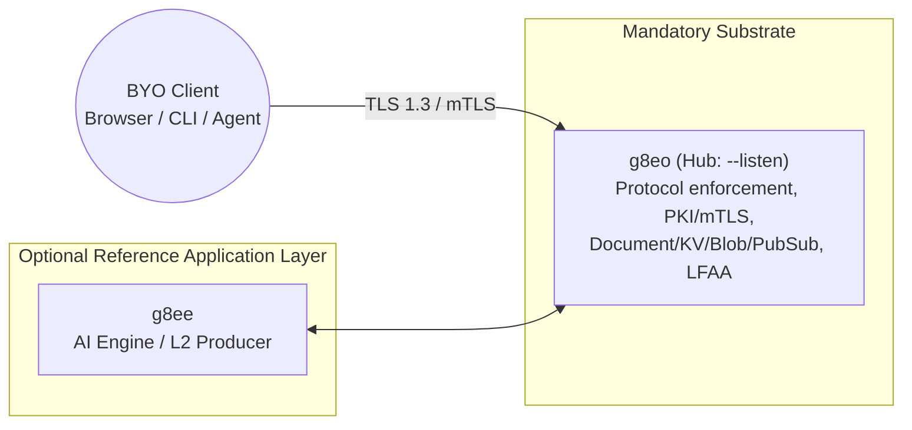

# g8ee

Last Updated: 2026-05-18
Version: v0.4.0

g8ee is the **optional reference AI engine** of the g8e platform. It is one concrete application-layer adapter built on top of the [g8e Protocol](protocol.md); the protocol substrate (`g8eo`, the reference Operator) is the only mandatory component. g8ee demonstrates how a Tribunal-based, multi-provider LLM reasoning system can act as a **Layer 2 (Consensus) producer** that emits typed, signed `GovernanceEnvelope` (UAP) transactions to a conforming Operator for verification and execution.

If you are building a BYO client, you do not need g8ee — anything that produces protocol-conformant transactions is interchangeable with it. g8ee is shipped in-tree as the first reference consumer of that same public contract.

## Position in the Platform

- **Mandatory substrate**: `g8eo` Operator (Hub mode via `--listen`, Satellite mode on managed hosts). Owns L1/L2/L3 verification, PKI/mTLS, audit, and Warden execution.
- **Optional reference application layer**: `g8ee` (this component, AI engine / L2 producer). It consumes the Operator protocol surface and has no privileged substrate role.
- **Default start (`./g8e platform start`)**: Operator only. g8ee is started explicitly via `./g8e platform start --with-apps` or `./g8e apps start g8ee`.
- **Wire format**: canonical JSON (protojson) `GovernanceEnvelope` on all client-facing surfaces (HTTP, pub/sub, receipts). Signing is computed over a deterministic transaction hash; wire encoding is independent of the security invariant.

---

## AI Agent Architecture

The g8e platform utilizes a specialized multi-agent system designed for autonomous infrastructure management. The architecture enforces a strict separation between **Reasoning** (the application layer, e.g., g8ee) and the **Substrate** (the mandatory g8eo Operator). This ensures that no action reaches a host without cryptographic proof of intent, consensus, and human authorization.

### Core Principles

- **3-Layer Governance Bedrock**: Every action is gated by a hierarchical validation system (L1 Technical Bedrock, L2 Consensus, L3 Authorization).
- **Intent-Driven Execution**: Reasoning agents (Sage/Dash) never write shell commands directly; they articulate natural language intent to the Tribunal.
- **Ensemble Consensus**: The Tribunal uses an independent multi-member ensemble with unique technical "lenses" to translate intent into commands.
- **Host Sovereignty**: The Operator (g8eo) distrusts all upstream inputs. It verifies every transaction against the protocol before execution.
- **Fail-Closed Verification**: Any missing signature, stale state root, or L1 violation results in immediate transaction rejection.
- **Interrogation Gate**: Agents can pause execution to ask clarifying questions via structured `<interrogation>` blocks, preventing "guessing" when context is missing.

---

## The AI Lifecycle

g8ee follows a strict "Traceable Pipeline" model for every message. A single user request moves through six distinct phases:

### 1. Ingress & Context Assembly
The `internal_router` receives the request. `ChatPipelineService` triggers `_prepare_chat_context`, performing a 15-step assembly process:
1. **Context Fetch**: Fetches the investigation context (operators, memory).
2. **Sentinel Sync**: Syncs `sentinel_mode` to DB if changed.
3. **Workflow Detection**: Determines `OPERATOR_BOUND` vs `NOT_BOUND`.
4. **History Fetch**: Retrieves prior conversation for triage.
5. **Triage**: Classifies message (Main Model vs Lite Model).
6. **Approval Cleanup**: Marks pending approvals as feedback.
7. **Persistence**: Saves user message to DB.
8. **History Re-fetch**: Includes the new user message.
9. **LFAA Audit**: Dispatches user-message audit to bound operators.
10. **Memory Retrieval**: Fetches user and case memories.
11. **System Prompt**: Builds modular system prompt.
12. **Config Generation**: Builds LLM generation config.
13. **Attachments**: Formats attachment parts.
14. **History Formatting**: Builds LLM contents from history.
15. **Assembly**: Constructs the final `AgentInputs`.

### 2. Triage (The Gatekeeper)
Before invoking the primary LLM, the `TriageAgent` classifies the message:
- **Simple**: Routed to the **Dash** agent using the **Assistant** model (e.g., greetings, simple status checks, single-tool calls).
- **Complex**: Escalated to the **Sage** agent using the **Primary** model (e.g., troubleshooting, command execution, multi-step investigations).

Posture is also gauged (`normal`, `escalated`, `adversarial`, `confused`) to calibrate downstream behavior. *Note: Triage is a classifier only. It does not generate questions or interact with the user.*

### 3. Orchestration (The ReAct Loop)
The `g8eEngine` runs the core agentic loop:
- **Provider Turn**: Communicates with the configured `LLMProvider` (Gemini, Anthropic, Ollama, etc.).
- **Tool Dispatch**: If the LLM requests a tool, `AIToolService` routes it. Universal tools (like `web_search`) run locally; gated tools (like `run_commands_with_operator`) route through the **Tribunal**.
- **Iteration**: The loop continues until the LLM provides a final text response or hits the `AGENT_MAX_TOOL_TURNS` limit.

#### The Interrogation Protocol
If Dash or Sage encounters ambiguity, they must use the Interrogation Protocol:
- Issue exactly **three targeted YES/NO questions** in parallel.
- Questions must be strictly binary to maximize information gain.
- The `<interrogation>` block must be the entire response; tool execution is suppressed until the user answers.

### 4. Governance & Safety
Every gated operation is verified through multiple layers:
- **Sentinel**: Scrubs sensitive data (PII, secrets) from inputs and outputs.
- **Tribunal**: An ensemble of five independent agents that translates intent into hardened shell commands.
- **Warden**: A defensive coordinator that performs pre-execution risk assessment and enforces the Two-Strike Circuit Breaker.
- **Auditor**: A high-reasoning agent that performs the final consistency check and Merkle commitment once the Warden has cleared the command.
- **Approval Pipeline**: State-changing operations trigger an `OPERATOR_COMMAND_APPROVAL_REQUESTED` event, halting execution until a human approves via the UI.

### 5. Streaming & Delivery
Responses are delivered via **Server-Sent Events (SSE)**:
- **Real-time**: `deliver_via_sse` publishes chunks (text, thinking, tool calls) to the client as they arrive.
- **Per-Iteration Persistence**: Intermediate AI commentary is persisted to the database *during* the loop, ensuring history is preserved if the connection drops.

### 6. Post-Flight & Telemetry
After the stream completes:
- **Final Persistence**: The complete response, token usage, and grounding metadata are saved.
- **LFAA Audit**: `OperatorLFAAService` publishes Local-First Audit Architecture events to the operator for an immutable execution record.
- **Background Memory**: `MemoryGenerationService` (Codex) updates the investigation's memory context based on the turn.

---

## Agent Personas

The g8e platform utilizes a tiered agent persona system that separates **Substrate Responsibilities** (governance enforcement and execution) from **Application-Layer Reasoning** (intent generation and consensus).

### The Persona Catalog

| Layer | Agent | Code ID | Role | Tier | Purpose |
|---|---|---|---|---|---|
| **Substrate** | **Operator** | `g8eo` | `executor` | `N/A` | Sovereign host implementation; enforces the protocol. |
| **Substrate** | **Warden (Substrate)** | `warden` | `boundary` | `N/A` | Final execution stop; enforces state root and emits receipts. |
| **Reasoning** | **Triage** | `triage` | `classifier` | `lite` | Initial classification of complexity, intent, and posture. |
| **Reasoning** | **Sage** | `sage` | `reasoner` | `primary` | Senior reasoning authority for complex investigations. |
| **Reasoning** | **Dash** | `dash` | `responder` | `assistant` | Fast-path responder for simple, single-turn tasks. |
| **Consensus** | **The Tribunal** | `tribunal` | `arbitrator` | `lite` | Collective ensemble of five specialized translators. |
| **Consensus** | **Auditor** | `auditor` | `auditor` | `primary` | Final judge of Tribunal candidates against Sage's intent. |
| **Defense** | **Warden (AI)** | `warden` | `coordinator` | `lite` | AI-layer coordinator for pre-execution risk analysis. |
| **Defense** | **Risk Analyzers** | `warden_*` | `defender` | `lite` | Specialized analyzers for command, file, and error risk. |
| **Utility** | **Scribe** | `scribe` | `summarizer` | `lite` | Generates concise, specific investigation titles. |
| **Utility** | **Codex** | `codex` | `analyzer` | `lite` | Extracts durable preferences and scrubbed summaries. |
| **Utility** | **Judge** | `judge` | `evaluator` | `primary` | Dispassionate evaluator for gold-standard benchmarks. |

### The Tribunal Members

| Member | Code ID | Lens | Focus |
|---|---|---|---|
| **Axiom** | `axiom` | `composition` | Elegant, efficient multi-stage pipeline composition. |
| **Concord** | `concord` | `safety` | Defensive flags, dry-runs, and minimal-risk discipline. |
| **Variance** | `variance` | `edge_cases` | Robustness against spaces, symlinks, and null inputs. |
| **Pragma** | `pragma` | `convention` | Idiomatic patterns for the specific OS and shell. |
| **Nemesis** | `nemesis` | `adversary` | Proposes plausible-but-flawed candidates to stress-test the Auditor. |

### Information Isolation
To preserve diversity and technical honesty, agents operate under the **Amnesia Principle**:
- **Tribunal Members** are blind to each other's candidates.
- **The Auditor** receives anonymized candidates to prevent source bias.
- **The Engine** only passes the minimum required context to each stage of the pipeline.

---

## Thinking & Reasoning

"Thinking" in g8e is a dual-layered architecture:

1.  **Structural Reasoning (L2 Consensus)**: A verifiable proof that an action was generated through deliberate consensus (the **Tribunal**).
2.  **Provider Reasoning (LLM Thinking)**: The native reasoning capabilities of LLM providers (e.g., Gemini's `thinking_config`, Anthropic's `thinking_budget`, OpenAI's `reasoning_effort`) abstracted into a canonical internal vocabulary.

### Thinking Levels

| Value     | Semantics                                                        |
|-----------|------------------------------------------------------------------|
| `OFF`     | Thinking disabled. Providers omit all thinking-related fields.  |
| `MINIMAL` | Least-expensive non-zero reasoning. Small token budget.          |
| `LOW` | Light reasoning.                                                 |
| `MEDIUM`  | Default reasoning for most primary calls.                        |
| `HIGH`    | Maximum reasoning the model exposes.                            |

Primary reasoning agents (like **Sage**) default to `HIGH` reasoning. If a model has no reasoning support, it returns `OFF`.

---

## Prompt Architecture

The g8e prompt system is a modular architecture designed for **prefix-cache reuse** and **strict structural enforcement**. It composes system prompts from shared fragments, canonical persona definitions, and dynamic turn-specific context.

### The Assembly Pipeline

Sections are concatenated in a fixed order to optimize prefix caching:

1. **Safety** (`core/safety.txt`) - Global Static behavioral guardrails.
2. **Loyalty** (`core/loyalty.txt`) - Global Static mission-over-moment doctrine.
3. **Dissent** (`core/dissent.txt`) - Global Static protocol for warnings and denials.
4. **Capabilities** (`modes/{mode}/capabilities.txt`) - Per-Mode Static authorized actions.
5. **Execution** (`modes/{mode}/execution.txt`) - Per-Mode Static task processing.
6. **Tools** (`modes/{mode}/tools.txt`) - Per-Mode Static high-level tool guidance.
7. **Response Constraints** (`system/response_constraints.txt`) - Global Static style constraints.
8. **Agent Persona** - Per-Agent Static identity and mission.
9. **System Context** (`<system_context>`) - Per-Turn Dynamic environment details.
10. **Sentinel Mode** (`system/sentinel_mode.txt`) - Injected during escalated threats.
11. **Triage Context** (`<triage_context>`) - User posture and intent classification.
12. **Investigation Context** (`<investigation_context>`) - Case details and bound operators.
13. **Learned Context** (`<learned_context>`) - Durable preferences and memory.

### XML Scaffolding
All sections are wrapped in XML tags to enforce hard structural boundaries. This prevents "prompt leakage" where one section's instructions bleed into another.

---

## Core Subsystems

### Component Relationships

### The Tribunal (Ensemble Command Generation)
The Tribunal is a five-member panel that converts Sage's intent into executable commands. The Tribunal uses a ranked-vote system to select a winner. The **Warden** then performs a safety analysis; only once cleared does the **Auditor** perform the final consistency check and Merkle commitment.

### LFAA (Local-First Audit Architecture)
`OperatorLFAAService` ensures every action taken by the AI is recorded on the target system. This provides an immutable audit trail that persists even if the control plane is compromised or inaccessible.

### Warden (Defensive Coordination)
The `warden` agent coordinates defensive analysis, classifying the risk of commands, errors, and file operations. The Warden validates the safety of a command *before* the Auditor cryptographically commits to the results.

### LLM Interface (`LLMProvider`)
g8ee abstracts LLM providers through a unified interface (`app/llm/provider.py`).

| Tier | Usage | Configuration |
|------|-------|---------------|
| **Primary** | Complex reasoning (Sage), Auditor, Judge. | `primary_provider` |
| **Lite** | Triage, Tribunal members, Scribe, Codex, Warden. | `lite_provider` |
| **Assistant** | Fast-path responder (Dash), Scribe, Codex. | `assistant_provider` |

---

## Governance & Audit

### Layer 1: Technical Bedrock (Hard Gates)
Enforced via reflected Protobuf options in `g8eo`.
- **Forbidden Patterns**: Global blocks on `sudo`, `su`, and other prohibited shell patterns.
- **Policy Enforcement**: Denies specific dangerous commands or path substrings based on host-local configuration.

### Layer 2: Consensus (The Tribunal)
The transaction must carry a valid ED25519 signature from the trusted Tribunal. The Operator verifies the signature against the `transaction_hash`.

### Layer 3: Authorization (Human-in-the-loop)
State-changing mutations require a hardware-bound signature (WebAuthn/FIDO2).
- **Auto-Approval**: Benign commands (e.g., `uptime`, `df`) defined in `auto_approved.json` can skip manual L3 approval *only if* they have passed all L1 and L2 gates.

### Agent Reputation (The Scoreboard)
g8ee maintains a reputation scoreboard for all AI agents. After every Tribunal invocation, the `ReputationService` updates scores based on the Auditor's verdict and the results of the ranked vote. Scores use Exponential Moving Averages (EMA) to prioritize recent behavior.

### Merkle Commitments (Artifact B)
The Auditor binds every verdict to a snapshot of the current reputation state by writing a signed Merkle commitment. These commitments are chained (`prev_root`) via HMAC-SHA256 signatures to provide a verifiable, tamper-evident history of agent performance.

---

## Function Tools

g8ee uses a single-source declarative registry for AI tools in `app/services/ai/tool_registry.py`.

### Active Tools

| Tool | Scope | Agent Modes | Purpose |
|------|-------|-------------|---------|
| `run_commands` | Gated | Bound | Execute shell commands on target systems (via Tribunal) |
| `file_read`/`write` | Gated | Bound | Direct file operations on operators |
| `list_files` | Gated | Bound | Directory listing and exploration |
| `recursive_grep` | Gated | Bound | Deep search within file contents |
| `fetch_file_history` | Gated | Bound | Retrieve git-like history of a file |
| `check_port` | Gated | Bound | Verify network port availability/connectivity |
| `grant_intent` | Gated | Bound | JIT permission escalation (AWS/Cloud) |
| `g8e_search_web` | Universal | All | Public web search (requires vertex/search config) |
| `query_investigation_context` | Universal | All | Retrieve case metadata and conversation history |
| `ssh_inventory` | Universal | All | Query known SSH target inventory |
| `stream_operator` | Universal | All | Execute un-voted commands (diagnostic) |

---

## Operator Execution

### Operator Service Layer
`OperatorCommandService` is the entry point for operator tool execution.

| Sub-service | Responsibility |
|-------------|----------------|
| `OperatorPubSubService` | Pub/sub lifecycle, channel subscription, command dispatch, result waiting |
| `OperatorApprovalService` | Human-in-the-loop approval request, poll, and response flow |
| `OperatorExecutionService` | Command validation, risk analysis, batch execution, pub/sub command dispatch |
| `OperatorResultHandlerService` | Inbound result parsing from g8eo pub/sub messages |
| `OperatorFileService` | File create/write/update/read operations on the operator |
| `OperatorFilesystemService` | Directory listing (`fs_list`) and file read (`fs_read`) |
| `OperatorIntentService` | AWS intent permission grant and revocation |
| `OperatorLFAAService` | Local-First Audit Architecture event dispatch |
| `OperatorPortService` | TCP/UDP port reachability checks |
| `TribunalInvoker` | Command generation pipeline coordinator (Sage -> Executor) |

### Cloud Operator & AWS Intents
Cloud Operators for AWS implement a **Zero Standing Privileges** model. The AI dynamically requests additional permissions through the intent system.
- **Operator Role**: Can execute AWS operations but cannot modify its own policies.
- **Escalation Role**: Can attach `Intent-*` prefixed policies to the Operator Role.

---

## Web Search & Grounding

### Mode 1: `search_web` Function Tool (Vertex AI Search)
The AI explicitly calls `search_web`. g8ee executes a Vertex AI Search query via the `searchLite` SDK method against a pre-configured data store.

### Mode 2: Native Gemini Grounding (Google Search Tool)
When using a Gemini provider with the `google_search` SDK tool enabled, the model retrieves live search results internally and attaches `SdkGroundingRawData` to the response. `GroundingService` converts this to canonical `GroundingMetadata`.

---

## LLM Configuration

All LLM model configurations are defined in `services/g8ee/app/models/model_configs.py`.

### Model Roles

| Role | Provider Setting | Used For |
|------|------------------|----------|
| **Primary** | `primary_provider` | Complex reasoning, Sage, Auditor, Judge |
| **Lite** | `lite_provider` | Triage, Tribunal, Dash, Scribe, Codex, Warden |
| **Assistant** | `assistant_provider` | Dash, Scribe, Codex |

The lite tier always has thinking disabled. The primary tier supports thinking when the model capability allows it.

---

## Data Connectivity

g8ee uses three distinct clients for data operations.

| Client | Transport | Purpose |
|--------|-----------|---------|
| `DBClient` | HTTP | Document store — cases, investigations, operators, memories. |
| `KVClient` | HTTP + WebSocket | KV store operations and pub/sub. |
| `InternalHttpClient` | HTTP | Internal API — SSE push, intent management, etc. |

### Context Propagation (`RequestContext`)
Business context (user_id, case_id, investigation_id, etc.) is passed in the **request body** via a typed `RequestContext` field. This eliminates the fragile header-as-state pattern.

---

## Evaluation & Testing

### AI Evaluation
AI agent evaluation runs through the **substrate-first evals framework** at `evals/`.
- **Accuracy**: LLM-as-a-judge grading against gold-standard behavior.
- **Safety**: Deterministic regex matching on tool-call payloads.
- **Privacy**: Sentinel PII redaction across egress layers.
- **IFEval**: Instruction Following Evaluation benchmark.

### Testing
g8ee has over 2,400 tests covering unit, integration, and AI-specific scenarios.
- **Unit tests**: Business logic isolation with mocked external boundaries.
- **Integration tests**: Real operator and service wiring.
- **AI integration tests**: Real LLM provider calls.
- **Contract tests**: Wire protocol and constants enforcement.
