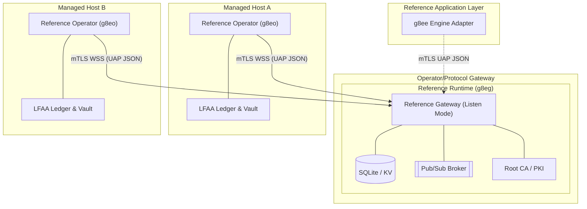
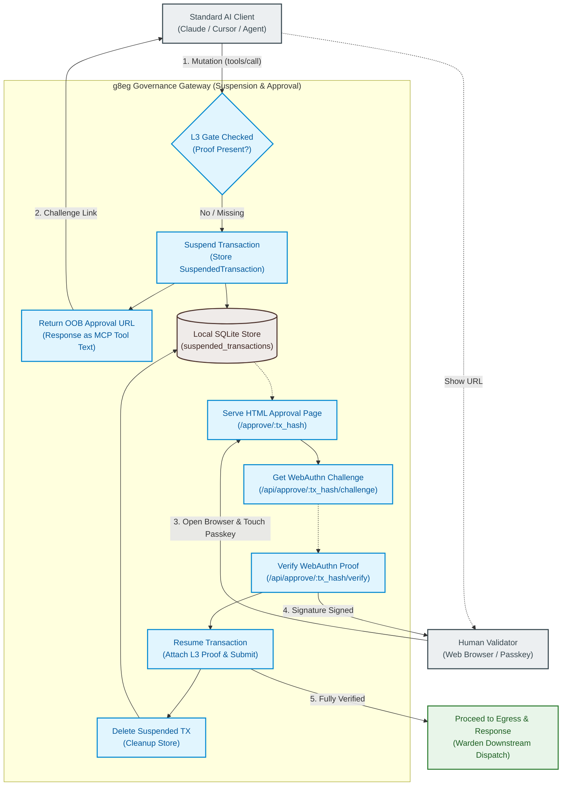

# g8e Gateway - Governance Gateway (g8eg)

The reference Go implementation of the g8e Protocol compiles from a single codebase into two role-specific binaries used in two distinct ways to secure and govern AI execution:

1. **Governance Gateway (`g8eg` / `g8e.gateway`)**: Runs in `--listen` mode to serve as the central, fail-closed Byzantine Fault Tolerant (BFT) Governance Gateway (Policy Decision Point / PDP).
2. **Governed Operator / MCP Server (`g8eo` / `g8e.operator`)**: Runs on target hosts (and exposes MCP over stdio with `--mcp-serve`) to function as the sovereign tool execution boundary (Policy Execution Point / PEP).

---

## Core Principles

- **Single Codebase, Two Roles**: The exact same Go codebase is compiled into the central Policy Decision Point (`g8e.gateway`) and host-level Policy Execution Point (`g8e.operator`). Behavior is activated via invocation flags (e.g. `--listen`).
- **mTLS-Everywhere**: All communication is outbound-only from the target operator and strictly gated by Gateway-owned mutual TLS. No inbound ports are required on managed hosts.
- **Local-First Audit (LFAA)**: The target host remains the source of truth for command history and file mutations, stored in a tamper-evident local ledger.
- **UAP JSON-First (GovernanceEnvelope)**: Every mutation action is governed by a UAP JSON `GovernanceEnvelope`. This is the single canonical container for all g8e mutations, binding identity, intent, state, and governance proofs into one transaction.
- **3-Layer Governance**: Hard gates at the bedrock (L1), consensus in the middle (L2), and human authorization at the top (L3).
- **Transaction Invariants**: Every transaction is identified by a deterministic `transaction_hash` computed from its content. The envelope `id` must match this hash for the transaction to be valid.
- **Protocol vs Implementation**: The protocol is the Gateway. The reference Governance Gateway (`g8eg`) and Governed Operator (`g8eo`) implement the protocol's core invariants, while application layers consume their public interfaces.
- **Sovereign Authority (PKI)**: The Governance Gateway owns the platform's PKI and is the only entity permitted to sign certificates, maintaining isolated intermediate CAs.
- **CSR-Based Enrollment**: Participants enroll by submitting a Certificate Signing Request (CSR) to the Governance Gateway. Long-lived API keys are deprecated for identity; the platform relies on short-lived, session-bound certificates.

---

## Architecture Overview

The g8e platform is built on the g8e Protocol as Gateway. Conforming gateway and operator implementations are what make that protocol live.

- **Protocol (Gateway)**: The wire contract, schemas, and L1/L2/L3 verification rules. Mandatory and immutable for any client or implementation.
- **Governance Gateway (`g8eg`)**: Built as `g8e.gateway` and run in **Listen Mode** (`--listen`). It acts as the platform's backbone - protocol hub, policy decision point, persistence layer (SQLite), pub/sub broker, root CA, and audit authority.
- **Governed Operator (`g8eo`)**: Built as `g8e.operator` and run in **Standard Mode** or **MCP Mode** (`--mcp-serve`). It acts as the sovereign tool execution boundary on a managed host, executing actions only after they carry a valid, signed gateway lease.
- **Reference Application Layer (Optional)**: Reference components like the Engine (`g8ee`) consume the public Gateway/Operator protocol surface. They have no privileged Gateway responsibilities and no private access channels.

---

## Operating Modes: Listen Mode (Hub)

By passing `--listen`, the binary transforms into the platform's central backbone (`g8eg`).

- **Role**: Reference hub for the bundled deployment.
- **Capabilities**:
    - **Gateway API** - `POST /api/governance/envelope` is the only customer-facing mutation entry point.
    - **Document Store** - JSON document CRUD on a Collection/ID pattern with `json_extract` query support.
    - **KV Store** - TTL-aware ephemeral state with `GLOB` pattern scanning and cursor-based `KVScan`. Supports a Write-Only cache policy.
    - **Blob Store** - Binary persistence for attachments, large objects, and certificate material.
    - **Pub/Sub Broker** - High-performance WebSocket fan-out. Mutation channels (`cmd:*`) are governed.
    - **SSE Buffer** - Per-session ring buffer for Server-Sent Events reconnection replay.
    - **State Root Provider** - Deterministic Merkle state root across all authoritative Hub data.
    - **Nonce Manager** - Sliding-window replay protection for governance transactions.
    - **Root CA / PKI** - Issues mTLS certificates via CSR-based enrollment with SPIFFE URI SAN identity.
    - **Secrets Vault** - Tamper-evident bootstrap secrets with a `bootstrap_digest.json` manifest.
    - **Audit Authority** - Append-only encrypted log of every event and signed `ActionReceipt`.

### Multiplexed Port Contract

The Governance Gateway (`g8eg`) exposes four logical protocol surfaces. Operators may bind each surface to its own TCP port or collapse multiple surfaces onto a single shared port. The Gateway automatically detects port overlaps and promotes the shared listener to a **Multiplexed Handler** with **Optional mTLS**.

Default ports are sourced from `services/g8eo/internal/constants/paths.go`:

| Surface | Port (default) | Auth | Purpose |
|---|---|---|---|
| **Bootstrap** | `<!-- g8e:port:operator_bootstrap -->8441<!-- /g8e:port -->` (plain HTTP) | None | `/.well-known/g8e/pki/hub-bundle.pem`, `/ca.crt`, `/trust`, device-link enrollment, CSR signing. |
| **Public Port** | `<!-- g8e:port:operator_public -->8442<!-- /g8e:port -->` (TLS) | Web session (passkey) | Login challenge/verify, web-session API, PKI discovery for browser/BYO bootstrap. |
| **mTLS API + Pub/Sub** | `<!-- g8e:port:operator_http -->8440<!-- /g8e:port -->` (mTLS) | mTLS + URI SAN | `/api/governance/envelope`, `/db/*`, `/kv/*`, `/blob/*`, `/pubsub/publish`, and `/ws/pubsub` real-time fan-out. |

#### Multiplexing rules

The gateway selects a TLS configuration and HTTP handler per port based on which surfaces are mapped to it:

- **mTLS only on a port** (HTTP and/or WSS, no Public): `tls.RequireAndVerifyClientCert`. Strict mTLS for every connection.
- **mTLS + Public on the same port**: `tls.VerifyClientCertIfGiven`. Unauthenticated requests reach public routes (web-session governed); mTLS and URI SAN verification are enforced for Gateway routes by per-route handlers.
- **Public only on a port**: TLS without client-cert request.
- **Bootstrap only on a port**: plain HTTP (no TLS).

When Public and mTLS surfaces share a port, the gateway serves them through a single `MasterRouter` that dispatches by route prefix. WebSocket connections are natively upgraded over the same listener.

#### Constraints

- **Bootstrap isolation is required for plain HTTP**: a port serves plain HTTP only when Bootstrap is the *sole* surface mapped to it. If Bootstrap shares a port with any TLS surface, the listener becomes TLS and trust-anchor download from clients without the platform CA breaks. Keep Bootstrap on its own port.
- **Privileged ports**: the gateway runs as an unprivileged user, so each configured port must be >1024 unless the binary has been granted `CAP_NET_BIND_SERVICE` (or another root-granted mechanism) out of band. The default ports above are all >1024 and require no privileged setup.
- **Port equality is the multiplex trigger**: ports collapse only when their numeric values match. Setting `operator_http` and `operator_public` to the same number multiplexes them; setting them to different numbers creates two listeners.

### Gateway Mutation Entry

`POST /api/governance/envelope` is the only customer-facing mutation API on the Governance Gateway (`g8eg`). Clients submit canonical JSON (protojson) `GovernanceEnvelope` transactions and receive a signed `ActionReceipt` after the envelope passes transaction hash, expiry, nonce/replay, state-root, L2 signer, L3 proof, and L1 typed-payload validation.

#### Out-of-Band (OOB) Suspension & WebAuthn Approval Flow

When a standard AI client requests a mutation, it typically cannot generate an L3 human signature. Instead of failing open or throwing a hard error, the `g8eg` gateway suspends the transaction. It records the envelope in the SQLite `suspended_transactions` table and returns a local out-of-band (OOB) WebAuthn challenge URL. Once the human user approves the transaction via their browser and physical security key, the gateway attaches the resulting WebAuthn proof, resumes verification, and moves the transaction to execution.

Direct `/db/` mutations are restricted to bootstrap and Operator-owned collections required to initialize governance and persist Warden/audit records. Mutations to non-bootstrap collections return `409 Conflict` with `{"error":"submit via POST /api/governance/envelope"}`. `/db/` reads and `_query` remain available because they do not mutate state.

`/pubsub/publish` remains available for non-mutation fan-out (`heartbeat:*`, `results:*`, `sse:*`, `ws_session:*`, `internal:*`). Mutation channels such as `cmd:*` and `auditor:*` return the same `409 Conflict` redirect so callers cannot bypass the governed execution boundary.

---

## Session Types

The g8e Protocol enforces strict separation between disjoint session types to prevent cross-tenant data leakage and identity conflation.

| Session Type | Identifier | Purpose | Authentication |
|---|---|---|---|
| **Operator Session** | `operator_session_id` | Authenticates a specific host-side **governed operator** (`g8eo`). Bound to the machine fingerprint. | mTLS (Operator Cert) |
| **CLI Session** | `cli_session_id` | Authenticates a specific **BYO/CLI client** (e.g., `./g8e chat`). Used for receiving real-time events. | mTLS (CLI Cert) |
| **Web Session** | `web_session_id` | Authenticates a **browser-based client** (e.g., Dashboard). Bound to a secure session cookie. | Passkey (WebAuthn) |

**Key Invariants:**
- **Disjoint Routing**: The Gateway (SSE/PubSub) routes events based on these identifiers. A `web_session_id` can never receive events intended for a `cli_session_id`.
- **Identity Binding**: CLI and Operator sessions are cryptographically bound to their respective mTLS certificates via SPIFFE URI SANs.
- **No Conflation**: The Gateway refuses to "fallback" to a single session ID; every request must explicitly declare which session context it is operating within.

SSE producers must set exactly one top-level routing key. Session-targeted events use either `web_session_id` or `cli_session_id` at the top level; `user_id` remains inside the typed event body for correlation. Background fan-out events use top-level `user_id` and no session route.

---

## PKI & Identity

The **Governance Gateway (`g8eg`)** owns the platform's Public Key Infrastructure (PKI). It acts as the sovereign root Certificate Authority (CA) for all platform participants, enforcing strict mutual TLS (mTLS) for all control-plane communication.

### PKI Hierarchy

The gateway manages a structured hierarchy in `.g8e/pki` to ensure isolation between different participants:

- **Root CA**: The foundational trust anchor, used only to sign intermediate CAs.
  - Path: `.g8e/pki/root/root_ca.crt`
- **Intermediate CAs**: Scoped authorities that sign leaf certificates.
  - **Hub CA**: Signs service certificates for the Gateway itself (e.g., `operator-listen`).
  - **Operator CA**: Signs certificates for Satellite operators (`g8eo`) during enrollment.
  - **Bootstrap CA**: Signs temporary certificates used during the initial discovery phase.
- **Trust Bundles**: Combinations of root and intermediate certificates used for verification.
  - Path: `.g8e/pki/trust/hub-bundle.pem` (Root + Hub Intermediate)

### Identity Schemes (SPIFFE)

Client identities follow the SPIFFE URI scheme, encoded in the certificate's URI SAN. These are generated using the `protocol.WorkloadIdentity` helper:

| Role | Helper | URI SAN Pattern |
|---|---|---|
| **Operator (Satellite)** | `OperatorSPIFFEID()` | `spiffe://g8e.local/operator/<org>/<op>/<session>` |
| **CLI (BYO Client)** | `CLISPIFFEID()` | `spiffe://g8e.local/cli/<user>/<session>` |
| **Application (Agent)** | `AppSPIFFEID()` | `spiffe://g8e.local/app/<operator>` |
| **Hub (Operator Listen)** | `HubSPIFFEID()` | `spiffe://g8e.local/hub/operator-listen` |

### CLI vs Operator separation

CLI and Operator are cryptographically distinct principals with separate keys, separate CSRs, and separate certificates:

- **Operator certificates** - Bound to `operator_session_id`. Authorize host-side mutations.
- **CLI certificates** - Bound to `cli_session_id`. Authorize BYO/CLI clients to issue commands and receive SSE.

This means CLI sessions cannot impersonate governed operators and operator sessions cannot drain another client's event stream. SSE routes are bound to CLI sessions specifically.

### Enrollment Lifecycle

The enrollment process transitions a participant from "untrusted" to "mTLS-verified":

1.  **Trust Verification**: The enrolling client fetches the Hub's root CA fingerprint from `GET /.well-known/pki/fingerprint` to verify the Hub's identity.
2.  **Registration Request**: The client presents a one-time device-link token and a locally generated `system_fingerprint` to the **Bootstrap Port (9002)**.
3.  **CSR Submission**: The client generates **two private keys** (Operator and CLI) and submits **two CSRs** (`csr_pem` for Operator, `cli_csr_pem` for CLI).
4.  **Issuance**: The Hub/Gateway verifies the token and fingerprint, signs both CSRs using the **Operator Intermediate CA** (with role-specific URI SANs), and returns both certificate chains (`operator_cert` and `cli_cert`).
5.  **Steady State**: The client uses the `cli_cert` for CLI-based operations and the `operator_cert` for host-side agent operations.

---

## Storage & Persistence

The Governance Gateway implements the central coordination store for the platform.

### Coordination Store

All Hub state lives in a single SQLite database at `.g8e/data/g8e.db`.

#### State Merkle Root Invariant
Hub state is anchored by a Merkle state root computed deterministically across authoritative documents, KV entries, and blobs.

#### Cache-Aside read/write contract
- **Writes** - Always go to the authoritative DB first, then invalidate the cache key.
- **Reads** - `get_document` checks the KV cache; on miss it fetches from the DB and warms the cache. `query_documents` hashes query parameters for result caching.
- **Atomic array ops** - `arrayUnion`/`arrayRemove` operate on the DB and invalidate the cache.
- **Write-Only mode** - Application adapters set `enable_cache_read: false`, ensuring every read is satisfied by the authoritative database while still populating the cache for ecosystem consumers.

#### PKI and Secrets directories (root of trust)
- **.g8e/pki/** stores the CA hierarchy and trust bundles:
    - **Root CA** - `root/root_ca.crt`
    - **Intermediate CAs** - Hub CA, Operator CA, Bootstrap CA.
    - **Trust Bundles** - `trust/hub-bundle.pem` (Root + Hub Intermediate).
- **.g8e/secrets/** stores tamper-evident bootstrap material:
    - `session_encryption_key`, `warden_signing_key`, `warden_key_id`.
    - `bootstrap_digest.json` - SHA-256 digests of every secret. Mismatch fails startup hard.

---

## Pub/Sub Broker

The Hub is the WSS broker and governance gate for all real-time traffic.

- **Channel format** - `{prefix}:{operator_id}:{operator_session_id}`. Always parse with a bounded split.
- **Mutation channels** - `cmd:*` and `auditor:*` only accept envelopes via `POST /api/governance/envelope`.
- **Non-mutation channels** - `heartbeat:*`, `results:*`, `sse:*`, `ws_session:*`, `internal:*` flow through `/pubsub/publish`.
- **Fail-closed** - Missing `message_id` or `operator_session_id` → reject. Unknown `event_type` → drop.
- **Subscribe-and-wait** - Subscribers must wait for the broker's `{"type":"subscribed","channel":"..."}` ack before publishing or dispatching commands.

---

## Audit Vault (Hub side)

The Hub keeps an authoritative encrypted audit vault keyed by `transaction_hash` for every governed mutation. ActionReceipts are queryable via the protected audit API. Audit writes are fail-closed: events with missing or unknown `operator_session_id` are rejected.

---

## Implementation Reference

| Concern | File |
|---|---|
| Listen mode entry | `services/g8eo/cmd/g8eo/main.go` |
| Coordination Store | `services/g8eo/internal/services/storage/` |
| Pub/Sub broker | `services/g8eo/internal/services/pubsub/` |
| State Root provider | `services/g8eo/internal/services/listen/listen_db.go` |
| Nonce / replay store | `services/g8eo/internal/services/storage/replay_store.go` |
| PKI / CertStore | `services/g8eo/internal/services/listen/listen_certs.go` |
| Secret Manager | `services/g8eo/internal/services/listen/secret_manager.go` |
| Audit Vault | `services/g8eo/internal/services/storage/audit_vault.go` |
| Workload identity | `protocol/workload_identity.go` |
| Collections registry | `services/g8eo/internal/constants/collections.go` |

---

## Canonical Collections

| Collection | Description |
|---|---|
| **Authentication & Sessions** | `users`, `web_sessions`, `operator_sessions`, `cli_sessions`, `bound_sessions`, `api_keys`, `passkey_challenges` |
| **Organizations & Tenants** | `organizations` |
| **Audit & Security** | `login_audit`, `auth_admin_audit`, `account_locks`, `console_audit`, `revoked_certificates` |
| **Operators & Usage** | `operators`, `operator_usage` |
| **Cases & Investigations** | `cases`, `investigations`, `tasks` |
| **Governance & Reputation** | `tribunal_commands`, `reputation_state`, `reputation_commitments`, `stake_resolutions` |
| **AI & Context** | `memories`, `agent_activity_metadata` |
| **Configuration** | `settings` |

---

## Related Documentation

- [**g8e Protocol**](protocol.md) - The wire contract and governance hierarchy.
- [**g8eo Operator**](operator.md) - Sovereign host-side execution agent and MCP server.
- [**g8ee Engine**](g8ee.md) - Reference AI reasoning application.
