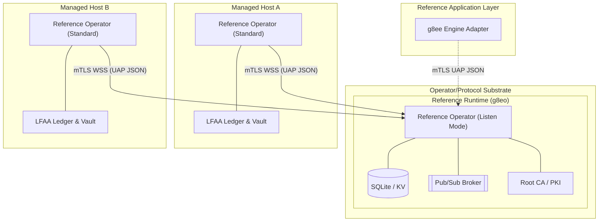

# g8eo - Reference Operator

**g8eo** is the reference Go implementation of the **Operator** role defined by the g8e Protocol. It is a sovereign, single-binary execution boundary that enforces the protocol's 3-layer governance hierarchy.

## Core Principles

- **Single Binary, Multi-Mode**: The reference binary runs as the Hub (Listen Mode), Target (Standard Mode), and Fleet Utility (Stream Mode).
- **mTLS-Everywhere**: All communication is outbound-only from the target and strictly gated by Operator-owned mutual TLS. No inbound ports are required on managed hosts.
- **Local-First Audit (LFAA)**: The host is the single source of truth for command history and file mutations, stored in a tamper-evident ledger.
- **UAP JSON-First (GovernanceEnvelope)**: Every mutation action is governed by a UAP JSON `GovernanceEnvelope`. This is the single canonical container for all g8e mutations, binding identity, intent, state, and governance proofs into one transaction.
- **3-Layer Governance**: Hard gates at the bedrock (L1), consensus in the middle (L2), and human authorization at the top (L3).
- **Transaction Invariants**: Every transaction is identified by a deterministic `transaction_hash` computed from its content. The envelope `id` must match this hash for the transaction to be valid.
- **Protocol vs Implementation**: The protocol is the substrate. The reference Operator is one implementation of the protocol's Operator role; the reference Engine is one example of an application built on top of it.
- **Sovereign Authority (PKI)**: The Operator is the only entity permitted to sign certificates. It maintains a multi-layer hierarchy with intermediate CAs for isolation.
- **CSR-Based Enrollment**: Participants enroll by submitting a Certificate Signing Request (CSR). Long-lived API keys are deprecated for identity; the platform relies on short-lived, session-bound certificates.

## Architecture Overview

The g8e platform is built on the g8e Protocol as substrate. A conforming Operator implementation is what makes that protocol live on a host.

- **Protocol (Substrate)**: The wire contract, schemas, and L1/L2/L3 verification rules. Mandatory and immutable for any client or implementation.
- **Reference Operator (`g8eo`)**: In **Listen Mode** it acts as the platform's backbone for the reference deployment - protocol hub, persistence layer (SQLite), pub/sub broker, root CA, and audit authority. In **Standard Mode** it acts as the execution agent on a managed host. It is sufficient on its own to receive, verify, and execute protocol-governed transactions, and it is replaceable by any conforming Operator.
- **Reference Application Layer (Optional)**: Reference components like the Engine (`g8ee`) consume the public Operator protocol surface. They have no privileged substrate responsibilities and no private access channels.

## Operating Modes

A single `g8eo` binary runs in one of several primary roles:

### 1. Listen Mode (Hub)
Transforms the reference Operator into the platform's backbone. Started with the `--listen` flag.

- **Role**: Reference hub for the bundled deployment.
- **Capabilities**:
    - **Substrate API** - `POST /api/governance/envelope` is the only customer-facing mutation entry point.
    - **Document Store** - JSON document CRUD on a Collection/ID pattern with `json_extract` query support.
    - **KV Store** - TTL-aware ephemeral state with `GLOB` pattern scanning and cursor-based `KVScan`. Supports a Write-Only cache policy.
    - **Blob Store** - Binary persistence for attachments, large objects, and certificate material.
    - **Pub/Sub Broker** - High-performance WebSocket fan-out. Mutation channels (`cmd:*`) are governed.
    - **SSE Buffer** - Per-session ring buffer for Server-Sent Events reconnection replay.
    - **State Root Provider** - Deterministic Merkle state root across all authoritative Hub data.
    - **Nonce Manager** - Sliding-window replay protection for governance transactions.
    - **Root CA / PKI** - Issues mTLS certificates via CSR-based enrollment with SPIFFE URI SAN identity.
    - **Secrets Vault** - Tamper-evident bootstrap secrets with a `bootstrap_digest.json` manifest.
    - **Audit Authority** - Append-only encrypted log of every event and signed `ActionReceipt`.

#### Four-Port Contract
Listen Mode exposes four distinct ports for different protocol surfaces:

| Surface | Port (default) | Auth | Purpose |
|---|---|---|---|
| **Bootstrap** | `9002` (HTTP) | None | `/.well-known/g8e/pki/hub-bundle.pem`, `/ca.crt`, `/trust`, device-link enrollment, CSR signing. |
| **Public Port** | `9003` (TLS) | Web session (passkey) | Login challenge/verify, web-session API, PKI discovery for browser/BYO bootstrap. |
| **mTLS API** | `9000` | mTLS + URI SAN | `/api/governance/envelope`, `/db/*` (reads + bootstrap writes), `/kv/*`, `/blob/*`, `/pubsub/publish`, `/api/operators/*`, `/api/device-links/*`, `/api/pki/{sign-csr,revoke,revocation-bundle}`, `/api/auth/passkey/*`. |
| **Pub/Sub** | `9001` (mTLS WSS) | mTLS + URI SAN | `/ws/pubsub` real-time fan-out. |

- **mTLS Ports (WSS, mTLS API)**: Require valid operator certificates with URI SAN binding to operator session IDs. Used for substrate operations and command dispatch.
- **Public Ports (Bootstrap, Public)**: The **Public Port (9003)** is a plain TLS endpoint for browser-based flows. The **Bootstrap Port (9002)** is a plain HTTP endpoint used to download the initial trust bundle and bootstrap enrollment. These are the sovereign entry points for new operators and BYO clients.

#### Substrate Mutation Entry

`POST /api/governance/envelope` is the only customer-facing mutation API on the reference Operator. Clients submit canonical JSON (protojson) `GovernanceEnvelope` transactions and receive a signed `ActionReceipt` after the envelope passes transaction hash, expiry, nonce/replay, state-root, L2 signer, L3 proof, and L1 typed-payload validation.

Direct `/db/` mutations are restricted to bootstrap and Operator-owned collections required to initialize governance and persist Warden/audit records. Mutations to non-bootstrap collections return `409 Conflict` with `{"error":"submit via POST /api/governance/envelope"}`. `/db/` reads and `_query` remain available because they do not mutate state.

`/pubsub/publish` remains available for non-mutation fan-out (`heartbeat:*`, `results:*`, `sse:*`, `ws_session:*`, `internal:*`). Mutation channels such as `cmd:*` and `auditor:*` return the same `409 Conflict` redirect so callers cannot bypass the governed execution boundary.

### 2. Standard Mode (Target)
The default mode for execution on target hosts. The reference Operator initiates an outbound connection and waits for protocol-governed UAP JSON envelopes.

**Lifecycle:**
1. **Discovery**: Resolves environment and local CA certificates from `.g8e/pki` or the Hub's PKI endpoint.
2. **Fingerprinting**: Generates a hardware-bound machine ID.
3. **Enrollment**: Authenticates via `POST /api/auth/operator` using a Device Token for initial CSR signing.
4. **mTLS Upgrade**: Receives an mTLS certificate and upgrades the transport to secure WSS.
5. **Vault Unlock**: API key unlocks the local **Encryption Vault** to retrieve the Data Encryption Key (DEK).
6. **Steady State**: Subscribes to its dedicated command channel for UAP JSON `GovernanceEnvelope` mutation commands.
7. **Verification & Execution**: 
    - Decodes inbound UAP JSON into a `GovernanceEnvelope`.
    - Passes through the `TransactionVerifier` (L1/L2/L3 check).
    - If valid, the **Warden** executes the command and issues a signed `ActionReceipt`.
    - Results are published back to the Hub via mTLS WSS.

### 3. Stream Mode (Fleet)
A utility for concurrent deployment over SSH. It streams itself into memory on remote hosts and manages the remote lifecycle via SSH.

### 4. OpenClaw Mode
Connects to an OpenClaw Gateway as a standalone capability provider, allowing g8e operators to be consumed by external OpenClaw-compliant orchestrators.

## Governance & Safety

A conforming Operator enforces a 3-layer validation hierarchy for every command. In the reference Operator, the **TransactionVerifier** performs the gates and the **Warden** service acts as the final execution boundary.

| Layer | Name | Mechanism | Role |
|---|---|---|---|
| **L1** | **Technical Bedrock** | Protobuf Reflection & `forbidden_patterns` | **Hard Gate**: Rejects `sudo`, `rm -rf /`, etc. based on regex patterns defined in the `.proto` schemas. |
| **L2** | **Consensus** | Tribunal Signatures | **Verification**: Ensures the command was generated by agent consensus (Tribunal). Verified against the Operator-owned `SignerStore` (Ed25519). |
| **L3** | **Authorization** | Human Approval (WebAuthn) | **Permission**: Human-in-the-loop sovereign authority for mutations. Verified using WebAuthn proofs. |

**Invariants:**
- **Fail-Closed**: If the `TransactionVerifier` or `Warden` encounters an error, the command is rejected immediately.
- **Execution Boundary**: All mutations *must* pass through the Warden. No service executes code without Warden authorization.
- **L3 never bypasses L1/L2**: Even if "auto-approved" (for diagnostic commands), L1 and L2 gates remain active.
- **Hash-to-ID Binding**: `envelope.id` MUST equal the `transaction_hash`.
- **State Bound**: Every transaction must include a `state_merkle_root` that matches the Operator's current state.
- **Replay Protection**: Every transaction must include a unique `nonce` and `expires_at` timestamp.

### Session Types

The g8e Protocol enforces strict separation between disjoint session types to prevent cross-tenant data leakage and identity conflation.

| Session Type | Identifier | Purpose | Authentication |
|---|---|---|---|
| **Operator Session** | `operator_session_id` | Authenticates a specific host-side **operator agent**. Bound to the machine fingerprint. | mTLS (Operator Cert) |
| **CLI Session** | `cli_session_id` | Authenticates a specific **BYO/CLI client** (e.g., `./g8e chat`). Used for receiving real-time events. | mTLS (CLI Cert) |
| **Web Session** | `web_session_id` | Authenticates a **browser-based client** (e.g., Dashboard). Bound to a secure session cookie. | Passkey (WebAuthn) |

**Key Invariants:**
- **Disjoint Routing**: The substrate (SSE/PubSub) routes events based on these identifiers. A `web_session_id` can never receive events intended for a `cli_session_id`.
- **Identity Binding**: CLI and Operator sessions are cryptographically bound to their respective mTLS certificates via SPIFFE URI SANs.
- **No Conflation**: The substrate refuses to "fallback" to a single session ID; every request must explicitly declare which session context it is operating within.

## PKI & Identity

The **g8eo Operator** owns the platform's Public Key Infrastructure (PKI). It acts as the sovereign root Certificate Authority (CA) for all platform participants, enforcing strict mutual TLS (mTLS) for all control-plane communication.

### PKI Hierarchy

The Operator manages a structured hierarchy in `.g8e/pki` to ensure isolation between different participants:

- **Root CA**: The foundational trust anchor, used only to sign intermediate CAs.
  - Path: `.g8e/pki/root/root_ca.crt`
- **Intermediate CAs**: Scoped authorities that sign leaf certificates.
  - **Hub CA**: Signs service certificates for the Operator itself (e.g., `operator-listen`).
  - **Operator CA**: Signs certificates for Satellite operators during enrollment.
  - **Bootstrap CA**: Signs temporary certificates used during the initial discovery phase.
- **Trust Bundles**: Combinations of root and intermediate certificates used for verification.
  - Path: `.g8e/pki/trust/hub-bundle.pem` (Root + Hub Intermediate)

### Identity Schemes (SPIFFE)

Client identities follow the SPIFFE URI scheme, encoded in the certificate's URI SAN. These are generated using the `protocol.WorkloadIdentity` helper:

| Role | Helper | URI SAN Pattern |
|---|---|---|
| **Operator (Satellite)** | `OperatorSPIFFEID()` | `spiffe://g8e.local/operator/<org>/<op>/<session>` |
| **CLI (BYO Client)** | `CLISPIFFEID()` | `spiffe://g8e.local/cli/<user>/<session>` |
| **Application (Agent)** | `AppSPIFFEID()` | `spiffe://g8e.local/app/<operator>` |
| **Hub (Operator Listen)** | `HubSPIFFEID()` | `spiffe://g8e.local/hub/operator-listen` |

### CLI vs Operator separation

CLI and Operator are cryptographically distinct principals with separate keys, separate CSRs, and separate certificates:

- **Operator certificates** - Bound to `operator_session_id`. Authorize host-side mutations.
- **CLI certificates** - Bound to `cli_session_id`. Authorize BYO/CLI clients to issue commands and receive SSE.

This means CLI sessions cannot impersonate operator agents and operator sessions cannot drain another client's event stream. SSE routes are bound to CLI sessions specifically.

### Enrollment Lifecycle

The enrollment process transitions a participant from "untrusted" to "mTLS-verified":

1.  **Trust Verification**: The enrolling client fetches the Hub's root CA fingerprint from `GET /.well-known/pki/fingerprint` to verify the Hub's identity.
2.  **Registration Request**: The client presents a one-time device-link token and a locally generated `system_fingerprint` to the **Bootstrap Port (9003)**.
3.  **CSR Submission**: The client generates **two private keys** (Operator and CLI) and submits **two CSRs** (`csr_pem` for Operator, `cli_csr_pem` for CLI).
4.  **Issuance**: The Hub verifies the token and fingerprint, signs both CSRs using the **Operator Intermediate CA** (with role-specific URI SANs), and returns both certificate chains (`operator_cert` and `cli_cert`).
5.  **Steady State**: The client uses the `cli_cert` for CLI-based operations and the `operator_cert` for host-side agent operations.

### Warden Public Key Export

The **Warden** signs all mutation receipts with an Ed25519 key. For external verification, the Warden's public key is exported at Operator bootstrap in listen mode to:
- **PEM format**: `.g8e/pki/warden_pub.pem`
- **JSON format**: `.g8e/pki/warden_pub.json`

## Storage & Persistence (LFAA)

`g8eo` implements the **Local-First Audit Architecture (LFAA)** to ensure data sovereignty and tamper-evident auditing on managed hosts.

### Storage Tiers

1.  **Coordination Store (Platform Hub)**: Shared state for users, sessions, operators, cases, and configuration. Centralized persistence for stateless components.
2.  **LFAA Vaults (Managed Hosts)**:
    *   **Audit Vault**: Cryptographically signed, append-only record of all session activity (encrypted at rest).
    *   **Scrubbed Vault**: Sentinel-processed output for AI context and platform-side reporting.
    *   **Raw Vault**: Unscrubbed command output for deep forensic analysis (customer-access only).
3.  **The Ledger (Managed Hosts)**: Multi-Ledger Architecture - a fleet of per-session isolated git repositories providing cryptographic history and instant rollback. Each operator session owns its own git repo under `.g8e/data/ledger/sessions/<operator_session_id>/`.

### Coordination Store (g8eo --listen)

The Coordination Store is the platform's central coordination point, implemented in the `g8eo` binary when running in `--listen` mode. All Hub state lives in a single SQLite database at `.g8e/data/g8e.db`.

#### State Merkle Root Invariant
Hub state is anchored by a Merkle state root computed deterministically across all documents, active KV entries, and blobs. Every governance transaction carries `state_merkle_root`; the Operator rejects any transaction whose root does not match the current authoritative state. This makes it impossible for an agent to act on stale reality.

#### Cache-Aside read/write contract
- **Writes** - Always go to the authoritative DB first, then invalidate the cache key.
- **Reads** - `get_document` checks the KV cache; on miss it fetches from the DB and warms the cache. `query_documents` hashes query parameters for result caching.
- **Atomic array ops** - `arrayUnion`/`arrayRemove` operate on the DB and invalidate the cache.
- **Write-Only mode** - Application adapters set `enable_cache_read: false`, ensuring every read is satisfied by the authoritative database while still populating the cache for ecosystem consumers.

#### PKI and Secrets directories (root of trust)
- **.g8e/pki/** stores the CA hierarchy and trust bundles:
    - **Root CA** - `root/root_ca.crt`
    - **Intermediate CAs** - Hub CA, Operator CA, Bootstrap CA.
    - **Trust Bundles** - `trust/hub-bundle.pem` (Root + Hub Intermediate).
- **.g8e/secrets/** stores tamper-evident bootstrap material:
    - `session_encryption_key`, `warden_signing_key`, `warden_key_id`.
    - `bootstrap_digest.json` - SHA-256 digests of every secret. Mismatch fails startup hard.

### The Ledger (Multi-Ledger Architecture)

The Ledger uses a **Multi-Ledger Architecture**: each operator session owns an isolated git repository under `.g8e/data/ledger/sessions/<operator_session_id>/`.

- **Session Isolation**: Each session ledger is initialized lazily on first file mutation. Concurrent sessions never share a git working tree.
- **Two-Phase Commit**: Every mutation captures `LedgerHashBefore` (pre-mutation git commit) and `LedgerHashAfter` (post-mutation git commit).
- **Tamper Evidence**: Git's Merkle tree guarantees history integrity.
- **Rollback**: Any file can be restored to any prior state within its session ledger.

### Sentinel Defense & Scrubbing

Sentinel protects data privacy in two phases:
1. **Defense (Pre-Execution)**: Analyzes commands and file edits *before* they occur, blocking threat patterns.
2. **Scrubbing (Post-Execution)**: Removes sensitive data (API keys, PII) from output before it is stored in the Scrubbed Vault or sent to the platform.

## Pub/Sub Broker

The Hub is the WSS broker and governance gate for all real-time traffic.

- **Channel format** - `{prefix}:{operator_id}:{operator_session_id}`. Always parse with a bounded split.
- **Mutation channels** - `cmd:*` and `auditor:*` only accept envelopes via `POST /api/governance/envelope`.
- **Non-mutation channels** - `heartbeat:*`, `results:*`, `sse:*`, `ws_session:*`, `internal:*` flow through `/pubsub/publish`.
- **Fail-closed** - Missing `message_id` or `operator_session_id` → reject. Unknown `event_type` → drop.
- **Subscribe-and-wait** - Subscribers must wait for the broker's `{"type":"subscribed","channel":"..."}` ack before publishing or dispatching commands.

## Audit Vault (Hub side)

The Hub keeps an authoritative encrypted audit vault keyed by `transaction_hash` for every governed mutation. ActionReceipts are queryable via the protected audit API. Audit writes are fail-closed: events with missing or unknown `operator_session_id` are rejected.

## Lifecycle

1. **Bootstrap (first boot)** - Hub generates CA hierarchy, trust bundles, and bootstrap secrets. Server certs are issued.
2. **Identity bootstrap (zero-touch)** - `./g8e platform start -a` creates a local superadmin and loopback CLI cert. The first real login retires the bootstrap user.
3. **Steady state** - The Hub serves the four ports, dispatches governed envelopes, and fans results back via pub/sub and SSE.
4. **Reset/wipe** - `wipe` clears app data; `reset` deletes data + secrets; `clean` destructive removal of `.g8e/`.

## Implementation Reference

| Concern | File |
|---|---|
| Listen mode entry | `services/g8eo/cmd/g8eo/main.go` |
| Coordination Store | `services/g8eo/internal/services/storage/` |
| Pub/Sub broker | `services/g8eo/internal/services/pubsub/` |
| State Root provider | `services/g8eo/internal/services/listen/listen_db.go` |
| Nonce / replay store | `services/g8eo/internal/services/storage/replay_store.go` |
| PKI / CertStore | `services/g8eo/internal/services/listen/listen_certs.go` |
| Secret Manager | `services/g8eo/internal/services/listen/secret_manager.go` |
| Audit Vault | `services/g8eo/internal/services/storage/audit_vault.go` |
| Workload identity | `protocol/workload_identity.go` |
| Collections registry | `protocol/constants/collections.json` |

## CLI Reference

| Flag | Description |
|---|---|
| `-k`, `--key` | API key for auth and Vault unlocking. |
| `-D`, `--device-token` | Device link token for automated registration and CSR signing. |
| `-e`, `--endpoint` | Hub endpoint address (IP or hostname). |
| `--listen` | Start in Listen Mode (Substrate Hub). |
| `--wss-listen-port` | Port for Pub/Sub connections (default: 9001). |
| `--http-listen-port` | Port for mTLS API (default: 9000). |
| `--bootstrap-listen-port` | Port for device-link enrollment (default: 9002). |
| `--public-listen-port` | Port for browser/BYO bootstrap (default: 9003). |
| `--data-dir` | Directory for persistence (default: `.g8e/data`). |
| `--pki-dir` | Directory for PKI hierarchy (default: `.g8e/pki`). |
| `--secrets-dir` | Directory for platform secrets (default: `.g8e/secrets`). |
| `-s`, `--local-storage` | Enable local LFAA auditing (default: on). |
| `-G`, `--no-git` | Disable the file ledger (git-backed versioning). |
| `--working-dir` | Anchor for all commands and storage (default: launch dir). |
| `--log` | Log level: info, error, debug (default: info). |

## Exit Codes

| Code | Meaning | Action |
|---|---|---|
| **0** | Success | - |
| **1** | General error | Inspect logs under `.g8e/logs/` |
| **2** | Auth failure | Verify device-link token or API key |
| **3** | Permission denied | Check filesystem permissions on `.g8e/` |
| **4** | Network error | Check Hub reachability and DNS |
| **5** | Config error | Validate CLI flags / environment |
| **6** | Storage error | Inspect SQLite vaults and git ledger init |
| **7** | TLS / cert trust failure | Refresh the Hub trust bundle |
| **10** | **Vault Error** | Failed to unlock or initialize the local audit vault. |

## Canonical Truths

The wire contract lives in `protocol/proto/`; the shared JSON registries in `protocol/constants/` remain the source for event names, status values, and channel prefixes.

- **Wire format**: Canonical JSON (protojson) on all client-facing surfaces (HTTP, pub/sub, receipts, audit exports).
- **Signing basis**: A deterministic `transaction_hash` is computed from normalized envelope fields.
- **Events / Status / Channels**: Mirrored as compile-time Go constants from `protocol/constants/`.

## Canonical Collections

| Collection | Description |
|---|---|
| **Authentication & Sessions** | `users`, `web_sessions`, `operator_sessions`, `cli_sessions`, `bound_sessions`, `api_keys`, `passkey_challenges` |
| **Organizations & Tenants** | `organizations` |
| **Audit & Security** | `login_audit`, `auth_admin_audit`, `account_locks`, `console_audit`, `revoked_certificates` |
| **Operators & Usage** | `operators`, `operator_usage` |
| **Cases & Investigations** | `cases`, `investigations`, `tasks` |
| **Governance & Reputation** | `tribunal_commands`, `reputation_state`, `reputation_commitments`, `stake_resolutions` |
| **AI & Context** | `memories`, `agent_activity_metadata` |
| **Configuration** | `settings` |

## Related Documentation

- [**g8e Protocol**](protocol.md) - The wire contract and governance hierarchy.
- [**Security Architecture**](protocol.md#host-sovereignty--audit) - mTLS, Sentinel, and host sovereignty.
- [**Contribution Guide**](../CONTRIBUTING.md) - Build instructions and testing standards.
- [**g8ee Engine**](g8ee.md) - Reference AI reasoning application.
