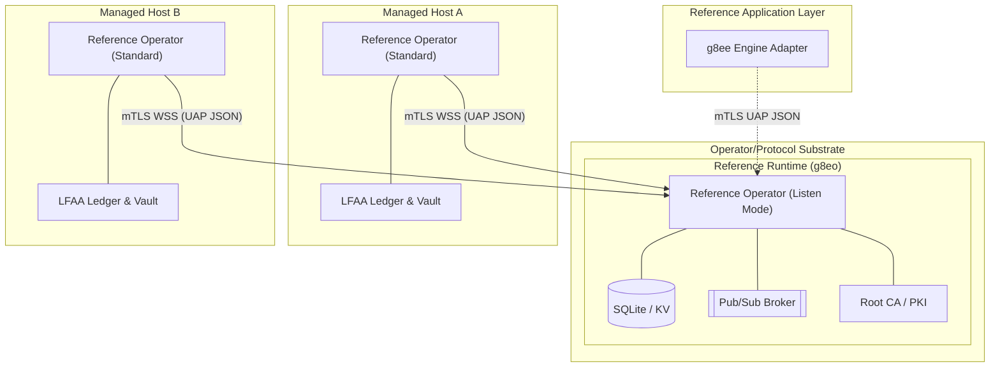

# g8e Operator

Last Updated: 2026-05-13
Version: v0.3.0

The **Operator** is a role defined by the g8e Protocol: a host-side implementation that receives signed transactions, enforces L1/L2/L3 verification, executes through a defensive boundary, and emits signed receipts anchored to a local ledger. It is the data plane, execution engine, and persistence layer for the platform.

This document describes **`g8eo`**, the reference Operator implementation: a statically compiled Go binary that functions as both the protocol hub (Listen Mode) and the execution agent (Standard Mode). Any conforming implementation can replace it; the protocol invariants below are mandatory, the specific binary is not.

## Core Principles

- **Single Binary, Multi-Mode**: The reference binary runs as the Hub (Listen Mode), Target (Standard Mode), and Fleet Utility (Stream Mode).
- **mTLS-Everywhere**: All communication is outbound-only from the target and strictly gated by Operator-owned mutual TLS. No inbound ports are required on managed hosts.
- **Local-First Audit (LFAA)**: The host is the single source of truth for command history and file mutations, stored in a tamper-evident ledger.
- **UAP JSON-First (GovernanceEnvelope)**: Every mutation action is governed by a UAP JSON `GovernanceEnvelope`. This is the *only* canonical mutation envelope, ensuring transparency and flexibility for audit.
- **3-Layer Governance**: Hard gates at the bedrock (L1), consensus in the middle (L2), and human authorization at the top (L3).
- **Protocol vs Implementation**: The protocol is the substrate. The reference Operator is one implementation of the protocol's Operator role; the reference Engine is one example of an application built on top of it.

## Architecture Overview

The g8e platform is built on the g8e Protocol as substrate. A conforming Operator implementation is what makes that protocol live on a host.

- **Protocol (Substrate)**: The wire contract, schemas, and L1/L2/L3 verification rules. Mandatory and immutable for any client or implementation.
- **Reference Operator (`g8eo`)**: In **Listen Mode** it acts as the platform's backbone for the reference deployment — protocol hub, persistence layer (SQLite), pub/sub broker, root CA, and audit authority. In **Standard Mode** it acts as the execution agent on a managed host. It is sufficient on its own to receive, verify, and execute protocol-governed transactions, and it is replaceable by any conforming Operator.
- **Reference Application Layer (Optional)**: Reference components like the Engine (`g8ee`) consume the public Operator protocol surface. They have no privileged substrate responsibilities and no private access channels.

## Operating Modes

The reference Operator (`g8eo`) supports the following modes. A BYO Operator may shape its lifecycle differently as long as it preserves the protocol's verification and audit invariants.

### 1. Listen Mode (Hub)
Transforms the reference Operator into the platform's backbone. Started with the `--listen` flag.

- **Role**: Reference hub for the bundled deployment.
- **Persistence**: Document-store and TTL-aware KV store backed by SQLite.
- **Messaging**: High-performance WebSocket Pub/Sub broker using UAP JSON `GovernanceEnvelope` messages.
- **Identity (PKI)**: Acts as the platform's root Certificate Authority, issuing mTLS certificates via CSR-based enrollment.
- **Security**: Manages the platform's Encryption Vault and secret rotation.
- **Gateway**: Provides the public Operator HTTP/WSS protocol surface for all clients.

#### Four-Port Contract
Listen Mode exposes four distinct ports for different protocol surfaces:

| Surface | Port (default) | Auth | Purpose |
|---|---|---|---|
| **Bootstrap / Trust Portal** | `8080` (TLS) | None | `/.well-known/g8e/pki/hub-bundle.pem`, `/ca.crt`, `/trust`, device-link enrollment, CSR signing. |
| **Public browser / BYO** | `8081` (TLS) | Web session (passkey) | Login challenge/verify, web-session API, PKI discovery. |
| **mTLS API** | `9000` | mTLS + SPIFFE URI SAN | `/db/*` (Document Store), `/kv/*` (KV with TTL), `/blob/*`, `/pubsub/publish`, `/api/operators/*`, `/api/device-links/*`, `/api/pki/{sign-csr,revoke,revocation-bundle}`, `/api/auth/passkey/*`. |
| **Pub/Sub** | `9001` (mTLS WSS) | mTLS + SPIFFE URI SAN | `/ws/pubsub` real-time fan-out to Satellites and clients. |

- **mTLS Ports (WSS, mTLS API)**: Require valid operator certificates with URI SAN binding to operator session IDs. Used for substrate operations and command dispatch.
- **Public Ports (Bootstrap, Public)**: Plain TLS endpoints for enrollment and browser-based flows. These are the sovereign entry points for new operators and BYO clients.

### 2. Standard Mode (Target)
The default mode for execution on target hosts. The reference Operator initiates an outbound connection and waits for protocol-governed UAP JSON envelopes.

**Lifecycle:**
1. **Discovery**: Resolves environment and local CA certificates from `.g8e/pki` or the Hub's PKI endpoint.
2. **Fingerprinting**: Generates a hardware-bound machine ID.
3. **Enrollment**: Authenticates via `POST /api/auth/operator` using a Device Token for initial CSR signing.
4. **mTLS Upgrade**: Receives an mTLS certificate and upgrades the transport to secure WSS.
5. **Vault Unlock**: API key unlocks the local **Encryption Vault** to retrieve the Data Encryption Key (DEK).
6. **Steady State**: Subscribes to its dedicated command channel for UAP JSON `GovernanceEnvelope` mutation commands.

### 3. Stream Mode (Fleet)
A utility for concurrent deployment over SSH. It streams itself into memory on remote hosts and manages the remote lifecycle via SSH.

### 4. OpenClaw Mode
Connects to an OpenClaw Gateway as a standalone capability provider, allowing g8e operators to be consumed by external OpenClaw-compliant orchestrators.

## Governance & Safety

A conforming Operator enforces a 3-layer validation hierarchy for every command. In the reference Operator, the **Warden** service acts as the final execution boundary.

| Layer | Name | Mechanism | Role |
|---|---|---|---|
| **L1** | **Technical Bedrock** | Protobuf Reflection & `forbidden_patterns` | **Hard Gate**: Rejects `sudo`, `rm -rf /`, etc. at the protocol level before dispatch. |
| **L2** | **Consensus** | Tribunal Signatures | **Verification**: Ensures the command was generated by agent consensus (Tribunal). Verified against the Operator-owned database-backed `SignerStore`. |
| **L3** | **Authorization** | Human Approval (WebAuthn) | **Permission**: Human-in-the-loop sovereign authority for mutations. |

**Invariants:**
- **Fail-Closed**: If the `TransactionVerifier` or `Warden` encounters an error, the command is rejected immediately.
- **Execution Boundary**: All mutations *must* pass through the Warden. No service executes code without Warden authorization.
- **L3 never bypasses L1/L2**: Even if "auto-approved" (for diagnostic commands), L1 and L2 gates remain active.

## Local Storage & Persistence (LFAA)

When local storage is enabled (`-s`), the Operator maintains a **Local-First Audit Architecture** in the `.g8e` directory:

- **Audit Vault (`g8e.db`)**: An append-only, tamper-evident ledger. Every UAP transaction result is recorded with its associated proof.
- **Encryption**: Sensitive data is encrypted at rest using the DEK retrieved from the Encryption Vault.
- **File Ledger**: A git-backed versioning system tracks exact file mutations, allowing for cryptographic verification and point-in-time restoration.

## CLI Reference

| Flag | Description |
|---|---|
| `-k`, `--key` | API key for auth and Vault unlocking. |
| `-D`, `--device-token` | Device link token for automated registration and CSR signing. |
| `-e`, `--endpoint` | Hub endpoint address (IP or hostname). |
| `--listen` | Start in Listen Mode (Substrate Hub). |
| `--wss-listen-port` | Port for Pub/Sub connections (default: 9001). |
| `--http-listen-port` | Port for mTLS API (default: 9000). |
| `--bootstrap-listen-port` | Port for device-link enrollment (default: 8080). |
| `--public-listen-port` | Port for browser/BYO bootstrap (default: 8081). |
| `--data-dir` | Directory for persistence (default: `.g8e/data`). |
| `--pki-dir` | Directory for PKI hierarchy (default: `.g8e/pki`). |
| `--secrets-dir` | Directory for platform secrets (default: `.g8e/secrets`). |
| `-s`, `--local-storage` | Enable local LFAA auditing (default: on). |
| `-G`, `--no-git` | Disable the file ledger (git-backed versioning). |
| `--working-dir` | Anchor for all commands and storage (default: launch dir). |
| `--log` | Log level: info, error, debug (default: info). |

## Exit Codes

On a fatal condition g8eo self-terminates with a stable exit code so launcher scripts and supervisors can act precisely. Codes are defined in `internal/constants/exit_codes.go`.

| Code | Meaning | Action |
|---|---|---|
| **0** | Success | — |
| **1** | General error | Inspect logs under `.g8e/logs/` |
| **2** | Auth failure | Verify device-link token or API key; re-enroll if needed |
| **3** | Permission denied | Check filesystem permissions on `.g8e/` |
| **4** | Network error | Check Hub reachability and DNS |
| **5** | Config error | Validate CLI flags / environment |
| **6** | Storage error | Inspect SQLite vaults and git ledger init |
| **7** | TLS / cert trust failure | Refresh the Hub trust bundle; re-enroll if pinning failed |
| **10** | **Vault Error** | Failed to unlock or initialize the local audit vault. |

## Canonical Truths

The wire contract lives in `protocol/proto/`; the shared JSON registries in `protocol/constants/` remain the source for event names, status values, and channel prefixes. g8eo mirrors them as compile-time Go constants so drift fails at build time, not at runtime.

- **Protocol**: Generated Go artifacts under `internal/protocol/proto/` mirror `protocol/proto/common.proto`, `protocol/proto/operator.proto`, and `protocol/proto/pubsub.proto`.
- **Wire format**: Canonical JSON (protojson) on all client-facing surfaces (HTTP, pub/sub, receipts, audit exports). Protobuf bytes are an internal storage detail only.
- **Signing basis**: A deterministic `transaction_hash` is computed from normalized envelope fields; signatures are over the hash, so wire encoding is irrelevant to the security invariant.
- **Events / Status / Channels**: `internal/constants/events.go`, `status.go`, and `channels.go` mirror their JSON counterparts under `protocol/constants/`.

---

*For detailed security specifications, see [Security Architecture](security.md).*
