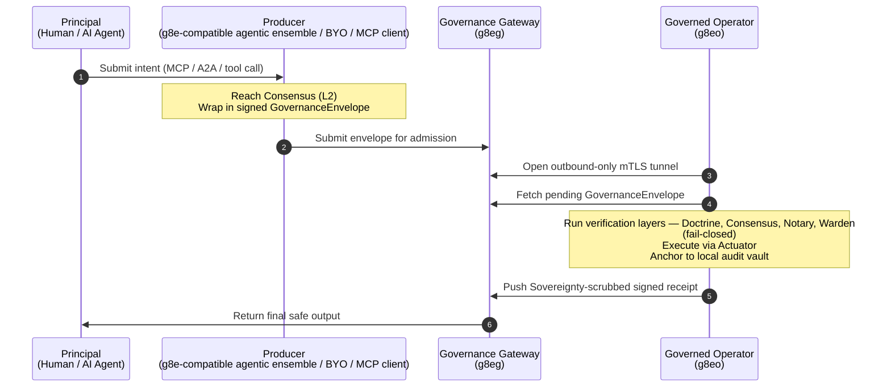

# g8e: Data-Sovereign Runtime Governance for Autonomous Execution

**A self-hosted, air-gap capable substrate that enforces fail-closed authority over AI tool calls through sequential technical, consensus, and human verification layers.**

[Getting Started](guides/getting_started.md){ .md-button .md-button--primary } [Position Paper](core/position_paper.md){ .md-button }

## Core Architecture

## 5-Layer Governance Verification

Every mutation passes a fail-closed verification pipeline at the host boundary.

=== "L1: Technical Bedrock (L1Doctrine)"

Static analysis and forbidden pattern enforcement. The action violates no hard technical policy before it reaches consensus.

=== "L2: Consensus (L2Consensus)"

Multi-model Byzantine Fault Tolerant Tribunal. Independent, heterogeneous models co-sign every mutation with Ed25519 cryptographic signatures.

=== "L3: Notary (L3Notary)"

WebAuthn/FIDO2 hardware-bound proof of human presence. A human authorizes the exact transaction using its hash as the challenge.

=== "L4: Warden (L4Warden)"

Pre-dispatch verification gate. Enforces transaction integrity, freshness (expiry/nonce), and state-root matching.

=== "L5: Actuator (L5Actuator)"

Sovereign execution boundary. The single fail-closed dispatch path that issues signed Action Receipts.

## Quick Links

-   **Getting Started**

    [Get started with g8e](guides/getting_started.md) in minutes using the unified CLI.

-   **Architecture**

    [Architecture and protocol overview](core/about.md) for the governance substrate.

-   **Guides**

    [Operational guides](guides/getting_started.md) for building, connecting, and deploying components.

-   **Reference**

    [API documentation](reference/api/index.md), constants, and protocol references.

