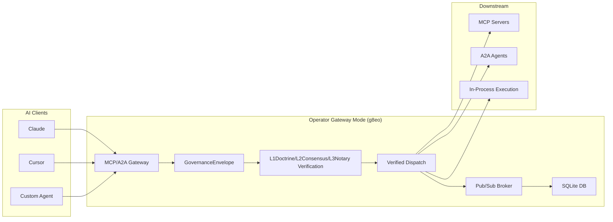

# MCP/A2A Gateway

Last Updated: 2026-05-24

The Operator (g8eo) in gateway mode functions as a universal protocol translator gateway for Model Context Protocol (MCP) and Agent-to-Agent (A2A) protocols. It intercepts standard JSON-RPC tool calls (MCP) and HTTP/JSON requests (A2A) from AI clients, forces them through the g8e governance envelope, runs them through the 3-layer BFT verification gauntlet (L1Doctrine/L2Consensus/L3Notary), and then dispatches verified payloads to downstream MCP/A2A servers or to the in-process execution service for local execution.

Gateway mode is the platform's central persistence and pub/sub broker. It runs the Operator binary with posture flags (`--doctrine`, `--consensus`, or `--notary`) to enable gateway mode. The MCP gateway is an in-process service within gateway mode, not a separate binary.

---

## Architecture Position

The Operator in gateway mode sits at the protocol boundary between untrusted AI clients and governed execution:

---

## Protocol Translation Flow

### 1. Inbound MCP/A2A Request

AI clients send standard JSON-RPC tool calls (MCP) or HTTP/JSON requests (A2A) to the Gateway:

- **MCP**: JSON-RPC 2.0 over HTTP transport to the gateway's mTLS API surface
- **A2A**: HTTP/JSON with skill-based payload structure

### 2. Envelope Construction

The Gateway wraps the raw protocol payload in a canonical JSON (protojson) `GovernanceEnvelope` with action type mapped to the protocol operation:

- `MCP_CALL`: Tool invocation via `McpCallRequested` proto payload
- `MCP_RESOURCE_READ`: Resource read via `McpResourceReadRequested` proto payload
- `MCP_PROMPT_GET`: Prompt template retrieval via `McpPromptGetRequested` proto payload
- `A2A_CALL`: Agent skill invocation via `A2aCallRequested` proto payload

The envelope includes timestamp, expiry, nonce, state root, and governance metadata. The Gateway signs the envelope with its local Ed25519 L5Actuator key when in gateway mode (single-agent bypass of full Consensus stage, indicated by `GatewaySigned: true` in governance metadata).

### 3. Verification Gates

The envelope passes through the in-process `PubSubCommandService` which enforces the 3-layer governance hierarchy:

- **L1 Doctrine**: Hard gates on forbidden patterns via protobuf field options and Sentinel scanning
- **L2 Consensus**: Consensus signature verification against trusted signers (or gateway-signed bypass in doctrine mode)
- **L3 Notary**: Human authorization (WebAuthn) or mTLS certificate fingerprint verification via composite L3 verifier

### 4. Dispatch

Verified envelopes are dispatched by the L4Warden to the appropriate downstream handler:

- **MCP servers**: Forwarded as MCP tool calls to configured downstream MCP server via HTTP proxy
- **A2A agents**: Forwarded as A2A protocol messages to downstream A2A server via HTTP proxy
- **Local execution**: Routed to in-process `ExecutionService` for host-side command execution
- **Field reads**: Handled locally via `read_field` tool with governed field path validation

---

## MCP Tool Discovery

The Gateway proxies tool discovery to the configured downstream MCP server:

### Tool Schema

Tools are defined by the downstream MCP server with schemas that include:

- **name**: Tool identifier
- **description**: Human-readable description
- **inputSchema**: JSON Schema for input validation

The Gateway applies L1 forbidden pattern checks to tool names before forwarding requests.

### Discovery Flow

1. Gateway receives `tools/list` request at `/api/mcp/v1/tools/list`
2. Proxies request to downstream MCP server (if configured)
3. Returns tool list verbatim from downstream
4. Tool calls are wrapped in GovernanceEnvelope before verification

---

## Governance Envelope Integration

### Payload Types

The Gateway maps MCP/A2A operations to governance action types with typed proto payloads:

| Action Type | Proto Payload | Description |
|---|---|---|
| `MCP_CALL` | `McpCallRequested` | Tool invocation with name and JSON arguments |
| `MCP_RESOURCE_READ` | `McpResourceReadRequested` | Resource URI read operation |
| `MCP_PROMPT_GET` | `McpPromptGetRequested` | Prompt template retrieval |
| `A2A_CALL` | `A2aCallRequested` | Agent skill invocation with JSON payload |

### Canonical JSON Wire Format

All envelopes use canonical JSON (protojson) encoding for client-facing surfaces:

- Schema source of truth: `.proto` files in `protocol/proto/`
- Wire format: canonical JSON (protojson)
- Signing basis: deterministic `transaction_hash` computed from normalized envelope fields
- Internal storage: protobuf bytes (implementation detail)

This ensures compatibility with JSON-based ecosystems (MCP, A2A, OpenAI, Anthropic, LangChain) while maintaining typed schema validation.

---

## Security and Verification Gates

### L1 Doctrine (Hard Gates)

- **Forbidden patterns**: Protobuf field options with regex constraints on tool names and URIs
- **Sentinel scanning**: Runtime scanning of field values for forbidden patterns (sudo, password, api_key, etc.)
- **Field path validation**: Allowlist/denylist enforcement for `read_field` tool via `FieldPathRegistry`

### L2 Consensus

- **Ed25519 signatures**: Consensus agents sign envelopes with their private keys
- **Signer verification**: Gateway verifies signatures against trusted signers in SQLite store
- **Gateway bypass**: In doctrine mode, Gateway signs envelopes locally (single-agent consensus)
- **Reputation staking**: Signers stake reputation on their decisions

### L3 Notary (Authorization)

- **WebAuthn**: Browser-based clients authenticate with passkeys via PasskeyService
- **mTLS fingerprint**: CLI sessions use mTLS certificate fingerprint as proof via CLIL3Notary
- **Composite verifier**: CompositeL3Verifier handles both web and CLI session types
- **Auto-approval**: Benign diagnostic commands may skip human prompt after L1/L2 pass

---

## Client Integration Patterns

### Standard MCP Clients

Claude, Cursor, and other MCP-compatible clients connect via:

- **HTTP**: JSON-RPC 2.0 over HTTPS to the gateway's mTLS API surface
- **Authentication**: mTLS certificate for CLI sessions, WebAuthn for browser sessions

### A2A Clients

A2A agents connect via:

- **HTTP/JSON**: Skill invocation endpoints with JSON payload structure
- **Authentication**: mTLS certificate or API key depending on configuration

### BYO Clients

Bring-your-own clients can integrate by:

1. Submitting standard MCP/A2A requests to the Gateway HTTP endpoints
2. Receiving GovernanceEnvelope responses with verification proofs
3. Trusting the Gateway's cryptographic guarantees without implementing full protocol

---

## Tool Discovery and Capabilities

### MCP Tool Discovery

The Gateway proxies MCP discovery endpoints to the downstream MCP server:

- `tools/list`: Proxies to downstream server, returns available tools with schemas
- `tools/call`: Wraps tool invocation in GovernanceEnvelope before verification
- `prompts/list`: Proxies to downstream server, returns available prompt templates
- `resources/list`: Proxies to downstream server, returns available resources

### A2A Agent Discovery

The Gateway exposes A2A skill invocation via HTTP endpoint:

- **Skill invocation**: POST to `/api/a2a/v1/call` with skill_name and JSON payload
- **Skill discovery**: Not currently implemented; A2A downstream URL is configured but no discovery endpoint exists

---

## Session Management

The Gateway enforces strict session separation via SQLite-backed session store:

| Session Type | Identifier | Authentication | Use Case |
|---|---|---|---|
| **Web Session** | `web_session_id` | WebAuthn (passkey) | Browser-based clients |
| **CLI Session** | `cli_session_id` | mTLS certificate | CLI/BYO clients |
| **Operator Session** | `operator_session_id` | mTLS certificate | In-process execution context |

Sessions are cryptographically bound to their authentication mechanism and cannot be conflated. SSE and pub/sub routing uses these identifiers to prevent cross-tenant data leakage.

---

## Error Handling and JSON-RPC Mapping

### MCP Error Mapping

Gateway verification errors are mapped to standard JSON-RPC error responses:

- **Invalid envelope**: `-32600` (Invalid Request)
- **L1 rejection**: `-32602` (Invalid params)
- **L2 rejection**: `-32603` (Internal error)
- **L3 rejection**: `-32001` (Unauthorized)
- **Downstream unavailable**: `-32603` (Internal error, circuit breaker)

### A2A Error Mapping

A2A protocol errors follow gateway error conventions:

- **Invalid request**: Standard JSON-RPC error codes
- **Authentication failure**: mTLS certificate validation failure
- **Authorization failure**: L3 verification failure
- **Circuit breaker**: Downstream server temporarily unavailable

---

## Configuration and Deployment

### Gateway Modes

The Operator runs in gateway mode with three posture options:

| Mode | Flag | Purpose |
|---|---|---|
| **Doctrine** | `--doctrine` | L1 enforced, L2/L3 audited (default) |
| **Consensus** | `--consensus` | L1/L2 enforced, L3 audited |
| **Notary** | `--notary` | L1/L2/L3 strictly enforced |

### Port Configuration

Default ports (configurable via flags or paths.json):

| Port | Purpose | Auth |
|---|---|---|
| `8440` | mTLS API + Pub/Sub | mTLS (RequireAndVerifyClientCert) |
| `8441` | Bootstrap enrollment | Plain HTTP (no TLS) |
| `8442` | Public web session | TLS (no client cert) |

### Environment Variables

- `G8E_PKI_DIR`: PKI hierarchy directory (default: `.g8e/pki`)
- `G8E_DATA_DIR`: SQLite persistence directory (default: `.g8e/data`)
- `G8E_SECRETS_DIR`: Platform secrets directory (default: `.g8e/secrets`)

### Circuit Breaker

The Gateway implements a circuit breaker for downstream MCP/A2A servers:

- **Max failures**: 5 consecutive failures before opening circuit
- **Cooldown**: 1 minute before attempting recovery
- **Behavior**: Rejects requests with error when circuit is open

---

## Implementation Reference

| Concern | File |
|---|---|
| Gateway entry | `cmd/g8eo/main.go` (runGatewayMode) |
| Gateway service | `internal/services/gateway/gateway_service.go` |
| HTTP routing | `internal/services/gateway/gateway_http.go` |
| MCP/A2A translation | `internal/services/mcp/gateway.go` |
| MCP models | `internal/services/mcp/models.go` |
| Field path registry | `internal/services/mcp/field_parser.go` |
| Envelope construction | `internal/services/mcp/gateway.go` (processGatewayTransaction) |
| Transaction verification | `internal/services/governance/l4_warden.go` |
| Envelope processor | `internal/services/governance/processor.go` |
| Pub/Sub command service | `internal/services/pubsub/pubsub_commands.go` |
| Session management | `internal/services/gateway/session_service.go` |
| Passkey L3 brokerage | `internal/services/gateway/passkey_service.go` |
| CLI L3 verification | `internal/services/gateway/cli_l3_notary.go` |
| Composite L3 verifier | `internal/services/gateway/composite_l3_verifier.go` |
| Suspended transactions | `internal/services/gateway/gateway_db.go` |

---

## Related Documentation

- [**g8e Protocol**](./protocol.md) - The wire contract and governance hierarchy
- [**Operator (g8eo)**](../architecture/operator.md) - Operator architecture and gateway mode
- [**A2A Protocol**](./a2a.md) - A2A protocol specification
